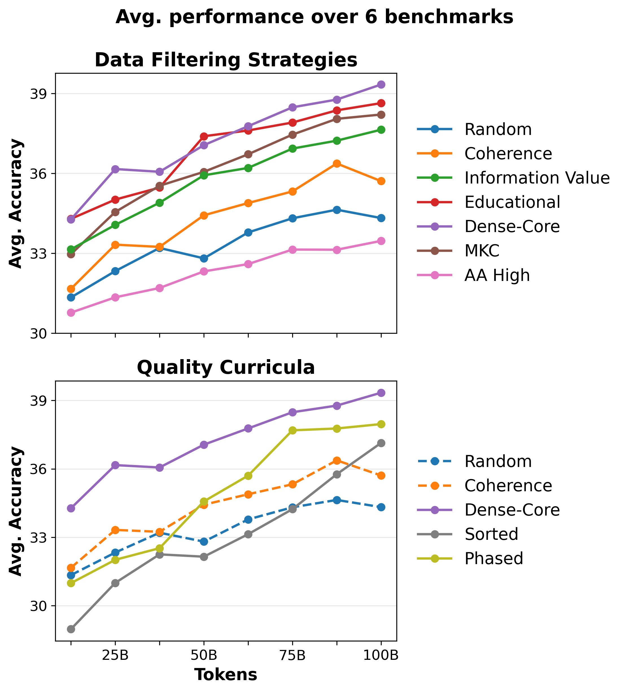
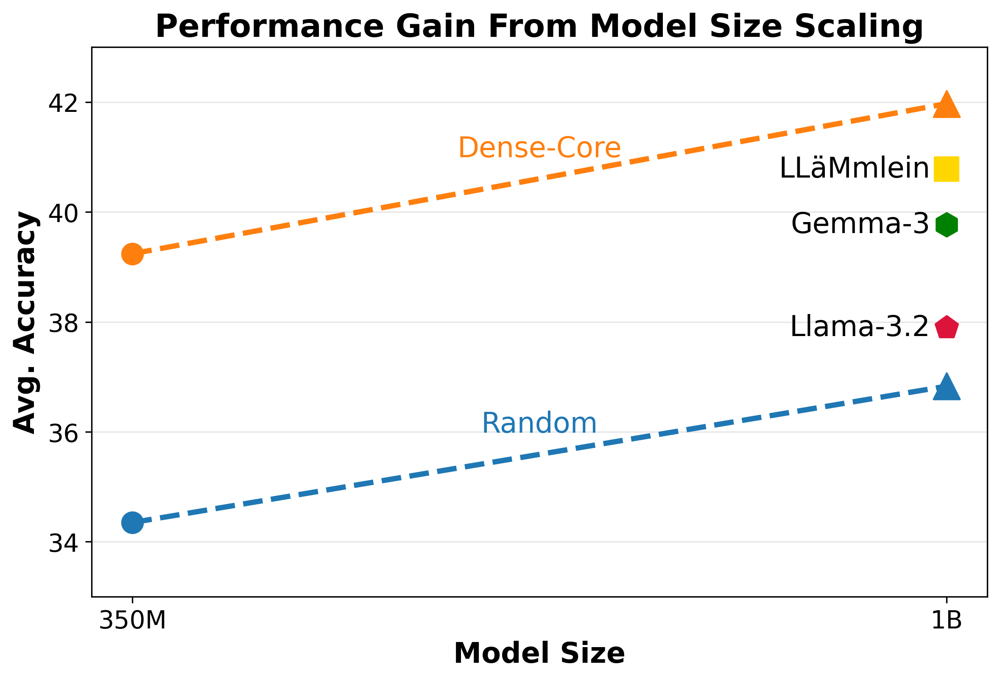
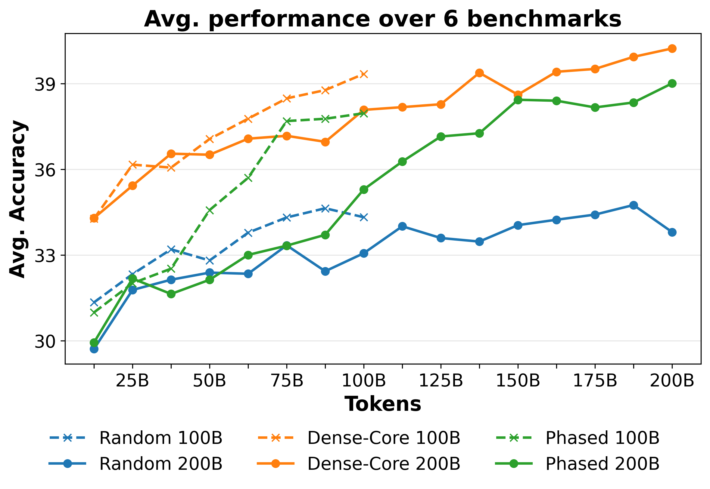

# Repetition over Diversity: High-Signal Data Filtering for Sample-Efficient German Language Modeling

## 基本信息

- **arXiv ID:** [2604.28075v1](https://arxiv.org/abs/2604.28075v1)
- **作者:** Ansar Aynetdinov, Patrick Haller, Alan Akbik
- **发布日期:** 2026-04-30
- **分类:** cs.CL, cs.AI
- **PDF:** [arXiv PDF](https://arxiv.org/pdf/2604.28075v1)

## 关键图示

<figure><figcaption>Figure 1</figcaption></figure>
<figure><figcaption>Figure 2</figcaption></figure>
<figure><figcaption>Figure 3</figcaption></figure>

## 摘要

Recent research has shown that filtering massive English web corpora into high-quality subsets significantly improves training efficiency. However, for high-resource non-English languages like German, French, or Japanese, aggressive filtering creates a strategic dilemma: should practitioners prioritize diversity by training once on large amounts of lightly filtered web data, or prioritize quality by strictly filtering for a high-quality core and repeating it over multiple epochs? We investigate this trade-off for German by constructing hierarchical quality filters applied to 500M web documents, comparing multi-epoch training on the filtered subsets against single-pass training on a diverse corpus. Our experiments across multiple model scales and token budgets show that repeating high-quality data consistently outperforms single-pass training on larger, less filtered sets. Notably, the performance gap persists even after 7 epochs. Our findings suggest that for non-English LLMs, semantic concentration through quality filtering offers a more viable path to efficient language modeling than simply maximizing unique data volume. We release our German language models (called Boldt), as well as our cleaned evaluation benchmarks to the research community. Our experiments indicate that they achieve state-of-the-art results despite training on 10-360x fewer tokens than comparable models.

## 核心贡献

- 针对高资源非英语语言提出一个实证问题：在总 token 预算固定时，是最大化唯一网页覆盖，还是严格过滤出高信号数据并多轮重复训练更有效？论文以德语 FineWeb-2 子集为案例系统回答该问题。
- 构建分层语义质量过滤：**Coherence** 去结构噪声，**Information Value** 选信息密度与事实承载，**Educational Quality** 选解释性/教学性文本，并用三者交集形成 28B token 的 **Dense Core**。
- 证明在 350M 与 1B 模型、100B 与 200B 训练预算下，多轮重复高质量 Dense Core 持续优于单遍更大随机/轻过滤语料；即使重复约 7.2 个 epoch 也未观察到早期饱和。
- 清理并重新翻译德语评测集，指出旧机器翻译在 HellaSwag、LAMBADA 等 completion 任务中因德语词序导致目标位置错误，从而污染评估信号。
- 发布 Boldt 系列德语小模型与清理后的 benchmarks；1B 模型在远少于同类模型训练 token 的情况下达到或接近同规模 SOTA。

## 方法概述

- **数据源与过滤：** 从 German split of FineWeb-2（约 496M 文档）出发，训练三个文档级分类器给文档打分：Coherence 保留 300.6M 文档，Information Value 保留 43.5M 文档/65B token，Educational Quality 保留 30.2M 文档/33B token，Dense Core 为三者交集，24.5M 文档/28B token。
- **tokenizer 控制：** 为每个子集训练独立 32k BPE tokenizer，以适配对应词汇分布；论文观察到随过滤严格度提升，tokenizer fertility 在训练、测试和 benchmark prompts 上均更低。
- **评测集现代化：** 用 Tower+ 72B 重新翻译 ARC、OpenBookQA、HellaSwag、LAMBADA 等英文原始实例，并删除极少数翻译破坏任务逻辑的样本；评测采用 length-normalized conditional log-likelihood。
- **预训练实验：** 使用 Llama-family decoder-only transformer，主实验为 350M non-embedding 参数、100B token 总曝光。比较三类策略：随机/Coherence 单遍多样性基线，高质量子集多 epoch 重复，以及 Random→Dense Core 或按 educational score 排序的 curriculum。
- **扩展实验：** 将 Random 与 Dense Core 扩展到 1B 参数；把 350M 的 Random、Phased、Dense Core 扩到 200B token，用于探索重复上限；再对最终 checkpoint 做德语 SmolTalk2 SFT，并用 Llama-3.3-70B-Instruct 作为 judge 评估 1,000 个 held-out prompts。

## 实验结果

- **100B 预算下 Dense Core 最强：** 350M 模型中 Random 平均 34.35，Coherence 36.48，Information Value 38.04，Educational Quality 38.62，Dense Core 39.24；Dense Core 比 Random 高 4.89 点，且是 28B token 约 3.6× 重复。
- **curriculum 不如纯高密度：** Sorted 和 Phased 后半段转向高质量数据后明显提升，但最终分别为 37.22 和 37.64，仍低于 Dense Core；论文解释为低信号 warm-up 在固定预算中稀释了信息密度。
- **规模越大，高质量重复优势越明显：** 1B Dense Core 相比 1B Random 的平均领先扩大到 5.14 点；100B token 对 1B 模型不是瓶颈，只要训练信号足够集中。
- **200B/7.2 epoch 仍有收益：** 350M Dense Core 在 200B token 下没有出现泛化损失；1B Dense Core 从 100B 到 200B 平均再提升 2.08 点，增幅超过 350M 对应增益，说明更大模型能从重复高质量数据中继续提取信息。
- **SFT 保留密度优势：** 350M@100B Dense Core 在 judge 评测中正确 253/1000，Random 为 178/1000；1B Dense Core 达 338/1000，Random 1B 为 293/1000。200B 的 350M Dense Core 达 278/1000，接近 1B Random。
- **Boldt 发布结果：** Boldt-DC-350M 平均 40.16，Boldt-DC-1B 44.05，Boldt-1B 44.51；Boldt-1B 用 230B token，在多个德语评测上优于或接近使用 1T–36T token 的 1B/更大多语模型。

## 局限性与注意点

- 语言范围仅限德语；作者认为可能迁移到法语、日语、中文等高资源非英语语言，但低资源语言或形态/语序差异更大的语言可能呈现不同质量—数量权衡。
- 模型规模最多 1B、训练最多 200B token；在工业级大模型、万亿级训练预算或更复杂数据混合下，高质量重复的最优点仍未知。
- 架构仅覆盖 dense transformer，没有评估 MoE、替代注意力结构或长上下文架构对重复数据的敏感性。
- 论文没有做毒性、偏见或有害刻板印象评估；高质量教育文本仍可能包含社会偏见，多轮重复甚至可能放大某些偏见。
- LLM-as-judge 的指令调优评测只衡量有用性/正确性，不覆盖安全性、拒答、价值观一致性等行为。

## 相关概念

- [语言模型预训练](../../concepts/language-model-pretraining.html)
- [数据过滤](../../concepts/data-filtering.html)
- [样本效率](../../concepts/sample-efficiency.html)
- [非英语自然语言处理](../../concepts/multilingual-nlp.html)
- [基准评估](../../concepts/benchmarking.html)

---
*导入时间: 2026-05-02 06:01*
*来源: arXiv Daily Digest 2026-05-02*
