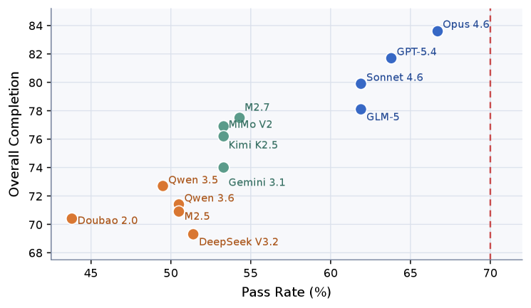
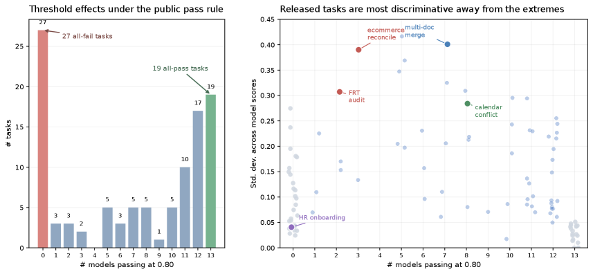
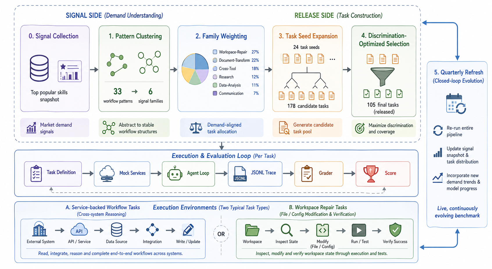

---
layout: paper
title: "Claw-Eval-Live: A Live Agent Benchmark for Evolving Real-World Workflows"
created: 2026-05-02
updated: 2026-05-02
type: paper
arxiv_id: 2604.28139v1
authors: "Chenxin Li, Zhengyang Tang, Huangxin Lin, Yunlong Lin, Shijue Huang, Shengyuan Liu, Bowen Ye, Rang Li"
published: 2026-04-30
categories: cs.SE, cs.AI
tags: [ai, benchmark]
source_url: https://arxiv.org/abs/2604.28139v1
pdf_url: https://arxiv.org/pdf/2604.28139v1
source_type: arxiv_daily
confidence: medium
status: partial
key_figures: [assets/papers/2604-28139v1/fig1.png, assets/papers/2604-28139v1/fig2.png, assets/papers/2604-28139v1/fig3.png]
---

# Claw-Eval-Live: A Live Agent Benchmark for Evolving Real-World Workflows

## 基本信息

- **arXiv ID:** [2604.28139v1](https://arxiv.org/abs/2604.28139v1)
- **作者:** Chenxin Li, Zhengyang Tang, Huangxin Lin et al.
- **发布日期:** 2026-04-30
- **分类:** cs.SE, cs.AI
- **PDF:** [arXiv PDF](https://arxiv.org/pdf/2604.28139v1)

## 今日导读

- **相关主题:** 大语言模型 / 基准评估 / 智能体
- **方法信号:** We introduce Claw-Eval-Live, a live benchmark for workflow agents that separates a refreshable signal layer, updated across releases from public workflow-demand signals, from a reproducible, time-stamped release snapshot.
- **阅读优先级:** 中：最新 arXiv 方向论文

## 关键图示

<figure><figcaption>Figure 1</figcaption></figure>
<figure><figcaption>Figure 2</figcaption></figure>
<figure><figcaption>Figure 3</figcaption></figure>

## 摘要

LLM agents are expected to complete end-to-end units of work across software tools, business services, and local workspaces. Yet many agent benchmarks freeze a curated task set at release time and grade mainly the final response, making it difficult to evaluate agents against evolving workflow demand or verify whether a task was executed. We introduce Claw-Eval-Live, a live benchmark for workflow agents that separates a refreshable signal layer, updated across releases from public workflow-demand signals, from a reproducible, time-stamped release snapshot. Each release is constructed from public workflow-demand signals, with ClawHub Top-500 skills used in the current release, and materialized as controlled tasks with fixed fixtures, services, workspaces, and graders. For grading, Claw-Eval-Live records execution traces, audit logs, service state, and post-run workspace artifacts, using deterministic checks when evidence is sufficient and structured LLM judging only for semantic dimensions. The release contains 105 tasks spanning controlled business services and local workspace repair, and evaluates 13 frontier models under a shared public pass rule. Experiments reveal that reliable workflow automation remains far from solved: the leading model passes only 66.7% of tasks and no model reaches 70%. Failures are structured by task family and execution surface, with HR, management, and multi-system business workflows as persistent bottlenecks and local workspace repair comparatively easier but unsaturated. Leaderboard rank alone is insufficient because models with similar pass rates can diverge in overall completion, and task-level discrimination concentrates in a middle band of tasks. Claw-Eval-Live suggests that workflow-agent evaluation should be grounded twice, in fresh external demand and in verifiable agent action.

## 核心贡献（摘要级初筛）

- We introduce Claw-Eval-Live, a live benchmark for workflow agents that separates a refreshable signal layer, updated across releases from public workflow-demand signals, from a reproducible, time-stamped release snapshot.
- Experiments reveal that reliable workflow automation remains far from solved: the leading model passes only 66.7% of tasks and no model reaches 70%.

## 方法概述（摘要级初筛）

We introduce Claw-Eval-Live, a live benchmark for workflow agents that separates a refreshable signal layer, updated across releases from public workflow-demand signals, from a reproducible, time-stamped release snapshot.

> 注：本页不再依赖 PDF 译文生成；以上为根据 arXiv 元数据和摘要即时生成的快速导读。后续可在阅读全文后升级为 `status: analyzed`。

## 实验结果

Experiments reveal that reliable workflow automation remains far from solved: the leading model passes only 66.7% of tasks and no model reaches 70%.

## 相关概念

- [大语言模型](../../concepts/large-language-model.html)
- [基准评估](../../concepts/benchmarking.html)
- [智能体](../../concepts/ai-agents.html)

---
*导入时间: 2026-05-02 16:44*
*来源: arXiv Daily Wiki Update 2026-05-02*
