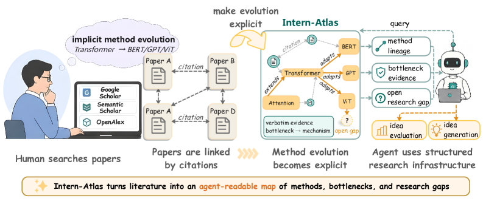
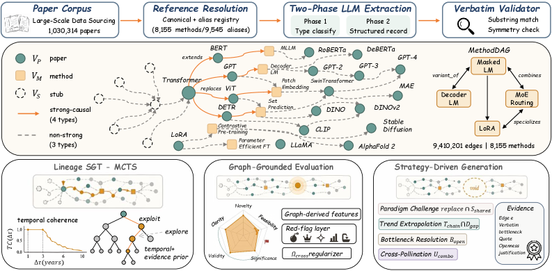

# Intern-Atlas: A Methodological Evolution Graph as Research Infrastructure for AI Scientists

## 基本信息

- **arXiv ID:** [2604.28158v1](https://arxiv.org/abs/2604.28158v1)
- **作者:** Yujun Wu, Dongxu Zhang, Xinchen Li et al.
- **发布日期:** 2026-04-30
- **分类:** cs.AI

## 关键图示

<figure><figcaption>Figure 1</figcaption></figure>
<figure><figcaption>Figure 2</figcaption></figure>
<figure><figcaption>Figure 3</figcaption></figure>

## 摘要

Existing research infrastructure is fundamentally document-centric, providing citation links between papers but lacking explicit representations of methodological evolution. In particular, it does not capture the structured relationships that explain how and why research methods emerge, adapt, and build upon one another. With the rise of AI-driven research agents as a new class of consumers of scientific knowledge, this limitation becomes increasingly consequential, as such agents cannot reliably reconstruct method evolution topologies from unstructured text. We introduce Intern-Atlas, a methodological evolution graph that automatically identifies method-level entities, infers lineage relationships among methodologies, and captures the bottlenecks that drive transitions between successive innovations. Built from 1,030,314 papers spanning AI conferences, journals, and arXiv preprints, the resulting graph comprises 9,410,201 semantically typed edges, each grounded in verbatim source evidence, forming a queryable causal network of methodological development. To operationalize this structure, we further propose a self-guided temporal tree search algorithm for constructing evolution chains that trace the progression of methods over time. We evaluate the quality of the resulting graph against expert-curated ground-truth evolution chains and observe strong alignment. In addition, we demonstrate that Intern-Atlas enables downstream applications in idea evaluation and automated idea generation. We position methodological evolution graphs as a foundational data layer for the emerging automated scientific discovery.

## 核心贡献

- **把文献图从“论文—引用”提升到“方法—因果演化”。** Intern-Atlas 认为现有 Google Scholar/Semantic Scholar 式基础设施只告诉 agent 哪篇论文引用哪篇论文，却不告诉它是扩展、改进、替代、适配还是仅作背景；论文因此构建 method-centric heterogeneous graph。
- **大规模构建 AI 方法演化图。** 作者从 1965–2025 年 1,030,314 篇 AI 论文中解析出 8,155 个规范方法节点、9,545 个 alias、3,173,187 个 stub 节点，并生成 9,410,201 条 typed edges。
- **为 causal edge 绑定可核验文本证据。** 对每条非 background 的因果边，系统抽取 citing paper 中的 bottleneck、mechanism、trade-off 三段直接引文和 LLM confidence；随后用 substring match、年份顺序、反向边一致性等确定性 validator 过滤，降低幻觉证据风险。
- **提出三个图上算子。** 同一张图支持 SGT-MCTS 方法 lineage reconstruction、graph-grounded idea evaluation、strategy-driven idea generation，让研究 agent 能追踪方法历史、评估 idea 所处位置、从结构缺口生成新提案。
- **将图作为科研 agent 基础设施来定位。** 论文类比 Protein Data Bank/ImageNet，主张方法演化图可以成为自动科学发现的底层数据层，而不是单个检索/问答应用。

## 方法概述

- **图构建：** 节点包含 paper、method、stub。Method 节点先由人工种子和 LLM proposer 扩展，再通过 alias registry 做实体归一；每个 resolved reference 形成从 citing method 到 cited method/stub 的边。
- **边类型体系：** LLM 分类器读取引用上下文，将边分为七类：`extends`、`improves`、`replaces`、`adapts`、`uses_component`、`compares`、`background`。前四类构成 strong-causal 子图，用于 lineage；后三类更多作为检索上下文。
- **证据记录：** 对每条 causal edge 存储 `ρ(e)=(b_e,m_e,t_e,c_e)`：被解决瓶颈、机制、权衡、置信度；瓶颈还映射到 14 类 taxonomy（如计算成本、长程依赖），供 idea generator 搜索未解决开放轴。
- **SGT-MCTS lineage：** 从查询方法种子出发，在 strong-causal DAG 中按发表年份展开；UCT 选择项加入图先验 `conf(e)*TC(Δτ)`，偏好高置信且时间间隔合理（1–3 年附近）的演化边；路径排序综合长度、平均置信度、MCTS visit count，并对 branch point mask 已覆盖边以恢复平行演化。
- **Graph-grounded idea evaluation：** 将 idea 中的方法解析到图节点，在局部检索上下文中用确定性图统计计算 Novelty、Feasibility、Significance、Validity、Clarity 五维分数；最终分数由线性加权加 cross-dimensional penalty 组成，可选 LLM reviewer 只能下调分数以防图错误。
- **Strategy-driven idea generation：** 从 lineage 和局部图中提取 open axes、recent improvement directions、sacrifice axes、disconnected pairs 四类结构缺口，对应 Bottleneck Resolution、Trend Extrapolation、Paradigm Challenge、Cross-Pollination 四种生成策略；每个 proposal 必须带具体边和原文 bottleneck quote 的 evidence certificate。

## 实验结果

- **图质量：** 在由 30 篇高影响 survey 构造的 method-evolution benchmark 上，Intern-Atlas 达到 Node Match Ratio 91.0%、Edge Reachable Ratio 89.7%、Path Semantic Correctness 92.0%，说明大部分专家整理的方法节点和演化关系能在图中找到语义正确路径。
- **Lineage reconstruction：** SGT-MCTS 明显优于 Beam search 和 Random Walk。表 1 中 Beam@10 的 NR/ER/CAS 为 44.9/23.2/44.9，而 SGT-MCTS 达到 84.8/79.0/84.8，尤其在 edge recall 上提升很大。
- **Idea evaluation 分层：** 在 1,200 篇论文的 Strata Dataset 上，整体分数随发表层级单调下降：top-tier 8.48，core 7.83，workshop 6.85，rejected 5.84；Significance 和 Validity 的层级差距最大，符合“图结构更适合判断方法重要性和支撑度”的设定。
- **与专家评分相关性：** 100 个 idea profiles、10 名 AI PhD 研究者评分中，Intern-Atlas 与专家整体 Spearman 相关为 0.81，纯 LLM-as-judge 为 0.58；在 Novelty/Significance 上差距尤其明显（0.84 vs 0.52，0.82 vs 0.55）。
- **Idea generation：** 在 100 个研究问题上，Intern-Atlas 生成 idea 的 overall 评分 7.20，高于 No-KB 5.78、OpenAlex 6.03、Semantic Scholar 6.18、BM25 RAG 6.15；盲评 pairwise 中，Intern-Atlas 相对 No-KB/OpenAlex/BM25 RAG 的总体胜率为 88.0%、82.0%、81.0%。

## 局限性与注意点

- **高度依赖自动抽取与 LLM 分类。** 虽然有 verbatim validator，但边类型、confidence、bottleneck taxonomy 仍来自 LLM 管线；substring match 只能保证引用文本存在，不能完全保证因果解释正确。
- **图粒度与专家图可能不一致。** 实验中剩余 mismatch 被作者归因于 survey 图与 Intern-Atlas 构建粒度不同；实际使用时，method alias、variant、组件边界的定义会影响 lineage 与 idea 评分。
- **评价集可能存在同源偏差。** 图由大规模 AI 文献构建，idea evaluation 又用发表层级作为 proxy；发表层级本身受领域热度、会议偏好、写作质量影响，不完全等同科学价值。
- **自动 idea generation 的成功受生成 LLM 限制。** 图提供结构和证据，但具体技术方案仍由 LLM 填写；evidence certificate 防止虚构动机，却不能保证新方法真的可实现或实验有效。
- **可扩展性和维护成本高。** 百万论文、数百万 stub、九百万边的持续更新、消歧、验证和跨版本兼容是一项基础设施工程；论文证明当前快照有用，但长期维护机制仍需观察。

## 相关概念

- [大语言模型](../../concepts/large-language-model.html)
- [多模态学习](../../concepts/multimodal-learning.html)
- [强化学习](../../concepts/reinforcement-learning.html)
- [基准评估](../../concepts/benchmarking.html)

---
*导入时间: 2026-05-02 06:01*
*来源: arXiv Daily Digest 2026-05-02*
