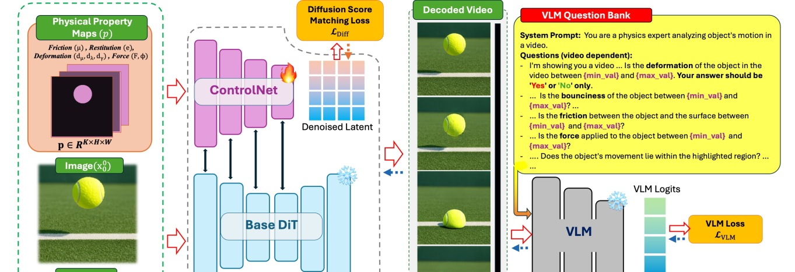
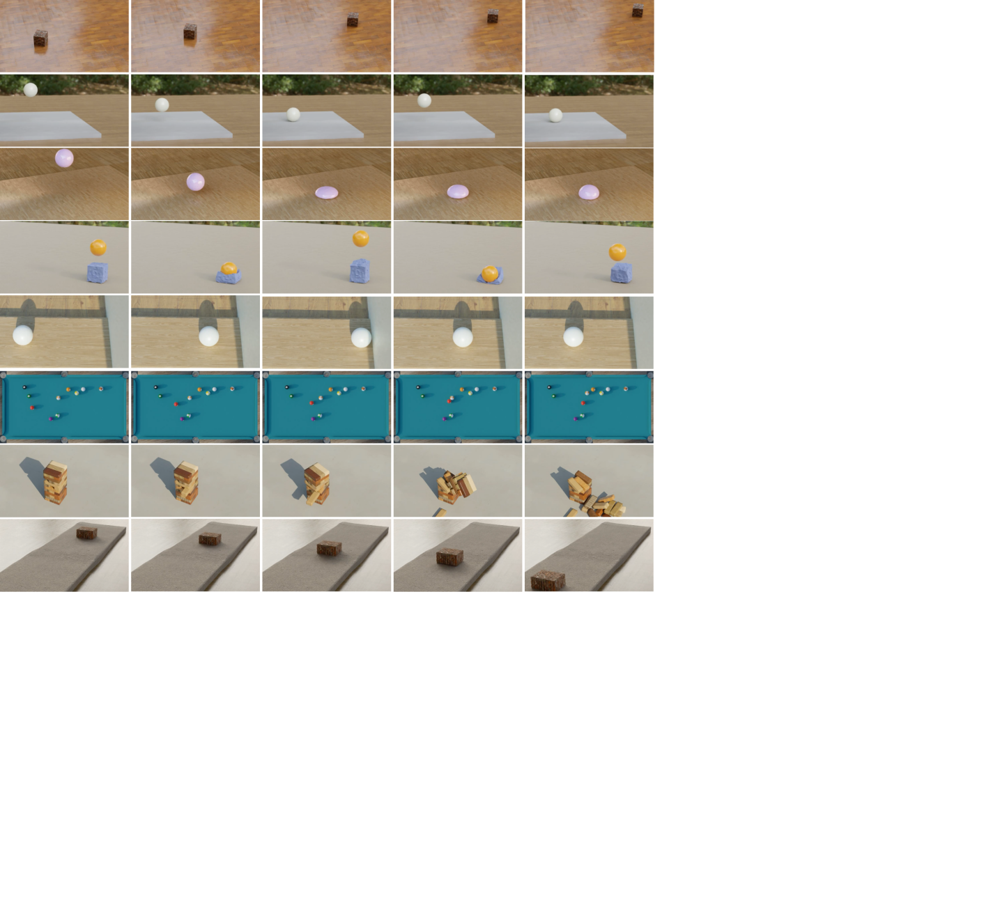

---
layout: paper
title: "PhyCo: Learning Controllable Physical Priors for Generative Motion"
created: 2026-05-02
updated: 2026-05-02
type: paper
arxiv_id: 2604.28169v1
authors: "Sriram Narayanan, Ziyu Jiang, Srinivasa Narasimhan"
published: 2026-04-30
categories: cs.CV, cs.AI, cs.LG
tags: [cv, ml, ai]
source_url: https://arxiv.org/abs/2604.28169v1
pdf_url: https://arxiv.org/pdf/2604.28169v1
source_type: arxiv_daily
confidence: medium
status: needs_pdf_lm_analysis
---

# PhyCo: Learning Controllable Physical Priors for Generative Motion

## 基本信息

- **arXiv ID:** [2604.28169v1](https://arxiv.org/abs/2604.28169v1)
- **作者:** Sriram Narayanan, Ziyu Jiang, Srinivasa Narasimhan et al.
- **发布日期:** 2026-04-30
- **分类:** cs.CV, cs.AI, cs.LG

## 关键图示

<figure><figcaption>Figure 1</figcaption></figure>
<figure><figcaption>Figure 2</figcaption></figure>
<figure><figcaption>Figure 3</figcaption></figure>

## 摘要

Modern video diffusion models excel at appearance synthesis but still struggle with physical consistency: objects drift, collisions lack realistic rebound, and material responses seldom match their underlying properties. We present PhyCo, a framework that introduces continuous, interpretable, and physically grounded control into video generation. Our approach integrates three key components: (i) a large-scale dataset of over 100K photorealistic simulation videos where friction, restitution, deformation, and force are systematically varied across diverse scenarios; (ii) physics-supervised fine-tuning of a pretrained diffusion model using a ControlNet conditioned on pixel-aligned physical property maps; and (iii) VLM-guided reward optimization, where a fine-tuned vision-language model evaluates generated videos with targeted physics queries and provides differentiable feedback. This combination enables a generative model to produce physically consistent and controllable outputs through variations in physical attributes-without any simulator or geometry reconstruction at inference. On the Physics-IQ benchmark, PhyCo significantly improves physical realism over strong baselines, and human studies confirm clearer and more faithful control over physical attributes. Our results demonstrate a scalable path toward physically consistent, controllable generative video models that generalize beyond synthetic training environments.

## 核心贡献

- Modern video diffusion models excel at appearance synthesis but still struggle with physical consistency: objects drift, collisions lack realistic rebound, and material responses seldom match their underlying properties

## 方法概述

integrates three key components: (i) a large-scale dataset of over 100K photorealistic simulation videos where friction, restitution, deformation, and force are systematically varied across diverse scenarios; (ii) physics-supervised fine-tuning of a pretrained diffusion model using a Control- Net conditioned on pixel-aligned physical property maps; and (iii) VLM-guided reward optimization, where a finetuned vision–language model evaluates generated videos with targeted physics queries and provid.

## 实验结果

a scalable path toward physically consistent; a scalable path toward physically consistent, controllable generative video models that generalize beyond synthetic training environments

## 深度解读状态

> 待 PDF 下载并由 LM 阅读后补充。本文详情页不会使用 arXiv 元数据或摘要快速导读冒充完整解读。

## 相关论文

<!-- 待填充：添加相关论文链接 -->

---
*导入时间: 2026-05-02 06:01*
*来源: arXiv Daily Digest 2026-05-02*
