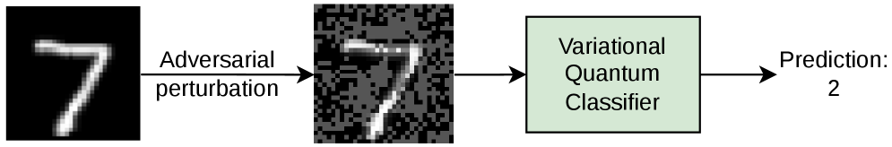
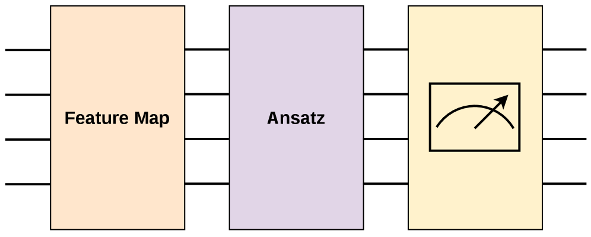
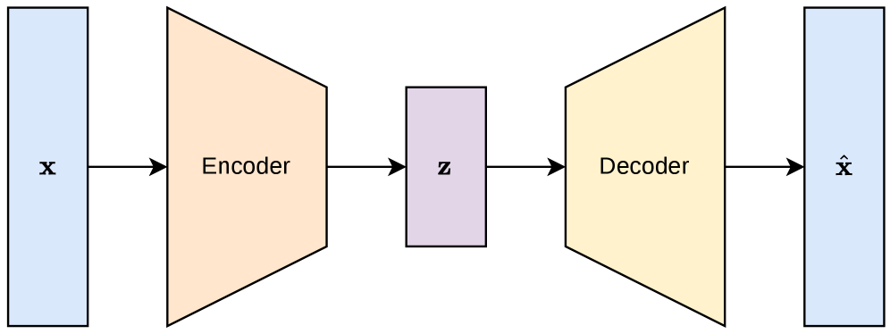

# Defending Quantum Classifiers against Adversarial Perturbations through Quantum Autoencoders

## 基本信息

- **arXiv ID:** [2604.28176v1](https://arxiv.org/abs/2604.28176v1)
- **作者:** Emma Andrews, Sahan Sanjaya, Prabhat Mishra
- **发布日期:** 2026-04-30
- **分类:** quant-ph, cs.LG
- **PDF:** [arXiv PDF](https://arxiv.org/pdf/2604.28176v1)

## 关键图示

<figure><figcaption>Figure 1</figcaption></figure>
<figure><figcaption>Figure 2</figcaption></figure>
<figure><figcaption>Figure 3</figcaption></figure>

## 摘要

Machine learning models can learn from data samples to carry out various tasks efficiently. When data samples are adversarially manipulated, such as by insertion of carefully crafted noise, it can cause the model to make mistakes. Quantum machine learning models are also vulnerable to such adversarial attacks, especially in image classification using variational quantum classifiers. While there are promising defenses against these adversarial perturbations, such as training with adversarial samples, they face practical limitations. For example, they are not applicable in scenarios where training with adversarial samples is either not possible or can overfit the models on one type of attack. In this paper, we propose an adversarial training-free defense framework that utilizes a quantum autoencoder to purify the adversarial samples through reconstruction. Moreover, our defense framework provides a confidence metric to identify potentially adversarial samples that cannot be purified the quantum autoencoder. Extensive evaluation demonstrates that our defense framework can significantly outperform state-of-the-art in prediction accuracy (up to 68%) under adversarial attacks.

## 核心贡献

- 提出 **QAE++**：一种不依赖对抗训练的量子分类器防御框架，把量子自编码器（QAE）作为变分量子分类器（VQC）前的重构/净化模块，用学习到的干净样本特征来削弱 FGSM、PGD 等对抗扰动。
- 将 QAE 的“垃圾量子位与参考态的编码保真度”用于防御决策，而不仅把自编码器当作图像去噪器；论文把这一量子训练信号与分类器 logit 差结合，形成可阈值化的置信度指标。
- 与已有用经典自编码器（CAE）净化对抗样本的方案相比，QAE++ 不需要用对抗样本训练防御器，且 QAE 参数量显著更小：文中报告 QAE 约 120 个参数，而 CAE 约 91,424 个参数。
- 在 MNIST 与 FashionMNIST、多个 VQC 深度、FGSM/PGD 多个扰动强度上系统评估，显示在强攻击下“重构 + 拒识”比单纯重构更关键，最高相对现有 CAE 防御提升约 68 个百分点。

## 方法概述

- **被保护模型：** 论文使用基于 PennyLane 的 VQC，采用振幅嵌入将 32×32 灰度图映射到 10 个量子位，并使用 strongly entangling layers；测量各类对应量子位的期望值作为 logits。
- **QAE 重构：** 输入图像同样经振幅嵌入进入 QAE。编码器把 n 个量子位压缩到 k 个潜变量量子位，其余 n-k 个“trash qubits”应接近参考态 \|0⟩。解码器利用量子门可逆性使用编码器的厄米共轭，将潜变量和参考态重构回原空间。
- **QAE 训练信号：** 只需训练编码器，使 trash state 与参考态的保真度最大。论文用 SWAP test 得到期望值 ⟨σZ⟩，并最小化 `1 - ⟨σZ⟩`。
- **置信度拒识：** 对样本 x，QAE 输出重构 x̂ 与编码保真度；VQC 对 x̂ 输出 logits。置信度定义为编码保真度加上归一化后的前两大 logit 差：`C = ⟨σZ⟩x + lx̂ / 2`。阈值 T 来自干净验证集：编码保真度取 1% 分位并减容忍项，logit 差取验证集中错误样本均值并减容忍项。若 `C < T`，样本被拒绝为潜在对抗样本；否则接受 VQC 预测。
- **实验设置：** MNIST/FMNIST 各取 2,000 张测试图作阈值验证、8,000 张作测试；攻击为 FGSM 和 PGD，扰动强度从 0.05 到 0.30；比较无防御、CAE、QAE、QAE++。

## 实验结果

- **干净样本重构基本不伤性能：** MNIST VQC-100 原始测试准确率 81.23%，经 QAE 重构后为 81.26%；FMNIST VQC-100 从 65.59% 到 64.44%，说明 QAE 可保留主要判别信息。
- **强攻击下 QAE++ 明显优于单纯重构：** MNIST VQC-100 在 FGSM ε=0.30 时，无防御几乎为 0.01%，CAE 为 14.95%，QAE 为 21.82%，QAE++ 达 78.06%；PGD ε=0.30 时 QAE++ 也达 76.42%。
- **拒识机制解释了提升来源：** MNIST VQC-100 在 FGSM ε=0.30 下，QAE++ 拒绝 5,751 个错误分类样本，仅接受 503 个错误样本，同时仍接受 494 个正确样本；论文指出这把 QAE 单独 21.82% 的表现提升到 78.06%。
- **数据集难度影响防御形态：** 在 FMNIST 上，CAE 在中低扰动时常比 QAE 重构准确率高，但 QAE++ 仍可通过拒识在高扰动时提升，例如 VQC-100 FGSM ε=0.30 从 QAE 的 3.24% 提升到 33.67%。
- **混合干净/对抗样本更接近部署场景：** MNIST 三个 VQC 深度下 QAE++ 分别达到 65.60%、65.57%、67.20%，优于无防御、CAE、QAE；FMNIST 上 QAE++ 在 VQC-200/300 优于 CAE，VQC-100 与 CAE 几乎持平（低 0.02%）。

## 局限性与注意点

- 该防御把“拒绝样本”计入正确防御结果，这对安全关键应用合理，但在必须给出分类结果的应用中会带来可用性代价；阈值 δ、γ 需要按任务调节。
- 实验集中在 MNIST 与 FashionMNIST 的小型灰度图像和仿真量子电路，尚不能直接说明在更复杂图像、真实量子硬件噪声、更多类别或更高维输入上的效果。
- QAE++ 对 FMNIST 的单纯重构不总是优于 CAE，说明量子自编码器并非普遍更强；其优势主要来自“量子保真度信号 + 分类置信度”的联合拒识。
- 攻击覆盖 FGSM/PGD 白盒梯度攻击，但未系统评估自适应攻击者针对 QAE++ 阈值、QAE 重构和拒识规则联合优化的情形。

## 相关概念

- [量子机器学习](../../concepts/quantum-machine-learning.html)
- [对抗鲁棒性](../../concepts/adversarial-robustness.html)
- [AI安全与对齐](../../concepts/ai-safety-alignment.html)
- [基准评估](../../concepts/benchmarking.html)

---
*导入时间: 2026-05-02 16:44*
*来源: arXiv Daily Wiki Update 2026-05-02*
