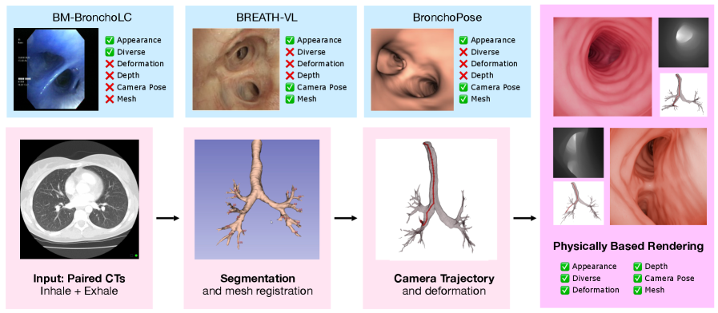
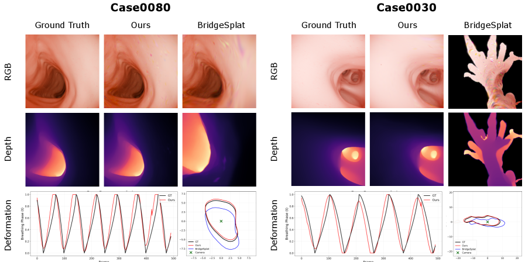

---
layout: paper
title: "Stop Holding Your Breath: CT-Informed Gaussian Splatting for Dynamic Bronchoscopy"
created: 2026-05-02
updated: 2026-05-02
type: paper
arxiv_id: 2604.28179v1
authors: "Andrea Dunn Beltran, Daniel Rho, Aarav Mehta"
published: 2026-04-30
categories: cs.CV
tags: [cv]
source_url: https://arxiv.org/abs/2604.28179v1
pdf_url: https://arxiv.org/pdf/2604.28179v1
source_type: arxiv_daily
confidence: high
status: analyzed
---

# Stop Holding Your Breath: CT-Informed Gaussian Splatting for Dynamic Bronchoscopy

## 基本信息

- **arXiv ID:** [2604.28179v1](https://arxiv.org/abs/2604.28179v1)
- **作者:** Andrea Dunn Beltran, Daniel Rho, Aarav Mehta et al.
- **发布日期:** 2026-04-30
- **分类:** cs.CV

## 关键图示

<figure><figcaption>Figure 1</figcaption></figure>
<figure><figcaption>Figure 2</figcaption></figure>

## 今日导读

- **相关主题:** 多模态学习 / 基准评估 / 医学AI / 世界模型
- **方法信号:** We propose to eliminate the need for breath-hold protocols by leveraging patient-specific respiratory modeling.

## 摘要

Bronchoscopic navigation relies on registering endoscopic video to a preoperative CT scan, but respiratory motion deforms the airway by 5-20 mm, creating CT-to-body divergence that limits localization accuracy. In practice, this is mitigated through breath-hold protocols, which attempt to match the intraoperative anatomy to a static CT, but are difficult to reproduce and disrupt clinical workflow. We propose to eliminate the need for breath-hold protocols by leveraging patient-specific respiratory modeling. Paired inhale-exhale CT scans, already acquired for planning, implicitly define the patient-specific deformation space of the breathing airway. By registering these scans, we reduce respiratory motion to a single scalar breathing phase per frame, constraining all reconstructions to anatomically observed configurations. We embed this representation within a mesh-anchored Gaussian splatting framework, where a lightweight estimator infers breathing phase directly from endoscopic RGB, enabling continuous, deformation-aware reconstruction throughout the respiratory cycle without breath-holds or external sensing. To enable quantitative evaluation, we introduce RESPIRE, a physically grounded bronchoscopy simulation pipeline with per-frame ground truth for geometry, pose, breathing phase, and deformation. Experiments on RESPIRE show that our approach achieves geometrically faithful reconstruction, over 20x faster training, and 1.22 mm target localization accuracy (within the 3mm clinically relevant tolerances) outperforming unconstrained single-CT baselines. Please check out our website for additional visuals: https://asdunnbe.github.io/RESPIRE/

## 核心贡献

- to eliminate the need for breath-hold protocols by leveraging patient-specific respiratory modeling
- a preoperative CT scan, but respiratory motion deforms the airway by 5-20 mm, creating CT-to-body divergence that limits localization accuracy. In practice, this is mitigated through breath-hold protocols, which attempt to match the intraoperative anatomy to a static CT, but are difficult to reproduce and disrupt clinical workflow. We propose to eliminate the need for breath-hold protocols by leveraging patient-specific respiratory modeling. Paired inhale-exhale CT scans, already acquired for planning, implicitly define the patient-specific deformation space of the breathing airway. By registering these scans, we reduce respiratory motion to a single scalar breathing phase per frame, constraining all reconstructions to anatomically observed configurations. We embed this representation within a mesh-anchored Gaussian splatting framework, where a lightweight estimator infers breathing phase directly from endoscopic RGB, enabling continuous, deformation-aware reconstruction throughout the respiratory cycle without breath-holds or external sensing. To enable quantitative evaluation

## 方法概述

patient-specific respiratory modeling. Paired inhale-exhale CT scans, already acquired for planning, implicitly define the patient-specific deformation space of the breathing airway. By registering these scans

## 实验结果

that our approach achieves geometrically faithful reconstruction

## 相关论文

<!-- 待填充：添加相关论文链接 -->

## 分析信息

- **分析来源:** summary_extract
- **分析置信度:** medium
- **分析时间:** 2026-05-02 06:02
- **关键词:** AI, ML

## 分析信息

- **分析来源:** pdf_analysis
- **分析置信度:** high
- **分析时间:** 2026-05-02 06:02
- **关键词:** RL, PPO
- **PDF 路径:** /root/wiki/raw/papers/2604-28179v1.pdf

---
*导入时间: 2026-05-02 06:01*
*来源: arXiv Daily Digest 2026-05-02*
