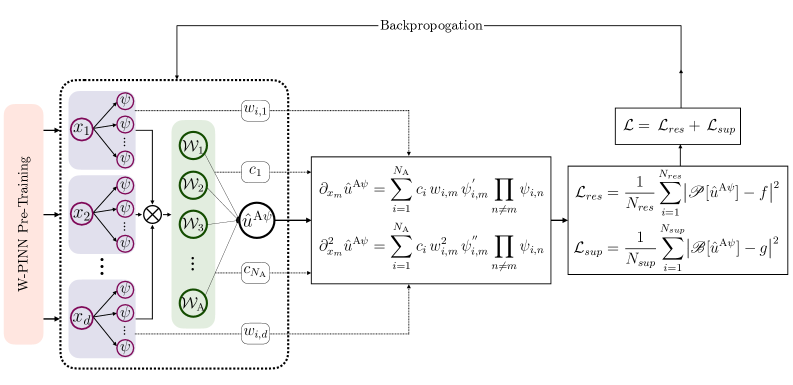
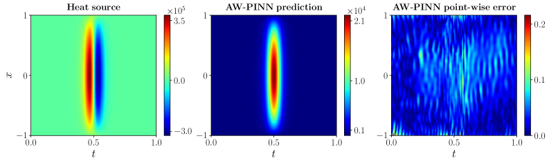
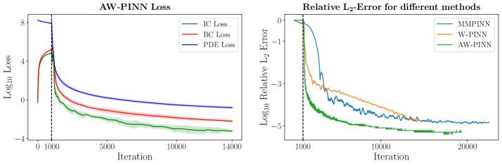

---
layout: paper
title: "An adaptive wavelet-based PINN for problems with localized high-magnitude source"
created: 2026-05-02
updated: 2026-05-02
type: paper
arxiv_id: 2604.28180v1
authors: "Himanshu Pandey, Ratikanta Behera"
published: 2026-04-30
categories: cs.LG
tags: [ml]
source_url: https://arxiv.org/abs/2604.28180v1
pdf_url: https://arxiv.org/pdf/2604.28180v1
source_type: arxiv_daily
confidence: medium
status: partial
key_figures: [assets/papers/2604-28180v1/fig1.png, assets/papers/2604-28180v1/fig2.png, assets/papers/2604-28180v1/fig3.png]
---

# An adaptive wavelet-based PINN for problems with localized high-magnitude source

## 基本信息

- **arXiv ID:** [2604.28180v1](https://arxiv.org/abs/2604.28180v1)
- **作者:** Himanshu Pandey, Ratikanta Behera
- **发布日期:** 2026-04-30
- **分类:** cs.LG
- **PDF:** [arXiv PDF](https://arxiv.org/pdf/2604.28180v1)

## 今日导读

- **相关主题:** 世界模型
- **方法信号:** In recent years, physics-informed neural networks (PINNs) have gained significant attention for solving differential equations, although they suffer from two fundamental limitations, namely, spectral bias inherent in neural networks and loss imbalance arising from multiscale phenomena.
- **阅读优先级:** 中：最新 arXiv 方向论文

## 关键图示

<figure><figcaption>Figure 1</figcaption></figure>
<figure><figcaption>Figure 2</figcaption></figure>
<figure><figcaption>Figure 3</figcaption></figure>

## 摘要

In recent years, physics-informed neural networks (PINNs) have gained significant attention for solving differential equations, although they suffer from two fundamental limitations, namely, spectral bias inherent in neural networks and loss imbalance arising from multiscale phenomena. This paper proposes an adaptive wavelet-based PINN (AW-PINN) to address the extreme loss imbalance characteristic of problems with localized high-magnitude source terms. Such problems frequently arise in various physical applications, such as thermal processing, electro-magnetics, impact mechanics, and fluid dynamics involving localized forcing. The proposed framework dynamically adjusts the wavelet basis function based on residual and supervised loss. This adaptive nature makes AW-PINN handle problems with high-scale features effectively without being memory-intensive. Additionally, AW-PINN does not rely on automatic differentiation to obtain derivatives involved in the loss function, which accelerates the training process. The method operates in two stages, an initial short pre-training phase with fixed bases to select physically relevant wavelet families, followed by an adaptive refinement that adapts scales and translations without populating high-resolution bases across entire domains. Theoretically, we show that under certain assumptions, AW-PINN admits a Gaussian process limit and derive its associated NTK structure. We evaluate AW-PINN on several challenging PDEs featuring localized high-magnitude source terms with extreme loss imbalances having ratios up to $10^{10}:1$. Across these PDEs, including transient heat conduction, highly localized Poisson problems, oscillatory flow equations, and Maxwell equations with a point charge source, AW-PINN consistently outperforms existing methods in its class.

## 核心贡献（摘要级初筛）

- This paper proposes an adaptive wavelet-based PINN (AW-PINN) to address the extreme loss imbalance characteristic of problems with localized high-magnitude source terms.
- Theoretically, we show that under certain assumptions, AW-PINN admits a Gaussian process limit and derive its associated NTK structure.
- We evaluate AW-PINN on several challenging PDEs featuring localized high-magnitude source terms with extreme loss imbalances having ratios up to $10^{10}:1$.

## 方法概述（摘要级初筛）

In recent years, physics-informed neural networks (PINNs) have gained significant attention for solving differential equations, although they suffer from two fundamental limitations, namely, spectral bias inherent in neural networks and loss imbalance arising from multiscale phenomena.

> 注：本页不再依赖 PDF 译文生成；以上为根据 arXiv 元数据和摘要即时生成的快速导读。后续可在阅读全文后升级为 `status: analyzed`。

## 实验结果

Theoretically, we show that under certain assumptions, AW-PINN admits a Gaussian process limit and derive its associated NTK structure.

## 相关概念

- [世界模型](../../concepts/world-models.html)

---
*导入时间: 2026-05-02 16:44*
*来源: arXiv Daily Wiki Update 2026-05-02*
