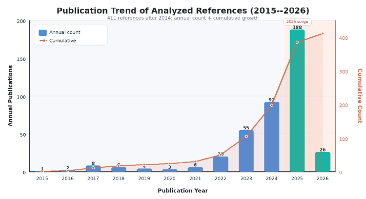
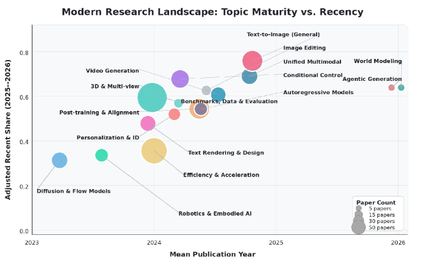
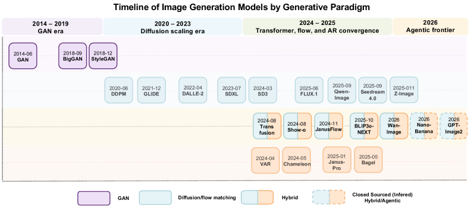

---
layout: paper
title: "Visual Generation in the New Era: An Evolution from Atomic Mapping to Agentic World Modeling"
created: 2026-05-02
updated: 2026-05-02
type: paper
arxiv_id: 2604.28185v1
authors: "Keming Wu, Zuhao Yang, Kaichen Zhang"
published: 2026-04-30
categories: cs.CV
tags: [cv]
source_url: https://arxiv.org/abs/2604.28185v1
pdf_url: https://arxiv.org/pdf/2604.28185v1
source_type: arxiv_daily
confidence: high
status: needs_pdf_lm_analysis
---

# Visual Generation in the New Era: An Evolution from Atomic Mapping to Agentic World Modeling

## 基本信息

- **arXiv ID:** [2604.28185v1](https://arxiv.org/abs/2604.28185v1)
- **作者:** Keming Wu, Zuhao Yang, Kaichen Zhang et al.
- **发布日期:** 2026-04-30
- **分类:** cs.CV

## 关键图示

<figure><figcaption>Figure 1</figcaption></figure>
<figure><figcaption>Figure 2</figcaption></figure>
<figure><figcaption>Figure 3</figcaption></figure>

## 摘要

Recent visual generation models have made major progress in photorealism, typography, instruction following, and interactive editing, yet they still struggle with spatial reasoning, persistent state, long-horizon consistency, and causal understanding. We argue that the field should move beyond appearance synthesis toward intelligent visual generation: plausible visuals grounded in structure, dynamics, domain knowledge, and causal relations. To frame this shift, we introduce a five-level taxonomy: Atomic Generation, Conditional Generation, In-Context Generation, Agentic Generation, and World-Modeling Generation, progressing from passive renderers to interactive, agentic, world-aware generators. We analyze key technical drivers, including flow matching, unified understanding-and-generation models, improved visual representations, post-training, reward modeling, data curation, synthetic data distillation, and sampling acceleration. We further show that current evaluations often overestimate progress by emphasizing perceptual quality while missing structural, temporal, and causal failures. By combining benchmark review, in-the-wild stress tests, and expert-constrained case studies, this roadmap offers a capability-centered lens for understanding, evaluating, and advancing the next generation of intelligent visual generation systems.

## 核心贡献

- a five-level taxonomy: Atomic Generation

## 方法概述

3. 1 Foundational Generative Paradigms .  .

## 实验结果

that current evaluations often overestimate progress

## 深度解读状态

> 待 PDF 下载并由 LM 阅读后补充。本文详情页不会使用 arXiv 元数据或摘要快速导读冒充完整解读。

## 相关论文

<!-- 待填充：添加相关论文链接 -->

## 分析信息

- **分析来源:** summary_extract
- **分析置信度:** medium
- **分析时间:** 2026-05-02 06:02
- **关键词:** RL, generation

## 分析信息

- **分析来源:** pdf_analysis
- **分析置信度:** high
- **分析时间:** 2026-05-02 06:02
- **关键词:** diffusion, GAN, RL, generation, multimodal
- **PDF 路径:** /root/wiki/raw/papers/2604-28185v1.pdf

---
*导入时间: 2026-05-02 06:01*
*来源: arXiv Daily Digest 2026-05-02*
