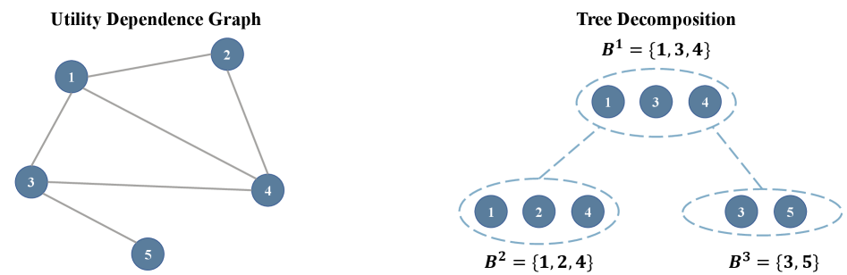
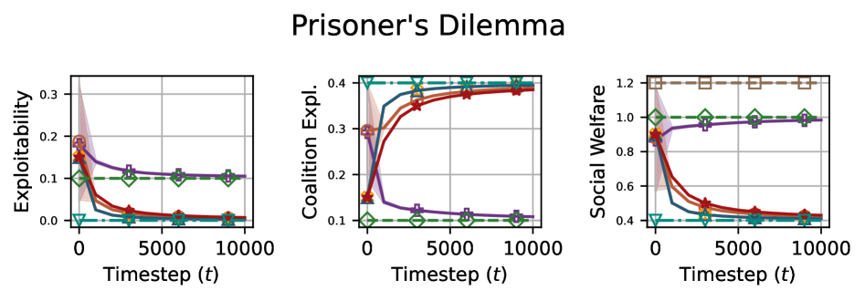
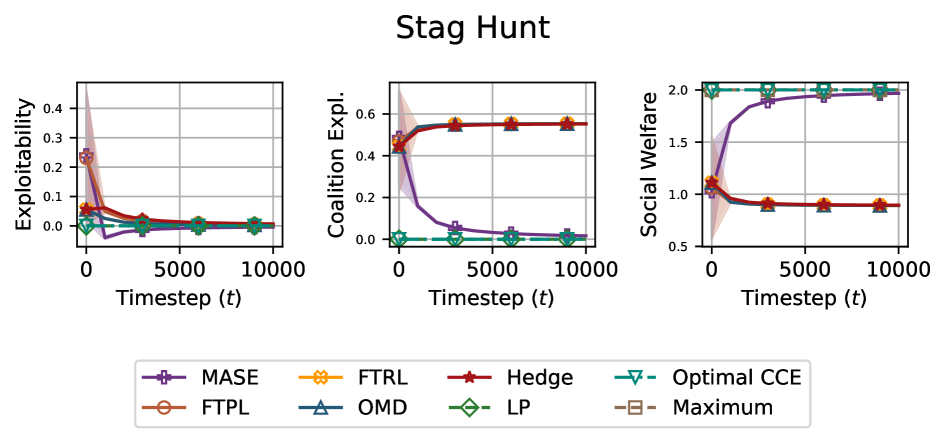

---
layout: paper
title: "Computing Equilibrium beyond Unilateral Deviation"
created: 2026-05-02
updated: 2026-05-02
type: paper
arxiv_id: 2604.28186v1
authors: "Mingyang Liu, Gabriele Farina, Asuman Ozdaglar"
published: 2026-04-30
categories: cs.GT, cs.AI, cs.CC
tags: [ml, ai]
source_url: https://arxiv.org/abs/2604.28186v1
pdf_url: https://arxiv.org/pdf/2604.28186v1
source_type: arxiv_daily
confidence: medium
status: needs_pdf_lm_analysis
---

# Computing Equilibrium beyond Unilateral Deviation

## 基本信息

- **arXiv ID:** [2604.28186v1](https://arxiv.org/abs/2604.28186v1)
- **作者:** Mingyang Liu, Gabriele Farina, Asuman Ozdaglar et al.
- **发布日期:** 2026-04-30
- **分类:** cs.GT, cs.AI, cs.CC

## 关键图示

<figure><figcaption>Figure 1</figcaption></figure>
<figure><figcaption>Figure 2</figcaption></figure>
<figure><figcaption>Figure 3</figcaption></figure>

## 摘要

Most familiar equilibrium concepts, such as Nash and correlated equilibrium, guarantee only that no single player can improve their utility by deviating unilaterally. They offer no guarantees against profitable coordinated deviations by coalitions. Although the literature proposes solution concepts that provide stability against multilateral deviations (\emph{e.g.}, strong Nash and coalition-proof equilibrium), these generally fail to exist. In this paper, we study an alternative solution concept that minimizes coalitional deviation incentives, rather than requiring them to vanish, and is therefore guaranteed to exist. Specifically, we focus on minimizing the average gain of a deviating coalition, and extend the framework to weighted-average and maximum-within-coalition gains. In contrast, the minimum-gain analogue is shown to be computationally intractable. For the average-gain and maximum-gain objectives, we prove a lower bound on the complexity of computing such an equilibrium and present an algorithm that matches this bound. Finally, we use our framework to solve the \emph{Exploitability Welfare Frontier} (EWF), the maximum attainable social welfare subject to a given exploitability (the maximum gain over all unilateral deviations).

## 深度解读状态

> 待 PDF 下载并由 LM 阅读后补充。本文详情页不会使用 arXiv 元数据或摘要快速导读冒充完整解读。

## 相关论文

<!-- 待填充：添加相关论文链接 -->

---
*导入时间: 2026-05-02 06:01*
*来源: arXiv Daily Digest 2026-05-02*
