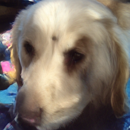

# Representation Fréchet Loss for Visual Generation

## 基本信息

- **arXiv ID:** [2604.28190v1](https://arxiv.org/abs/2604.28190v1)
- **作者:** Jiawei Yang, Zhengyang Geng, Xuan Ju et al.
- **发布日期:** 2026-04-30
- **分类:** cs.CV
- **PDF:** [arXiv PDF](https://arxiv.org/pdf/2604.28190v1)

## 关键图示

<figure><figcaption>Figure 1</figcaption></figure>
<figure><figcaption>Figure 2</figcaption></figure>
<figure><figcaption>Figure 3</figcaption></figure>

## 摘要

We show that Fréchet Distance (FD), long considered impractical as a training objective, can in fact be effectively optimized in the representation space. Our idea is simple: decouple the population size for FD estimation (e.g., 50k) from the batch size for gradient computation (e.g., 1024). We term this approach FD-loss. Optimizing FD-loss reveals several surprising findings. First, post-training a base generator with FD-loss in different representation spaces consistently improves visual quality. Under the Inception feature space, a one-step generator achieves0.72 FID on ImageNet 256x256. Second, the same FD-loss repurposes multi-step generators into strong one-step generators without teacher distillation, adversarial training or per-sample targets. Third, FID can misrank visual quality: modern representations can yield better samples despite worse Inception FID. This motivates FDr$^k$, a multi-representation metric. We hope this work will encourage further exploration of distributional distances in diverse representation spaces as both training objectives and evaluation metrics for generative models.

## 核心贡献

- **把 Fréchet Distance 从评估指标变成可训练目标。** 论文指出 FD 本身可微，真正障碍是估计统计量需要数万样本而反传批量通常只有几百到一千；作者通过把“统计估计总体规模”和“梯度计算 batch”解耦，使 FD-loss 可用于生成器后训练。
- **提出两类大总体估计器。** Queue 版本维护最多 100K 级别的历史生成特征，当前 batch 参与梯度、旧特征 detach；EMA 版本维护一阶/二阶矩指数滑动平均，不存大队列，更省内存且更 on-policy。两者都避免小 batch 协方差不稳的问题。
- **系统比较不同表征空间。** 论文不仅优化 Inception FID，还在 ConvNeXt-v2、DINOv2、MAE、SigLIP2、CLIP 等表征上计算/优化 FD，展示“哪个表征定义相似性”会显著改变模型质量与指标排序。
- **提出 FDr^k 多表征归一化指标。** 由于不同表征的 FD 数值尺度不可比，作者用生成集到训练集的 FD 除以验证集到训练集的 FD，得到 FDr；再对 K 个表征求平均，形成 FDr^k，用来缓解单一 Inception FID 饱和和误排序。
- **证明 FD-loss 可把多步模型改造成一步模型。** 对 JiT、SD3.5 Medium 等原本多步 denoising 模型，直接把终止时刻一次前向输出当成 one-step 生成，再用 FD-loss 后训练，无需蒸馏、GAN 或逐样本目标，即可得到可用的一步生成器。

## 方法概述

- **FD-loss 形式：** 固定特征提取器 `φ`，分别估计真实图像和生成图像特征的均值、协方差，并最小化 Gaussian Fréchet Distance。真实统计量预先计算，生成统计量由当前 batch 加历史队列或 EMA 矩估计。
- **Queue 估计：** 每轮生成 B 张图像，提取特征后与队列拼接估计 `μ_g, Σ_g`；反传时只有当前 batch 特征有梯度，队列特征作为常量，类似 MoCo 的动态字典。论文发现 5K–100K 队列有帮助，过大队列会因 stale/off-policy 反而伤害 FDr^6。
- **EMA 估计：** 对 batch 均值和二阶矩做 `β` 衰减更新，再由 `M_g - μ_g μ_g^T` 得协方差；默认 `β=0.999`，在不存特征队列的情况下达到更好的 FID/FDr^6 折中。
- **多表征组合：** 对多个 `φ_i` 的 FD-loss 做 stop-gradient 归一化，避免某一特征空间因数值尺度主导总 loss；默认组合 SigLIP+Inception+MAE（文中记为 SIM）。
- **训练设置：** 所有实验都是 post-training，从公开预训练生成器开始，global batch size 1024，AdamW，cosine 学习率；ImageNet 256/512 上训练 50 或 100 epochs，并用 50K 生成图像统一评估。

## 实验结果

- **总体规模与 EMA 消融：** 以 pMF-B/16 为例，当前 batch 统计（无队列）使 FID 从 3.31 变差到 3.84；50K queue 可到 0.89 FID；EMA `β=0.999` 达到 0.81 FID 和 10.81 FDr^6，是默认选择。
- **表征选择改变质量方向：** 优化 Inception 得最低 FID，但现代 ViT 表征（DINOv2、MAE、SigLIP2）虽然可能让 Inception FID 变差，却显著改善 FDr^6 和样本结构；组合 SIM 使 pMF-B/16 的 FDr^6 从 13.70 降到 4.20，同时 FID 保持 0.94。
- **一步化多步模型：** JiT-L 原始 1-step FID 为 291.59，几乎不可用；FD-loss 后训练后，SIM 版本 1 NFE 达到 FID 0.85、FDr^6 3.29，视觉上接近或优于原 50-step 模型。
- **系统级 ImageNet 结果：** 在多种生成器和尺寸上，FD-Inception 把 FID 推到 0.72–0.79 区间；FD-SIM 把 FDr^6 降到 1.81–5.56。表 4 中 pMF-H + FD-loss 仅 1 NFE 即达到 FID 0.77、FDr^6 1.89。
- **人类偏好验证：** FD-loss 后训练模型相对各自 base 模型被人类明显偏好（如 iMF-XL 77.1% vs 23.0%，pMF-H 75.7% vs 24.3%）；但最强生成器仍输给真实验证图像，支持“ImageNet 生成未被 FID 完全解决”的论点。
- **文本到图像演示：** 论文还将 SD3.5 Medium 用 FD-loss 和 BLIP3o-GPT4o-60k 参考分布改造成 1-NFE 文生图模型，展示方法不限于类条件 ImageNet，但该部分主要是定性示例。

## 局限性与注意点

- **核心实验仍集中在图像生成和 ImageNet。** 附录明确说 ImageNet 是主要受控基准，文生图只是额外展示；视频、3D、音频等模态的 FD-loss 表征选择与稳定性尚未验证。
- **目标与指标依赖表征集合。** FD-loss 和 FDr^k 的行为取决于所选特征提取器、参考统计量和权重；不同领域可能需要不同表征，否则可能优化到表征盲区。
- **Fréchet/Gaussian 假设仍存在。** FDr^k 改善了单一 FID 的盲点，但仍是均值/协方差匹配，不保证捕捉高阶分布结构、局部伪影或语义组合错误。
- **后训练需要生成大批量样本与真实参考统计。** 虽比全量反传便宜，但仍需要 batch 1024、多 epoch、特征抽取和较大训练资源；数据受限或隐私受限场景需要进一步研究。
- **质量提升带来双重用途风险。** 附录指出更高质量生成器可被用于虚假内容或欺骗性图像，论文的正面贡献在于揭示 FID 不足和提供更诊断性的评估。

## 相关概念

- [扩散模型](../../concepts/diffusion-models.html)
- [视觉生成](../../concepts/visual-generation.html)
- [表征学习](../../concepts/representation-learning.html)
- [基准评估](../../concepts/benchmarking.html)

---
*导入时间: 2026-05-02 16:38*
*来源: arXiv Daily Wiki Update 2026-05-02*
