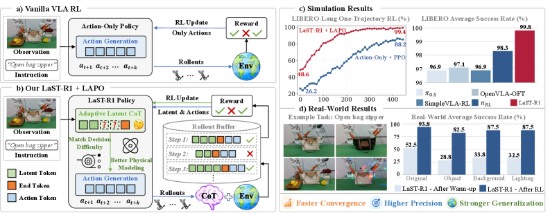
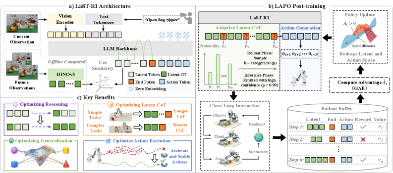
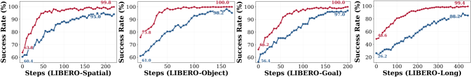

---
layout: paper
title: "LaST-R1: Reinforcing Action via Adaptive Physical Latent Reasoning for VLA Models"
created: 2026-05-02
updated: 2026-05-02
type: paper
arxiv_id: 2604.28192v1
authors: "Hao Chen, Jiaming Liu, Zhonghao Yan"
published: 2026-04-30
categories: cs.RO, cs.CV
tags: [cv]
source_url: https://arxiv.org/abs/2604.28192v1
pdf_url: https://arxiv.org/pdf/2604.28192v1
source_type: arxiv_daily
confidence: high
status: needs_pdf_lm_analysis
---

# LaST-R1: Reinforcing Action via Adaptive Physical Latent Reasoning for VLA Models

## 基本信息

- **arXiv ID:** [2604.28192v1](https://arxiv.org/abs/2604.28192v1)
- **作者:** Hao Chen, Jiaming Liu, Zhonghao Yan et al.
- **发布日期:** 2026-04-30
- **分类:** cs.RO, cs.CV

## 关键图示

<figure><figcaption>Figure 1</figcaption></figure>
<figure><figcaption>Figure 2</figcaption></figure>
<figure><figcaption>Figure 3</figcaption></figure>

## 摘要

Vision-Language-Action (VLA) models have increasingly incorporated reasoning mechanisms for complex robotic manipulation. However, existing approaches share a critical limitation: whether employing explicit linguistic reasoning that suffers from latency and discretization, or utilizing more expressive continuous latent reasoning, they are predominantly confined to static imitation learning that limits adaptability and generalization. While online reinforcement learning (RL) has been introduced to VLAs to enable trial-and-error exploration, current methods exclusively optimize the vanilla action space, bypassing the underlying physical reasoning process. In this paper, we present \textbf{LaST-R1}, a unified VLA framework that integrates latent Chain-of-Thought (CoT) reasoning over physical dynamics prior to action execution, along with a tailored RL post-training paradigm. Specifically, we propose \textbf{Latent-to-Action Policy Optimization (LAPO)}, a novel RL algorithm that jointly optimizes the latent reasoning process and the action generation. By bridging reasoning and control, LAPO improves the representation of physical world modeling and enhances robustness in interactive environments. Furthermore, an \textbf{adaptive latent CoT mechanism} is introduced to allow the policy to dynamically adjust its reasoning horizon based on environment complexity. Extensive experiments show that LaST-R1 achieves a near-perfect 99.8\% average success rate on the LIBERO benchmark with only one-shot supervised warm-up, significantly improving convergence speed and performance over prior state-of-the-art methods. In real-world deployments, LAPO post-training yields up to a 44\% improvement over the initial warm-up policy across four complex tasks, including both single-arm and dual-arm settings. Finally, LaST-R1 demonstrates strong generalization across simulated and real-world environments.

## 深度解读状态

> 待 PDF 下载并由 LM 阅读后补充。本文详情页不会使用 arXiv 元数据或摘要快速导读冒充完整解读。

## 相关论文

<!-- 待填充：添加相关论文链接 -->

---
*导入时间: 2026-05-02 06:01*
*来源: arXiv Daily Digest 2026-05-02*
