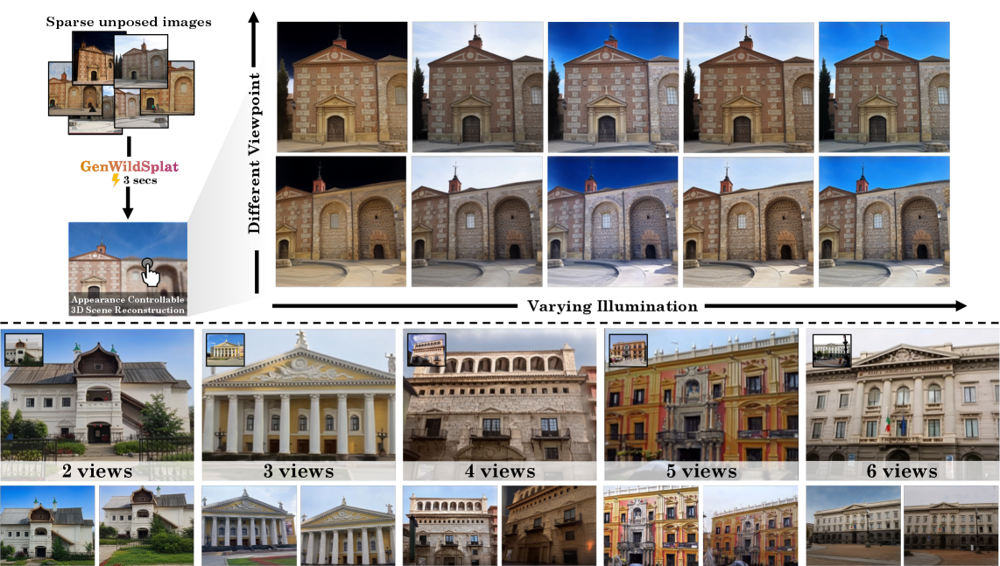
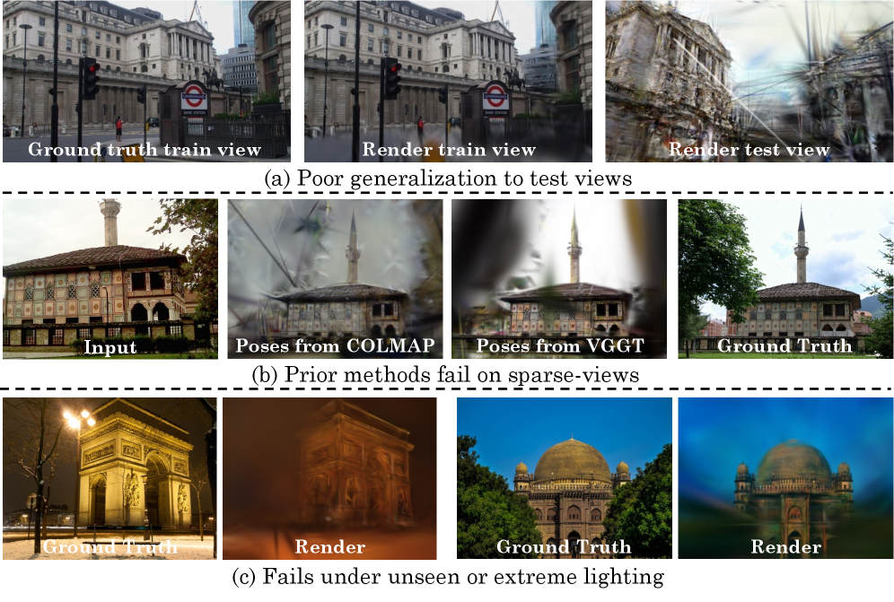
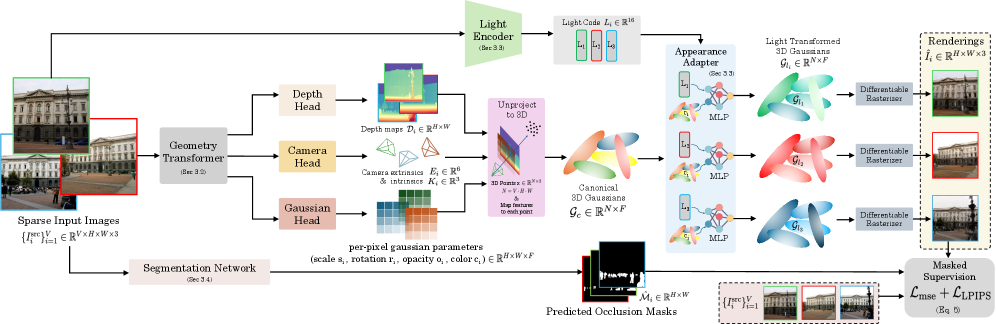

---
layout: paper
title: "Generalizable Sparse-View 3D Reconstruction from Unconstrained Images"
created: 2026-05-02
updated: 2026-05-02
type: paper
arxiv_id: 2604.28193v1
authors: "Vinayak Gupta, Chih-Hao Lin, Shenlong Wang"
published: 2026-04-30
categories: cs.CV
tags: [cv]
source_url: https://arxiv.org/abs/2604.28193v1
pdf_url: https://arxiv.org/pdf/2604.28193v1
source_type: arxiv_daily
confidence: medium
status: needs_pdf_lm_analysis
---

# Generalizable Sparse-View 3D Reconstruction from Unconstrained Images

## 基本信息

- **arXiv ID:** [2604.28193v1](https://arxiv.org/abs/2604.28193v1)
- **作者:** Vinayak Gupta, Chih-Hao Lin, Shenlong Wang et al.
- **发布日期:** 2026-04-30
- **分类:** cs.CV

## 关键图示

<figure><figcaption>Figure 1</figcaption></figure>
<figure><figcaption>Figure 2</figcaption></figure>
<figure><figcaption>Figure 3</figcaption></figure>

## 摘要

Reconstructing 3D scenes from sparse, unposed images remains challenging under real-world conditions with varying illumination and transient occlusions. Existing methods rely on scene-specific optimization using appearance embeddings or dynamic masks, which requires extensive per-scene training and fails under sparse views. Moreover, evaluations on limited scenes raise questions about generalization. We present GenWildSplat, a feed-forward framework for sparse-view outdoor reconstruction that requires no per-scene optimization. Given unposed internet images, GenWildSplat predicts depth, camera parameters, and 3D Gaussians in a canonical space using learned geometric priors. An appearance adapter modulates appearance for target lighting conditions, while semantic segmentation handles transient objects. Through curriculum learning on synthetic and real data, GenWildSplat generalizes across diverse illumination and occlusion patterns. Evaluations on PhotoTourism and MegaScenes benchmark demonstrate state-of-the-art feed-forward rendering quality, achieving real-time inference without test-time optimization

## 核心贡献

- Reconstructing 3D scenes from sparse, unposed images remains challenging under real-world conditions with varying illumination and transient occlusions

## 方法概述

predicts novel views under target lighting conditions while handling occlusions.  Top: Novel-view synthesis under different lighting from the same sparse inputs, demonstrating appearance control.  Bottom: Reconstruction quality across varying input sparsity (2–6 views), showing view-consistent rendering even with minimal observations.

## 实验结果

state-of-the-art feed-forward rendering quality

## 深度解读状态

> 待 PDF 下载并由 LM 阅读后补充。本文详情页不会使用 arXiv 元数据或摘要快速导读冒充完整解读。

## 相关论文

<!-- 待填充：添加相关论文链接 -->

---
*导入时间: 2026-05-02 06:01*
*来源: arXiv Daily Digest 2026-05-02*
