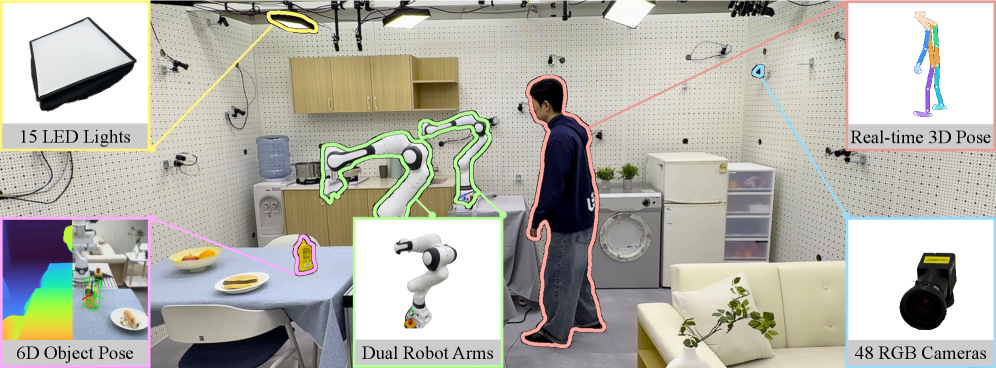
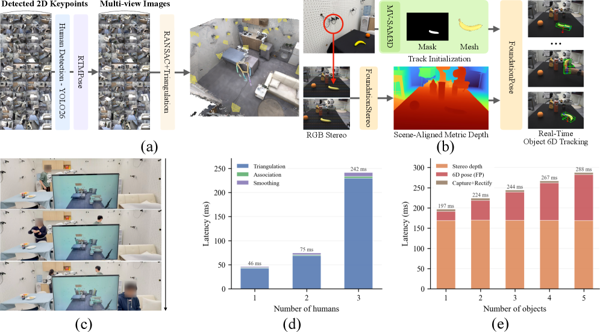
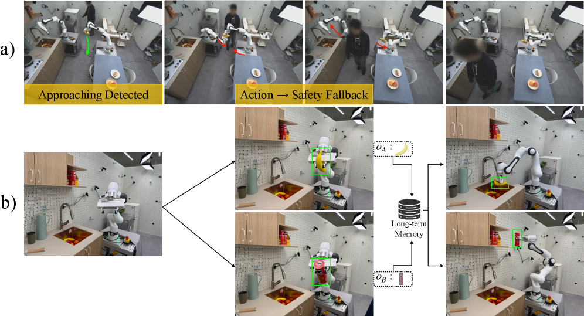

---
layout: paper
title: "OmniRobotHome: A Multi-Camera Platform for Real-Time Multiadic Human-Robot Interaction"
created: 2026-05-02
updated: 2026-05-02
type: paper
arxiv_id: 2604.28197v1
authors: "Junyoung Lee, Sookwan Han, Jeonghwan Kim"
published: 2026-04-30
categories: cs.RO, cs.CV
tags: [cv]
source_url: https://arxiv.org/abs/2604.28197v1
pdf_url: https://arxiv.org/pdf/2604.28197v1
source_type: arxiv_daily
confidence: medium
status: needs_pdf_lm_analysis
---

# OmniRobotHome: A Multi-Camera Platform for Real-Time Multiadic Human-Robot Interaction

## 基本信息

- **arXiv ID:** [2604.28197v1](https://arxiv.org/abs/2604.28197v1)
- **作者:** Junyoung Lee, Sookwan Han, Jeonghwan Kim et al.
- **发布日期:** 2026-04-30
- **分类:** cs.RO, cs.CV

## 关键图示

<figure><figcaption>Figure 1</figcaption></figure>
<figure><figcaption>Figure 2</figcaption></figure>
<figure><figcaption>Figure 3</figcaption></figure>

## 摘要

Human-robot collaboration has been studied primarily in dyadic or sequential settings. However, real homes require multiadic collaboration, where multiple humans and robots share a workspace, acting concurrently on interleaved subtasks with tight spatial and temporal coupling. This regime remains underexplored because close-proximity interaction between humans, robots, and objects creates persistent occlusion and rapid state changes, making reliable real-time 3D tracking the central bottleneck. No existing platform provides the real-time, occlusion-robust, room-scale perception needed to make this regime experimentally tractable. We present OmniRobotHome, the first room-scale residential platform that unifies wide-area real-time 3D human and object perception with coordinated multi-robot actuation in a shared world frame. The system instruments a natural home environment with 48 hardware-synchronized RGB cameras for markerless, occlusion-robust tracking of multiple humans and objects, temporally aligned with two Franka arms that act on live scene state. Continuous capture within this consistent frame further supports long-horizon human behavior modeling from accumulated trajectories. The platform makes the multiadic collaboration regime experimentally tractable. We focus on two central problems: safety in shared human-robot environments and human-anticipatory robotic assistance, and show that real-time perception and accumulated behavior memory each yield measurable gains in both.

## 核心贡献

- Human-robot collaboration has been studied primarily in dyadic or sequential settings

## 方法概述

s condition on predicted contact [48], receiver motion [24], and gaze [35].  Cooperative planners model human motion [6], learn interaction primitives [8], predict intention from skeleton cues [43], and learn strategies via imitation [46].  For safety, reactive [2, 38] and learning-based [10, 55] controllers handle collision avoidance in dynamic settings.

## 实验结果

that real-time perception and accumulated behavior memory each yield measurable gains in both

## 深度解读状态

> 待 PDF 下载并由 LM 阅读后补充。本文详情页不会使用 arXiv 元数据或摘要快速导读冒充完整解读。

## 相关论文

<!-- 待填充：添加相关论文链接 -->

---
*导入时间: 2026-05-02 06:01*
*来源: arXiv Daily Digest 2026-05-02*
