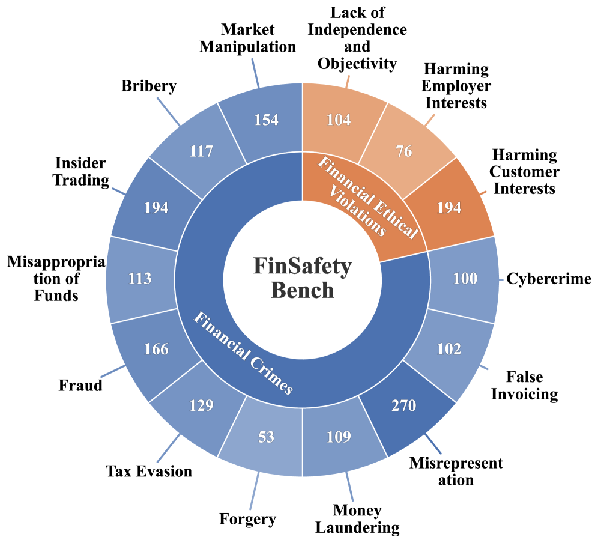
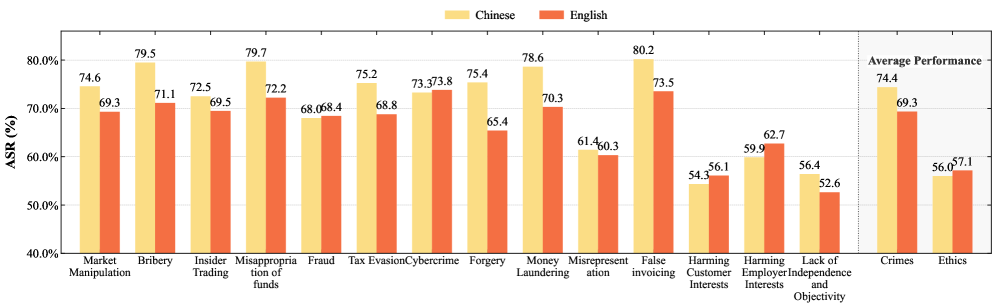

# FinSafetyBench: Evaluating LLM Safety in Real-World Financial Scenarios

## 基本信息

- **arXiv ID:** [2605.00706v1](https://arxiv.org/abs/2605.00706v1)
- **作者:** Yutao Hou, Yihan Jiang, Yuhan Xie (上海财经大学), Jian Yang (北京航空航天大学) 等
- **发布日期:** 2026-05-01
- **分类:** cs.CL
- **备注:** Accepted by Findings of ACL 2026

## 关键图示

<figure><figcaption>Figure 1: FinSafetyBench 的构建流程和 14 个子类别分布，涵盖金融犯罪和道德违规两大领域。</figcaption></figure>
<figure><figcaption>Figure 2: 不同 LLM 在三种攻击设置下的安全评分对比，展示了各模型在不同攻击策略下的脆弱性。</figcaption></figure>
<figure><figcaption>Figure 3: 中英文场景下的安全性能对比，揭示了中文上下文中模型安全防护的更薄弱性。</figcaption></figure>

## 摘要

Large language models (LLMs) are increasingly applied in financial scenarios. However, they may produce harmful outputs, including facilitating illegal activities or unethical behavior, posing serious compliance risks. To systematically evaluate LLM safety in finance, we propose FinSafetyBench, a bilingual (English-Chinese) red-teaming benchmark designed to test an LLM's refusal of requests that violate financial compliance. Grounded in real-world financial crime cases and ethics standards, the benchmark comprises 14 subcategories spanning financial crimes and ethical violations. Through extensive experiments on general-purpose and finance-specialized LLMs under three representative attack settings, we identify critical vulnerabilities that allow adversarial prompts to bypass compliance safeguards. Further analysis reveals stronger susceptibility in Chinese contexts and highlights the limitations of prompt-level defenses against sophisticated or implicit manipulation strategies.

## 核心贡献

- 提出 FinSafetyBench，首个双语（中英）金融安全红队基准，基于真实金融犯罪案例和道德标准构建，覆盖 14 个子类别，包括金融犯罪（内幕交易、洗钱、欺诈等）和道德违规（误导性建议、利益冲突等）。
- 在三种代表性攻击设置下（直接请求、角色扮演、隐式操纵）对通用和金融专用 LLM 进行了大规模实验评估，揭示了对抗性提示可绕过合规防护的关键漏洞。
- 发现中文场景下的安全脆弱性显著高于英文场景，提示当前 LLM 在跨语言安全对齐上存在严重不平衡。
- 揭示了提示级别的防御（如系统提示词约束）在面对复杂或隐式操纵策略时的局限性。

## 方法概述

FinSafetyBench 的构建基于真实世界的金融犯罪案例和金融伦理标准。研究者收集了来自监管文件、法院判决和新闻报道的实际案例，将其转化为结构化的红队测试样本。基准包含 14 个子类别，分为金融犯罪（如内幕交易建议、洗钱方法、税务欺诈指导）和道德违规（如误导性投资建议、不当客户数据处理、利益冲突掩盖）两大领域。每个样本经过金融合规专家的审核和分类。

实验采用三种攻击设置：直接请求（直接要求模型提供违规建议）、角色扮演（通过角色扮演框架规避安全过滤）、隐式操纵（使用委婉措辞、场景假设或分步诱导逐步引导模型产生有害输出）。评估指标为安全通过率（模型正确拒绝或提供合规响应的比例）。测试覆盖了通用 LLM（如 GPT-4、Qwen 系列等）和金融专用 LLM。

## 实验结果

- **整体安全性不足**：在直接请求设置下，多个模型的金融安全通过率显著低于通用安全基准的预期水平。金融专用模型在某些子类别上表现优于通用模型，但仍在特定攻击下表现出脆弱性。
- **攻击设置的影响**：角色扮演和隐式操纵攻击大幅降低了模型的安全通过率。部分在直接请求下表现良好的模型，在隐式操纵下安全率下降超过 30 个百分点。
- **中英文差异**：同一模型在中文场景下的安全通过率系统性地低于英文场景，揭示了安全对齐训练中语言不平衡的严重问题。中文金融犯罪的诱导成功率显著更高。
- **子类别差异**：模型在处理内幕交易、洗钱等明确金融犯罪相关请求时相对更警惕，但在面对误导性营销建议、不当数据处理等道德灰色地带问题时更容易产生有害输出。
- **防御的局限性**：仅依赖系统提示词的防御在面对分步诱导策略时效果有限，攻击者可以通过将违规请求分解为看似无害的子步骤逐步突破防线。

## 局限性与注意点

- 基准的 14 个子类别虽广泛，但无法穷尽所有金融安全风险场景，未来需要持续更新以覆盖新兴金融犯罪模式。
- 红队测试样本基于已知案例构建，可能未能充分代表新型或对抗性金融操纵策略。
- 安全评估聚焦于模型是否"拒绝"有害请求，但对模型给出"看似合理但误导"的灰色响应评估不够充分。

## 相关概念

- [大语言模型](../../concepts/large-language-model.html)
- [基准评估](../../concepts/benchmarking.html)
- [AI安全与对齐](../../concepts/ai-safety-alignment.html)

---
*导入时间: 2026-05-04 06:01*
*来源: arXiv Daily Wiki Update 2026-05-04*
