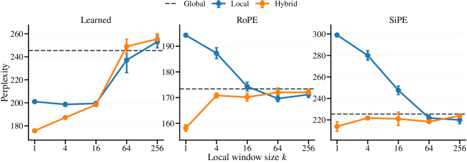

# Characterizing the Expressivity of Local Attention in Transformers

## 基本信息

- **arXiv ID:** [2605.00768v1](https://arxiv.org/abs/2605.00768v1)
- **作者:** Jiaoda Li, Ryan Cotterell (ETH Zürich)
- **发布日期:** 2026-05-01
- **分类:** cs.CL
- **备注:** ACL 2026

## 关键图示

<figure><figcaption>Figure 1: LTL[P,Y] 可定义语言的最小 DFA 中的禁止配置。该图展示了局部注意力带来的表达能力边界。</figcaption></figure>
<figure><figcaption>Figure 2: 有界 Dyck 语言的最小 DFA。(ab)*（深度 1）在 LTL[P,Y] 内，而 (a(ab)*b)*（深度 2）不在，因后者包含禁止配置。</figcaption></figure>
<figure><figcaption>Figure 3: 不同注意力类型和窗口大小下模型的最长完美长度热力图。混合全局-局部注意力（hybrid）在形式语言和自然语言上均优于纯全局或纯局部注意力。</figcaption></figure>

## 摘要

The transformer is the most popular neural architecture for language modeling. One common variant is local attention, which restricts each token to aggregating information from a bounded window of predecessors, reducing the quadratic cost of global attention to linear. Although this restriction is usually motivated by efficiency, it has also been found to improve model quality, a phenomenon that has so far lacked a satisfactory explanation. We provide a formal account of this phenomenon in terms of recognizer expressivity. Fixed-precision transformers with global attention correspond to a fragment of linear temporal logic containing a single past operator LTL[P]. We additionally prove that adding local attention introduces a second temporal operator Y, strictly enlarging the class of recognizable regular languages. Moreover, global and local attention are expressively complementary: neither subsumes the other, and combining them yields the richest fragment LTL[P,Y]. Experiments on formal language recognition and natural language modeling corroborate the theory, showing that hybrid global–local transformers outperform their global-only counterparts.

## 核心贡献

- 首次从识别器表达能力角度为局部注意力的质量提升提供了严格的形式化解释：全局注意力对应 LTL[P]（仅含单个过去算子），加入局部注意力引入第二个时序算子 Y，严格扩大了可识别正则语言类。
- 证明了全局注意力与局部注意力在表达能力上互补而非包含：全局注意力可识别左边界依赖模式（如 aΣ*），局部注意力可识别右边界依赖模式（如 Σ*a），二者结合得到最丰富的片段 LTL[P,Y]。
- 建立了 LTL[P,Y] 与经典形式语言理论的联系：该片段恰好对应局部 R-平凡（locally R-trivial）语言类，包含所有局部可检验语言（locally testable languages），但不包含深度 ≥2 的有界 Dyck 语言。
- 通过形式语言识别实验和 WikiText-2 自然语言建模实验验证了理论，发现混合全局-1-局部注意力在两种设置下均一致优于纯全局注意力。

## 方法概述

论文采用线性时序逻辑（LTL）作为分析工具，将 Transformer 的注意力模式与逻辑片段对应。全局注意力（掩码 M*）对应 LTL[P]，其中算子 P（previously）使模型可以回看任意远的位置。k-局部注意力（掩码 M≤k）对应 LTL[Y≤k]，其中算子 Y≤k 限制了模型只能回看前 k 步。作者证明了两者不可比较（incomparable），但结合后产生的 LTL[P,Y] 严格强于任一片段。

在形式语言实验中，作者测试了四类语言（LTL[Y] 可定义、LTL[P] 可定义、LTL[P,Y] 可定义但不在前两类中、LTL[S] 可定义但不在 LTL[P,Y] 中），训练长度为 ≤40 的字符串，评估长度 41–500 的泛化能力。在自然语言实验中，使用 WikiText-2 评估不同注意力配置在 SiPE 和 RoPE 位置编码下的困惑度。

## 实验结果

- **形式语言泛化**：混合全局-局部注意力模型在 LTL[P,Y] 类语言上的最长完美长度显著高于纯全局或纯局部模型。例如在 (ab)* 语言上，hybrid (k=1) 模型完美泛化到长度 500，而纯全局模型仅在 40 左右停止泛化。
- **窗口大小效应**：1-局部注意力在局部注意力家族中一致最强，无论是纯局部还是混合模型。对于 k>1 的 k-局部注意力，理论上严格弱于 1-局部（除非有足够的位置编码信息补偿）。
- **自然语言困惑度**：在 WikiText-2 上，hybrid (k=1) 配置在 SiPE 和 RoPE 两种编码下均取得最低困惑度。例如 RoPE + hybrid (k=1) 显著优于 RoPE + global-only。
- **位置编码的作用**：SiPE 和 RoPE 均未能弥补缺失局部注意力的差距，表明位置编码提供的额外时序信息不足以替代局部注意力结构带来的表达能力增益。

## 局限性与注意点

- 理论分析假设定点精度（fixed-precision）运算，这与实践中使用的浮点格式一致，但仍是对真实模型的抽象。
- 深度开销考量：用 1-局部注意力表达 k-局部注意力可能需要额外的算子深度，因此在固定深度下 1-局部注意力未必严格更强。但现代语言模型通常足够深，此限制影响有限。
- 形式语言实验未穷尽所有可能的 Transformer 配置，仅关注注意力掩码和位置编码的变化。

## 相关概念

- [大语言模型](../../concepts/large-language-model.html)

---
*导入时间: 2026-05-04 06:01*
*来源: arXiv Daily Wiki Update 2026-05-04*
