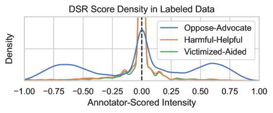
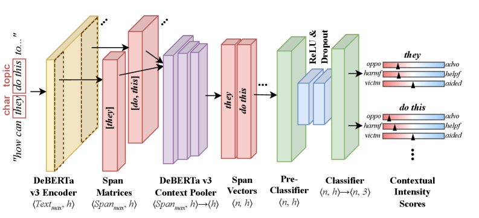

# Directed Social Regard: Surfacing Targeted Advocacy, Opposition, Aid, Harms, and Victimization in Online Media

## 基本信息

- **arXiv ID:** [2605.00776v1](https://arxiv.org/abs/2605.00776v1)
- **作者:** Scott Friedman, Ruta Wheelock (SIFT), Sonja Schmer-Galunder (University of Florida) 等
- **发布日期:** 2026-05-01
- **分类:** cs.CL, cs.AI
- **PDF:** [arXiv PDF](https://arxiv.org/pdf/2605.00776v1)

## 关键图示

<figure><figcaption>Figure 1: DSR 示例输出。句子"How can they do this to the children??"中，"they"和"do this"被标记为 Opposed 和 Harmful（红色），"children"被标记为 Advocated 和 Victimized（蓝色/红色）。</figcaption></figure>
<figure><figcaption>Figure 2: 标注界面中使用的单维度滑块，标注者从强烈 Oppose（左）到强烈 Advocate（右）对每个字符或主题片段进行评分。</figcaption></figure>
<figure><figcaption>Figure 3: 数据集中片段密度和评分密度分布。字符片段比主题片段更常见，各维度的负面和正面评分总体平衡。</figcaption></figure>

## 摘要

The language in online platforms, influence operations, and political rhetoric frequently directs a mix of pro-social and anti-social sentiment at different topics, all in the same message. While many NLP tools classify a text's overall sentiment as positive or negative, these tools cannot report that positive and negative sentiments coexist, nor can they report the target. This paper presents the Directed Social Regard (DSR) approach to multi-dimensional, multi-valence sentiment analysis, comprised of a pair of transformer-based models that (1) detect span-level targets of sentiment in a message and then (2) score all spans along three (-1, 1) axes of regard motivated by social science theories of moral disengagement and moral framing. We present a data collection and annotation strategy for DSR dataset construction, a transformer-based architecture for span-level scoring, and a validation study with promising results. We apply the validated DSR model on six third-party datasets of online media and report meaningful correlations between DSR outputs and the labels in these pre-existing social science datasets.

## 核心贡献

- 提出 Directed Social Regard (DSR) 框架，将情感分析从单一整体标签拓展为多维、多价、定向的社会评价，支持在同一条消息中识别指向不同目标的共存正面和负面情感。
- 定义了三个基于社会心理学理论（Brown & Levinson 的礼貌理论、Bandura 的道德脱离理论）的评价维度：Oppose–Advocate（反对–倡导）、Harmful–Helpful（有害–有益）、Victimized–Aided（受害–受助）。
- 构建了包含 1,838 条文本、13,893 个标注片段和 26,779 个高一致性评分的数据集，来自 8 个多元化公开来源（Reddit、NYT 评论、选举推文等），Krippendorff's α 达 0.87。
- 验证了最佳模型（DeBERTa-v3-large, debiased）在 Oppose–Advocate 维度上达到 RMSE 0.20 和 R² 0.85，并展示了 DSR 在 Bridging Benchmark 和 MFTC 等第三方数据集上的有意义相关性分析。

## 方法概述

DSR NLP 流水线由两个串联的 Transformer 模型组成。第一个是 token 分类模型（基于 HuggingFace TokenClassification），输入原始文本，输出文本中字符（人物、群体）和主题（事件、抽象概念）片段的标注。最佳模型 DeBERTa-v3-large-mnli 在严格片段匹配下达到微平均 F1 0.89，在宽松匹配下达到 0.92。

第二个是评价评分模型：对整个文本进行一次编码后，为每个标注片段提取上下文相关矩阵，通过上下文池化将单/多词片段统一为固定长度向量，经线性层和激活函数处理后，分类器输出三个 DSR 维度的 [-1,1] 分数。使用 MSE 损失进行训练。论文还探索了基于模板的数据增强"去偏"方法（保持上下文和评分不变，只替换字符和主题名称），在所有维度上提高了 R² 并降低了 RMSE。

## 实验结果

- **片段识别**：DeBERTa-v3-large-mnli 最佳，字符 F1≈0.96，主题 F1≈0.74（严格匹配），微平均 F1 0.89。字符识别优于主题识别，因为代词和专有名词更易识别。
- **评价评分（DeBERTa-v3-large, debiased）**：Oppose–Advocate RMSE=0.20, R²=0.85；Victimized–Aided RMSE=0.10, R²=0.67；Harmful–Helpful RMSE=0.12, R²=0.57。
- **与 LLM 对比**：LoRA 微调的 Llama 3.2 3B 在 Oppose–Advocate 上 RMSE=0.26, R²=0.75，低于 DeBERTa 模型。GPT-4o few-shot 表现最差（RMSE=0.40, R²=0.39），可能是因为 DSR 任务需要数字回归而非文本生成。
- **第三方数据集分析**：在 Bridging Benchmark 上，高道德义愤（Moral Outrage）文档中的片段评分显著偏向反对（M=-0.25），而高尊重（Respect）文档中的片段显著偏向倡导（M=0.23）。第一人称引用在高道德义愤下仍保持倡导，显示了 DSR 捕捉群体内偏见的能力。

## 局限性与注意点

- 当前 DSR 模型仅建模了三个维度，但道德脱离理论还涉及其他指标（如委婉化、责任扩散等），可作为未来扩展方向。
- Harmful–Helpful 和 Victimized–Aided 维度仅对字符片段标注，主题片段（非人类）的这两个维度缺乏人工标注，因此训练信号中不包含。
- DSR 分析仅展示了相关性，未建立因果关系。
- 去偏数据增强使用模板化示例，可能无法覆盖所有实际偏差来源。

## 相关概念

- [大语言模型](../../concepts/large-language-model.html)
- [基准评估](../../concepts/benchmarking.html)

---
*导入时间: 2026-05-04 06:01*
*来源: arXiv Daily Wiki Update 2026-05-04*
