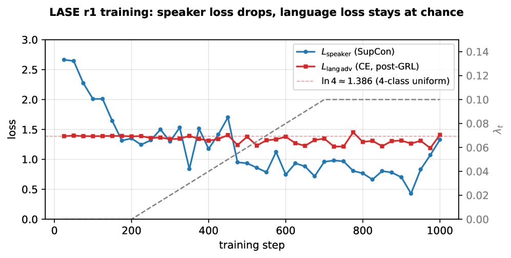

# LASE: Language-Adversarial Speaker Encoding for Indic Cross-Script Identity Preservation

## 基本信息

- **arXiv ID:** [2605.00777v1](https://arxiv.org/abs/2605.00777v1)
- **作者:** Venkata Pushpak Teja Menta (Praxel Ventures)
- **发布日期:** 2026-05-01
- **分类:** cs.SD, cs.CL, eess.AS
- **PDF:** [arXiv PDF](https://arxiv.org/pdf/2605.00777v1)
- **代码与模型:** https://github.com/praxelhq/lase

## 关键图示

<figure><figcaption>Figure 1: 三种分布对比。对于每个编码器，绿色为同语言内分布，蓝色为跨语言分布，红色为不同说话人（噪声底）。LASE r1 几乎消除了蓝绿之间的差距。</figcaption></figure>
<figure><figcaption>Figure 2: LASE r1 训练曲线。说话人对比损失（SupCon）下降而语言对抗损失保持在 ln 4（四类均匀），表明编码器学习了说话人身份但未学习语言信息。</figcaption></figure>

## 摘要

A speaker encoder used in multilingual voice cloning should treat the same speaker identically regardless of which script the audio was uttered in. Off-the-shelf encoders do not, and the failure is accent-conditional. On a 1043-pair Western-accented voice corpus across English, Hindi, Telugu, and Tamil, WavLM-base-plus-sv loses 0.082 absolute cosine similarity when the same voice changes script and ECAPA-TDNN loses 0.105. On a 1369-pair Indian-accented voice corpus, the gap shrinks to 0.006 (WavLM-SV) and 0.044 (ECAPA-TDNN). We present LASE, a small projection head over frozen WavLM-base-plus trained with two losses: a supervised contrastive loss over voice identity, and a gradient-reversal cross-entropy against a 4-language classifier. Trained on 1118 quality-gated cross-script pairs synthesised from 8 commercial multilingual voices, LASE's residual gap is consistent with zero on both corpora (Δ = 0.013 Western, Δ = 0.026 Indian; both bootstrap 95% CIs include zero) and amplifies the cross-script-vs-floor margin 2.4–2.7× over both baselines. In synthetic multi-speaker diarisation, LASE matches ECAPA-TDNN on cross-script speaker recall (0.788 vs 0.789) with ∼100× less training data.

## 核心贡献

- 构建并开源了首个印地语系跨文字同说话人身份基准：1118 训练对和 1043 留出对，涵盖 8 个声音 × 4 种语言（英语、印地语、泰卢固语、泰米尔语），通过 TTS 引导方法构建。
- 定义了三分布测量框架（同语言内 / 跨语言 / 不同说话人），分离编码器的语言-身份纠缠，量化跨文字身份间隙（Δ）和区分度边际（M）。
- 训练并开源了 LASE r1：256 维说话人编码器，基于冻结的 WavLM-base-plus 骨干网络 + 投影头 + 梯度反转语言分类器。在留出评估上将跨文字身份间隙缩小了 84.3%（0.082 → 0.013）。
- 在合成多说话人语码转换说话人日志任务中，LASE 以约 100× 少的训练数据（1118 对 vs. VoxCeleb 的 100 万+ 条）匹配了 ECAPA-TDNN 的跨文字说话人召回率（0.788 vs 0.789）。

## 方法概述

LASE 采用域对抗训练范式：在冻结的 WavLM-base-plus 骨干网络上添加一个可训练的两层 MLP 投影头（768→512→256，ReLU+Dropout 0.1），对层 10–12 进行平均池化后输出 256 维说话人嵌入 z。z 通过梯度反转层（强度 λt 按三阶段调度：warmup 200 步 λ=0、线性渐增至 0.1 持续 500 步、保持 0.1）后经过一个小的 MLP 语言分类器，预测输入属于 {en, hi, te, ta} 中的哪种语言。

训练使用两个损失之和：说话人监督对比损失（SupCon，温度 τ=0.07）拉近同说话人对并推远不同说话人对；语言对抗损失为标准四类交叉熵。总损失 L = L_spk + λt·L_lang。由于 GRL 在反向传播时将分类器损失的梯度乘以 -λt，最大化分类器准确率会驱动投影头使 z 不携带语言信息。训练在单张 A10G GPU 上进行 1000 步，总计算成本约 $0.31。

## 实验结果

- **跨文字身份间隙（Western 语料，1043 对）**：WavLM-SV Δ=0.082, ECAPA-TDNN Δ=0.105, ECAPA+GRL Δ=0.027, LASE r1 Δ=0.013（95% CI 包含零）。LASE 的间隙仅为 WavLM-SV 的 1/6。
- **跨文字身份间隙（Indian 语料，1369 对）**：WavLM-SV Δ=0.006（说明印度口音自带跨文字声学一致性）, ECAPA-TDNN Δ=0.044, LASE r1 Δ=0.026（95% CI 包含零）。
- **区分度边际（M = cross − floor）**：LASE 在 Western 语料上 M=0.662，是 WavLM-SV 的 2.7 倍和 ECAPA-TDNN 的 3.3 倍，表明不同说话人在 LASE 空间中被大幅拉开。
- **说话人日志**（50 段对话，23.7 分钟）：ECAPA-TDNN 总体 ARI 略高（0.693 vs 0.640），但跨文字说话人召回率 LASE 与之持平（0.788 vs 0.789）。
- **消融分析**：GRL 训练对两种骨干（WavLM 和 ECAPA）均有效；WavLM+GRL 组合最佳，且 WavLM 使 L_lang 完美维持在 ln 4，表明语言信息被完全隐藏。

## 局限性与注意点

- **仅合成数据**：训练和留出音频均由 ElevenLabs Multilingual 合成，LASE 消除的间隙是合成音频中的间隙。真实世界的跨文字语音具有额外的变异性（口音、麦克风、情绪、韵律）。
- **留出集与训练集共享声音**：留出集仅包含新的句子，而非新的声音。新声音泛化是 v2 实验。
- **未在整体 ARI 上超越 ECAPA**：LASE 并非通用说话人验证的即插即用替代品，其优势特指跨文字一致性，而非通用说话人区分度。
- **未测试混合文字片段**：生产部署中常见的印地语/泰卢固语文本中嵌入英语品牌名等脚本混合场景未被测试。

## 相关概念

- [AI安全与对齐](../../concepts/ai-safety-alignment.html)

---
*导入时间: 2026-05-04 06:01*
*来源: arXiv Daily Wiki Update 2026-05-04*
