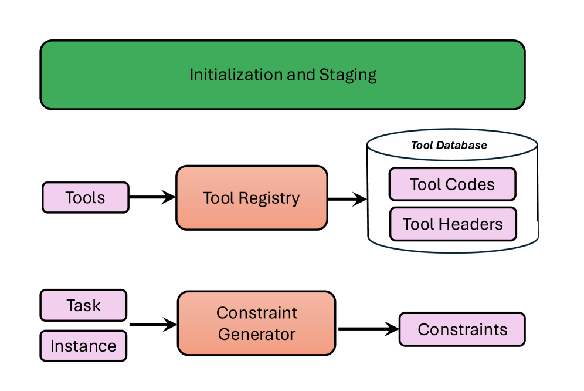
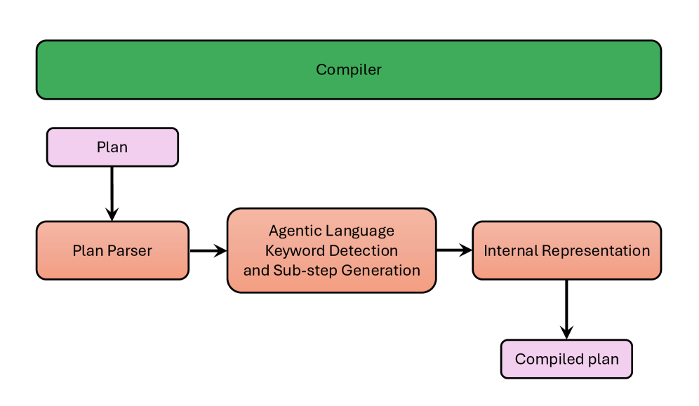

# RunAgent: Interpreting Natural-Language Plans with Constraint-Guided Execution

## 基本信息

- **arXiv ID:** [2605.00798v1](https://arxiv.org/abs/2605.00798v1)
- **作者:** Arunabh Srivastava (University of Maryland), Mohammad A. Khojastepour, Srimat Chakradhar (NEC Labs America), Sennur Ulukus (University of Maryland)
- **发布日期:** 2026-05-01
- **分类:** cs.LG, cs.CL, cs.MA
- **PDF:** [arXiv PDF](https://arxiv.org/pdf/2605.00798v1)

## 关键图示

<figure><figcaption>Figure 1: RunAgent 整体架构，包含三个主要模块：初始化与分级、编译器、执行器。</figcaption></figure>
<figure><figcaption>Figure 2: 初始化与分级模块，负责工具注册、约束生成和参数设置。</figcaption></figure>
<figure><figcaption>Figure 3: 编译器模块，将自然语言计划解析为内部表示，检测智能体语言关键词（IF、GOTO、FORALL）并生成对应子步骤。</figcaption></figure>

## 摘要

Humans solve problems by executing targeted plans, yet large language models (LLMs) remain unreliable for structured workflow execution. We propose RunAgent, a multi-agent plan execution platform that interprets natural-language plans while enforcing stepwise execution through constraints and rubrics. RunAgent bridges the expressiveness of natural language with the determinism of programming via an agentic language with explicit control constructs (e.g., IF, GOTO, FORALL). RunAgent autonomously derives and validates constraints based on the description of the task and its instance at each step, dynamically selects among LLM-based reasoning, tool usage, and code generation, and incorporates error correction mechanisms to ensure correctness. Evaluations on Natural-plan and SciBench Datasets demonstrate that RunAgent outperforms baseline LLMs and state-of-the-art PlanGEN methods.

## 核心贡献

- 提出 RunAgent，一个多智能体计划执行平台，通过约束和评分标准强制逐步执行自然语言计划。
- 设计了一种"智能体语言"（agentic language），在保持自然语言表达力的同时引入 IF、GOTO、FORALL 等显式控制结构，桥接编程语言的确定性与自然语言的灵活性。
- 实现了自主约束生成与验证：在初始化阶段从任务和实例自动推导原子约束，在每个步骤执行后进行相关约束检查，确保计划执行的正确性。
- 动态选择执行策略：对每个步骤自主决策使用 LLM 直接推理、Python 代码生成与执行、或工具调用，并包含完善的错误纠正机制和上下文历史过滤。

## 方法概述

RunAgent 由三个核心模块组成。初始化与分级模块负责工具注册（所有工具以 Python 函数形式存储并生成描述供 LLM 工具调用选择）和约束生成（从任务描述和实例中自动推导原子约束列表）。编译器模块将自然语言计划解析为机器可读的 Python 字典结构，检测智能体语言关键词（IF、GOTO、FORALL），生成相应的子步骤和内部执行表示。执行器模块逐步解释和执行编译后的计划，对每一步动态选择 LLM/Python/工具执行模式，执行后进行语义验证和约束/评分标准检查，并在失败时利用错误纠正机制重试直至成功或达到最大重试次数后回退到 LLM 直接执行。

RunAgent 的一个关键设计是上下文历史过滤：在执行下一步之前，仅保留与当前步骤相关的信息，避免上下文窗口膨胀。约束验证采用两步 LLM 流程（先推理后判断），避免单次 LLM 调用可能产生的模糊响应。此外，该系统支持人在回路（HITL）操作，用户可以提供工作流、约束、事实或反馈。

## 实验结果

- **Natural-plan Calendar Scheduling 数据集**：RunAgent 达到 81.1% 的精确匹配准确率，显著优于 PlanGEN Best-of-N + Gemini-2.0-Flash（68.9%）和 RunAgent 自身无约束检查的消融版本（75.4%）。手动检查不匹配案例后，调整准确率可达 86.2%。
- **Natural-plan Trip Planning 数据集**：RunAgent 达到 14.73% 的准确率，显著优于 GPT-4o 直接执行计划（6.69%）和直接求解（3.07%）。尽管绝对值较低，但该任务是极具挑战性的多日行程规划。
- **SciBench Math 数据集**（Stat/Calc/Diff）：RunAgent 分别达到 80.56%/78.05%/62% 的准确率，相较于 GPT-4o 基线的 72.22%/70.73%/50% 有显著提升。有趣的是，让 GPT-4o 执行计划反而略微降低了准确率，这进一步说明仅靠计划生成不够，还需要强制逐步执行的平台。
- **消融实验**：禁用运行时约束检查导致性能从 81.1% 降至 75.4%，验证了约束机制的关键作用。

## 局限性与注意点

- 计划生成不是本文重点，实验中使用了自定义算法（内部使用 GPT-4o）生成计划，计划质量可能影响最终结果。
- 未评估 Meeting Scheduling 数据集（因为该数据集中每个问题存在多个正确答案）。
- 所有 LLM 调用使用 GPT-4o，未测试其他基座模型下 RunAgent 的泛化能力。
- SciBench 评估仅使用 Math 子集（不含图像），且排除了包含图像的一个 Calc 问题。

## 相关概念

- [大语言模型](../../concepts/large-language-model.html)
- [基准评估](../../concepts/benchmarking.html)
- [智能体](../../concepts/ai-agents.html)

---
*导入时间: 2026-05-04 06:01*
*来源: arXiv Daily Wiki Update 2026-05-04*
