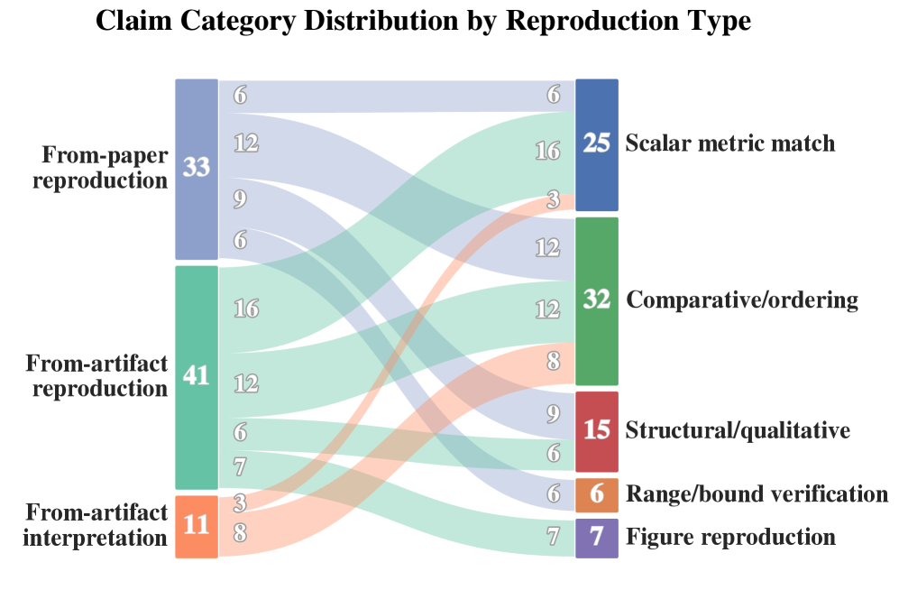

# Can Coding Agents Reproduce Findings in Computational Materials Science?

## 基本信息

- **arXiv ID:** [2605.00803v1](https://arxiv.org/abs/2605.00803v1)
- **作者:** Ziyang Huang, Yi Cao, Ali K. Shargh 等（Johns Hopkins University）
- **发布日期:** 2026-05-01
- **分类:** cs.SE, cs.AI, cs.CL
- **PDF:** [arXiv PDF](https://arxiv.org/pdf/2605.00803v1)
- **项目主页:** https://jhu-clsp.github.io/AutoMat

## 关键图示

<figure><figcaption>Figure 1</figcaption></figure>
<figure><figcaption>Figure 2</figcaption></figure>
<figure><figcaption>Figure 3</figcaption></figure>

## 摘要

Large language models are increasingly deployed as autonomous coding agents and have achieved remarkably strong performance on software engineering benchmarks. However, it is unclear whether such success transfers to computational scientific workflows, where tasks require not only strong coding ability, but also the ability to navigate complex, domain-specific procedures and to interpret results in the context of scientific claims. To address this question, we present AutoMat, a benchmark for evaluating LLM-based agents' ability to reproduce claims from computational materials science. AutoMat poses three interrelated challenges: recovering underspecified computational procedures, navigating specialized toolchains, and determining whether the resulting evidence supports a claim. By working closely with subject matter experts, we curate a set of 85 claims from real materials science papers. Our results show that current LLM-based agents obtain low overall success rates on AutoMat, with the best-performing setting (Claude Code with Opus 4.6) achieving a success rate of only 54.1%. Error analysis reveals that agents perform worst when workflows must be reconstructed from paper text alone and that they fail primarily due to incomplete procedures, methodological deviations, and execution fragility.

## 核心贡献

- 提出 AutoMat 基准，包含 85 个由领域专家（SME）标注的计算材料科学声明，涵盖 DFT、分子动力学、机器学习、离散位错动力学等多个子领域。
- 将科学声明级复现形式化为可运行的基准任务：给定声明和论文（可选工件），智能体需恢复计算流程、实现代码、配置环境、执行工作流并产出支持或反驳声明的证据。
- 评估了五种智能体设置（Claude Code + Opus 4.6/Sonnet 4.6/Kimi K2.5、OpenAI Codex + GPT-5.4 和特定任务编排智能体），发现最好的系统成功率仅 54.1%。
- 揭示了复现失败的主要模式为过程不完整（procedural incompleteness）和方法偏离（methodological deviation），而非代码生成能力不足。

## 方法概述

AutoMat 的构建从计算材料科学论文集合出发，由高级博士生和博士后研究人员作为领域专家，识别适合复现性评估的科学声明并进行标注。每个声明被封装为自包含的任务包，包含声明文本、来源论文、元数据文件和可选的计算工件（代码、数据等）。基准定义了三种声明类型：从论文复现（仅依赖论文中描述的通用工具和公共资源）、从工件复现（配有必要自定义代码/数据的声明）、从工件解释（已有模拟输出，主要进行后处理分析和解读）。

评估采用独立 LLM 评估智能体，与固定提示词评判不同，该评估智能体可以浏览产出的工件目录、检查文件并使用工具收集评估所需信息。评估智能体在 40 个样本上与领域专家进行校准，达到 0.69 的二次加权 Kappa 和 0.80 的 ±1 分一致率。评估采用五点量表（1=失败 到 5=完全复现），成功定义为总分 ≥4。

## 实验结果

- **整体性能**：Claude Code + Opus 4.6 表现最佳，平均复现评分 3.52，成功率 54.1%。Codex + GPT-5.4 最弱，平均评分 2.44，成功率仅 23.5%。没有任何系统成为可靠的科学复现助手。
- **按声明类型**：从论文复现是最难的设置，平均评分 1.5–2.2，成功率接近零。从工件复现相对容易，平均评分 3.1–4.1，成功率 39%–77%。从工件解释的表现也不均衡，成功率 33%–50%，表明科学复现不仅是执行问题，也是解释问题。
- **编排 vs. 通用智能体**：任务特定的编排智能体并未在整体复现成功率上超越 Claude Code + Sonnet（两者平局占 45%）。编排智能体仅在"科学严谨性"维度上显著更优，但在其他维度上存在权衡。
- **失败模式**：过程不完整（47–66% 的运行受影响）和方法偏离（19–32%）是最常见的失败类别。资源和执行失败也较为常见，尤其在编排智能体中。

## 局限性与注意点

- AutoMat 目前仅覆盖 85 个声明，且来自单一（虽广泛）的科学领域，声明类型的分布反映了专家数据收集的实际限制。
- 基准侧重于已被识别为可复现的声明，未直接评估智能体识别真正不可复现声明的能力。
- 评估智能体虽与人类专家校准，但自动化判断应被理解为可扩展的近似，而非替代专家评估。
- 未来工作应扩展领域覆盖和声明类型、纳入不可复现或对抗性案例，并进行大规模人类评估。

## 相关概念

- [大语言模型](../../concepts/large-language-model.html)
- [基准评估](../../concepts/benchmarking.html)
- [智能体](../../concepts/ai-agents.html)

---
*导入时间: 2026-05-04 06:01*
*来源: arXiv Daily Wiki Update 2026-05-04*
