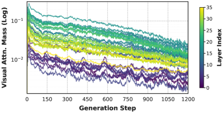
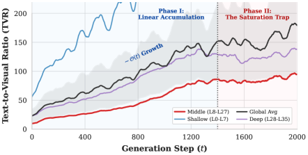

# Persistent Visual Memory: Sustaining Perception for Deep Generation in LVLMs

## 基本信息

- **arXiv ID:** [2605.00814v1](https://arxiv.org/abs/2605.00814v1)
- **作者:** Siyuan Huang (上海 AI 实验室/上海交大), Xiaoye Qu (上海 AI 实验室), Yafu Li (港中文) 等
- **发布日期:** 2026-05-01
- **分类:** cs.CV, cs.AI
- **代码:** https://github.com/huaixuheqing/PVM

## 关键图示

<figure><figcaption>Figure 1: 视觉记忆机制对比。标准 LVLM 因视觉稀释而退化，注入方法导致序列干扰，而 PVM 建立独立的检索路径，在不干扰自回归流的情况下保持视觉强度。</figcaption></figure>
<figure><figcaption>Figure 2: 视觉信号的幂律衰减。对数尺度分析确认 Ω_V 严格遵循定理 3.1 预测的 O(t⁻¹) 轨迹。</figcaption></figure>
<figure><figcaption>Figure 3: 文本主导性（TVR）的演变。TVR 轨迹验证了两阶段稀释机制：线性增长后饱和到严格均衡，文本先验在结构上压倒视觉信号。</figcaption></figure>

## 摘要

While autoregressive Large Vision-Language Models (LVLMs) demonstrate remarkable proficiency in multimodal tasks, they face a "Visual Signal Dilution" phenomenon, where the accumulation of textual history expands the attention partition function, causing visual attention to decay inversely with generated sequence length. To counteract this, we propose Persistent Visual Memory (PVM), a lightweight learnable module designed to ensure sustained, on-demand visual perception. Integrated as a parallel branch alongside the Feed-Forward Network (FFN) in LVLMs, PVM establishes a distance-agnostic retrieval pathway that directly provides visual embeddings for precise visual perception, thereby structurally mitigating the signal suppression inherent to deep generation. Extensive experiments on Qwen3-VL models demonstrate that PVM brings notable improvements with negligible parameter overhead, delivering consistent average accuracy gains across both 4B and 8B scales, particularly in complex reasoning tasks that demand persistent visual perception.

## 核心贡献

- 对"视觉信号稀释"（Visual Signal Dilution）现象进行了严格的数学分析：证明视觉注意力质量 Ω_V(t) 随生成长度 t 呈 O(t⁻¹) 衰减（定理 3.1），并通过 Qwen3-VL-8B 上的"盲画师"压力测试实证验证了幂律衰减轨迹和两阶段稀释机制。
- 提出 PVM（持久视觉记忆），一个轻量可学习模块，作为 FFN 的并行分支集成到 Transformer 解码器中。PVM 通过瓶颈适配器在低维空间中进行跨注意力检索，仅关注固定视觉集合，实现了独立于文本历史的注意力归一化。
- 理论上证明了 PVM 架构结构性缓解视觉稀释：在固定局部隐状态条件下，PVM 的检索表示 h_pvm 对文本历史长度 t 的偏导数为零（定理 4.1），与标准骨干中 Ω_V(t) ∈ O(t⁻¹) 形成对比。
- 在 Qwen3-VL 4B 和 8B 上分别实现 4.4% 和 4.8% 的平均准确率提升，新增参数仅 27.92M（8B 模型的 ~0.32%）。

## 方法概述

PVM 被集成在 Transformer 解码器块的 FFN 旁路，形成双流架构：推理路径（原 FFN）保持预训练的静态知识和逻辑模式，观察路径（PVM）作为主动视觉感知通道。PVM 的计算分三步：投影——通过两个独立的可学习降维矩阵将隐状态 $x$ 和视觉特征 $V_{img}$ 投影到低维空间 $d' < d$；潜在检索——在低维空间执行交叉注意力（$Q=x_{lat}, K=V_{lat}, V=V_{lat}$），后接轻量 FFN，注意力域完全限制在视觉集合 $V$ 上；恢复——通过上投影矩阵恢复到原始高维空间。

PVM 采用带选择性激活的门控融合：通过可学习标量门 λ（初始化为 0 以保留预训练能力）和视觉静音掩码 M_txt（仅对文本 token 激活）进行残差注入。训练分两阶段：第一阶段（SFT）冻结骨干仅训练 PVM 模块和门控标量，使用 526K OpenMMReasoner-SFT 样本建立文本查询与视觉键的语义映射；第二阶段（GRPO）解冻 LLM 骨干和 PVM 模块，使用 3.6K 复杂推理查询通过群组相对策略优化强制激活视觉检索。

## 实验结果

- **综合基准（8B）**：PVM-8B (SFT+GRPO) 在 8 个基准上的平均准确率从基线的 66.7% 提升至 71.5%（+4.8%），超越所有对比方法（MemVR、ICoT、CoMemo、Euclid-8B、PEARL-8B、OneThinker-8B）。
- **数学与科学推理**：在 MathVerse、MathVision、AI2D 上分别达到 58.2%、51.3%、81.2%，显著优于基线和 SFT/LoRA 变体，验证了 PVM 在需要持久视觉感知的复杂推理任务上的优势。
- **4B 扩展性**：PVM-4B 同样实现平均 4.4% 的提升，证明方法在不同规模下的一致性。
- **信号衰减抵抗**：深入分析表明 PVM 能抵抗长度诱导的信号衰减并加速内部预测收敛（通过 LogitLens 验证），而非仅仅增加模型容量。
- **仅 SFT 阶段的贡献**：PVM-8B (SFT only) 已经达到 70.6% 的平均准确率（+3.9% vs 基线），证明 PVM 架构本身即可带来显著增益，GRPO 进一步提升了推理能力。

## 局限性与注意点

- 训练数据量相对较小（SFT 526K + RL 3.6K），更大规模数据的扩展行为尚未探索。
- LogitLens 分析提供了 PVM 加速预测收敛的机制性证据，但该分析方法本身的局限性（仅揭示部分内部表示）需要被考虑。
- 当前仅在 Qwen3-VL 系列上验证，尚未测试其他 LVLM 架构（如 LLaVA 系列）的泛化能力。

## 相关概念

- [大语言模型](../../concepts/large-language-model.html)
- [多模态学习](../../concepts/multimodal-learning.html)

---
*导入时间: 2026-05-04 06:01*
*来源: arXiv Daily Wiki Update 2026-05-04*
