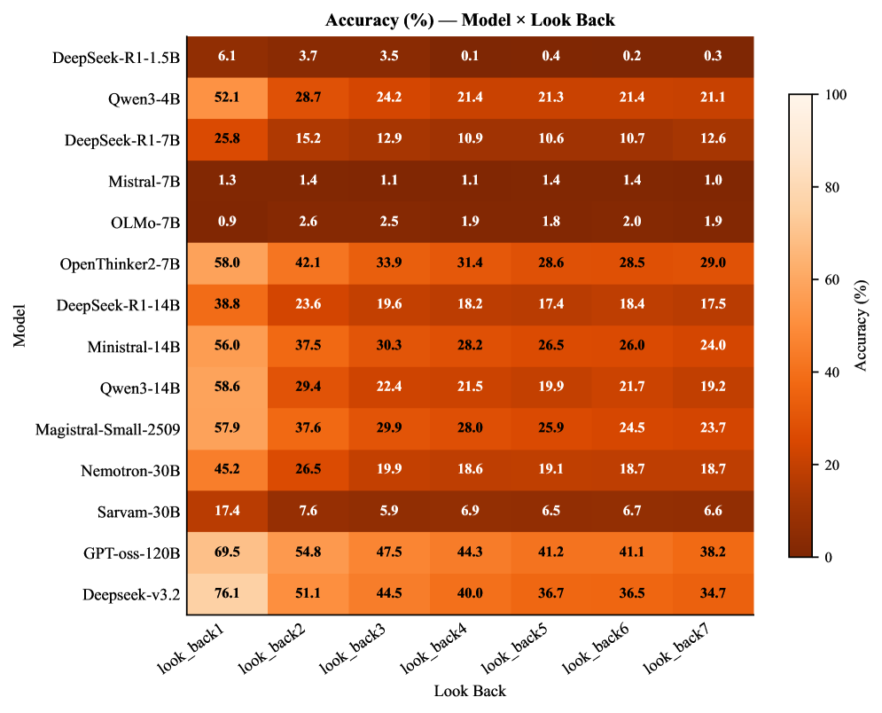
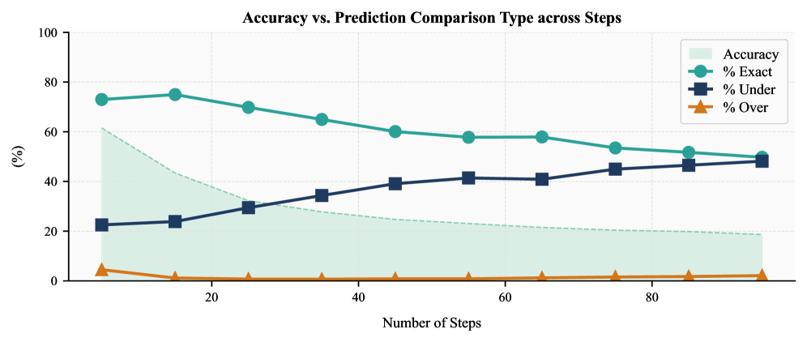

# When LLMs Stop Following Steps: A Diagnostic Study of Procedural Execution in Language Models

## 基本信息

- **arXiv ID:** [2605.00817v1](https://arxiv.org/abs/2605.00817v1)
- **作者:** Sailesh Panda, Pritam Kadasi, Abhishek Upperwal, Mayank Singh (IIT Gandhinagar, Soket AI)
- **发布日期:** 2026-05-01
- **分类:** cs.CL
- **PDF:** [arXiv PDF](https://arxiv.org/pdf/2605.00817v1)

## 关键图示

<figure><figcaption>Figure 1: Accuracy of various language models as a function of algorithmic step count (5–95). Performance consistently declines across all models.</figcaption></figure>
<figure><figcaption>Figure 2: Accuracy (%) of language models under varying look-back dependencies (1–7). Performance generally declines as dependency depth increases.</figcaption></figure>
<figure><figcaption>Figure 3: Accuracy vs. execution behavior. As steps increase, exact executions decrease and under-executed generations rise — failures are driven by incomplete procedural execution.</figcaption></figure>

## 摘要

Large language models (LLMs) often achieve strong performance on reasoning benchmarks, but final-answer accuracy alone does not show whether they faithfully execute the procedure specified in a prompt. We study this question through a controlled diagnostic benchmark for procedural execution, where models are given a step-wise arithmetic algorithm and two numeric inputs, and must return the final computed value. The benchmark uses simple arithmetic operations but increases complexity through algorithm length and look-back dependencies over intermediate variables. Across 14 models and 55 datasets, average first-answer accuracy drops from 61% on 5-step procedures to 20% on 95-step procedures. Generation-level analysis shows that failures often involve missing answers, premature answers, self-correction after an initial error, under-executed traces, and hallucinated extra steps. These findings suggest that apparent reasoning ability can mask substantial weaknesses in faithful instruction execution.

## 核心贡献

- 构建了一个受控诊断基准，包含 55 个数据集和 55,000 个样本，通过步数（5–95 步）和回溯依赖（look-back 1–7）两个维度系统性地衡量 LLM 的过程执行能力。
- 对 14 个模型（1.5B 到 685B，含推理增强模型如 DeepSeek-R1、Qwen3-Thinking 等）进行了全面评估，揭示了模型规模与过程执行能力之间并非简单正相关。
- 提出了超越最终答案正确率的分析框架：区分"精确执行""欠执行""过执行"三种行为，并追踪首个答案位置和空答案率，从生成层面揭示失败模式。
- 发现随着步数增加，欠执行比例从约 24% 升至 51%，说明性能下降的根本原因是模型丧失了对预设过程的跟踪能力，而非仅仅是个别算术错误。

## 方法概述

该研究构建了一个程序化执行诊断基准，每个样例包含一个逐步算术算法和两个数值输入 x、y。算法初始化 S1=x、S2=y，然后定义一系列中间变量通过基本算术运算（加减乘除）递推计算，模型需返回最终计算结果。难度通过两个轴控制：算法步数（从 5 到 95，步长 10）和回溯依赖深度（从 look-back1 到 look-back7），后者要求当前步从之前若干步的中间变量中取值，增加了状态跟踪的难度。

实验评估了 14 个大语言模型，涵盖不同规模（1.5B–685B）和训练范式（包括 RL 推理增强模型）。评估指标不仅包含首个答案正确率和任一答案正确率，还引入了空答案率、答案位置分析，以及基于生成轨迹的步骤执行分类（精确执行、欠执行、过执行）。通过对 55 个数据集共计 55,000 个样本的系统评估，作者分离了算法长度、回溯依赖、输入范围、数据类型和任务类型等因素对模型表现的影响。

## 实验结果

- **算法长度效应**：平均首个答案正确率从 5 步时的 61% 下降到 95 步时的 20%，几乎所有模型都呈现一致的下降趋势。表现最好的模型（GPT-oss-120B、DeepSeek-V3.2）在 95 步时正确率也仅约 35–38%。
- **回溯依赖效应**：增加依赖深度从 look-back1 到 look-back7，平均正确率额外下降 18.43 个百分点。这表明模型不仅难以处理长过程，也难以检索和组合非局部的中间状态。
- **任务类型影响**：纯加法和纯减法任务正确率显著高于纯乘法和纯除法任务。混合运算设置引入了额外的操作切换难度。
- **生成层面分析**：空答案率随步数增加而升高，多个低性能模型频繁产生无有效答案的输出。精确执行比例从约 70.88% 降至 46.84%，而欠执行比例从 24.25% 升至 50.87%。
- **输入范围与数据类型**：[0,1] 范围的浮点输入通常比 [1,10] 和 [10,100] 范围的正确率稍高，但趋势不能仅用输出数值量级解释。

## 局限性与注意点

- 研究仅限于算术运算任务，结论对其他类型推理任务的可推广性需进一步验证。
- 虽然观察到任务复杂度与性能下降之间的强相关性，但在更广泛的任务上评估能够更深入地了解模型的多步推理执行机制。
- 未来工作应考虑工具增强智能体（tool-augmented agents）在执行基础算法时的表现，以缓解当前性能瓶颈。

## 相关概念

- [大语言模型](../../concepts/large-language-model.html)
- [基准评估](../../concepts/benchmarking.html)

---
*导入时间: 2026-05-04 06:01*
*来源: arXiv Daily Wiki Update 2026-05-04*
