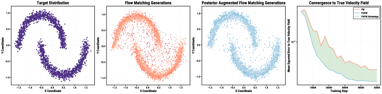
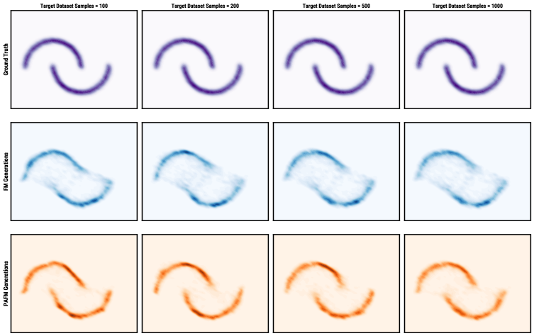

# Posterior Augmented Flow Matching

## 基本信息

- **arXiv ID:** [2605.00825v1](https://arxiv.org/abs/2605.00825v1)
- **作者:** George Stoica (Georgia Tech), Sayak Paul (Hugging Face), Matthew Wallingford (Ai2) 等
- **发布日期:** 2026-05-01
- **分类:** cs.CV
- **代码:** https://github.com/gstoica27/PAFM.git

## 关键图示

<figure><figcaption>Figure 1: 左：标准 FM 提供稀疏的一对一监督信号。右：PAFM 聚合后验分布中所有兼容目标的监督，为每个中间点产生更密集、更连贯的流。</figcaption></figure>
<figure><figcaption>Figure 2: PAFM 比 FM 更鲁棒。FM 训练模型在两弯月之间生成大量伪点（左二），PAFM 训练则基本消除此问题（中右），且 PAFM 对真实速度场的估计误差持续更低。</figcaption></figure>
<figure><figcaption>Figure 3: 在不同模型规模和架构下的 FID50K 结果对比，PAFM 在所有设置下一致优于 FM，带来高达 3.4 FID50K 的改善。</figcaption></figure>

## 摘要

Flow matching (FM) trains a time-dependent vector field that transports samples from a simple prior to a complex data distribution. However, for high-dimensional images, each training sample supervises only a single trajectory and intermediate point, yielding an extremely sparse and high-variance training signal. This under-constrained supervision can cause flow collapse, where the learned dynamics memorize specific source–target pairings, failing to generalize. We introduce Posterior-Augmented Flow Matching (PAFM), a theoretically grounded generalization of FM that replaces single-target supervision with an expectation over an approximate posterior of valid target completions for a given intermediate state and condition. PAFM factorizes this posterior and uses importance sampling to construct a mixture over multiple candidate targets. We prove that PAFM yields an unbiased estimator of the FM objective while substantially reducing gradient variance. Finally, PAFM improves over FM by up to 3.4 FID50K across different model scales and architectures, in both class- and text-conditioned benchmarks, with negligible compute overhead.

## 核心贡献

- 提出 PAFM（后验增强流匹配），将 FM 的单一目标监督扩展为对给定中间状态和条件下所有有效目标后验分布的期望，从理论上解决了 FM 中监督信号稀疏和梯度高方差的问题。
- 证明了 PAFM 是标准 FM 目标的无偏估计量（Theorem 1），并通过自归一化重要性采样（SNIS）理论上将每个中间点的梯度方差降低了 ESS(z_t^i) ≥ 1 倍（Theorem 2）。
- 展示了 PAFM 在实践中高度灵活：候选目标集可以通过 FAISS k-近邻检索、随机裁剪增强、VAE 矩分布重采样等多种策略构建，且重要性权重自动调整目标的后验似然。
- 在 ImageNet-1K 和 CC12M 两个基准上，跨越 SiT-B/2、SiT-XL/2、MMDiT 等不同架构和规模，PAFM 一致提升 FM 性能，最大改善达 3.4 FID50K。

## 方法概述

PAFM 的核心思想是：对任意中间隐变量 z_t^i 和条件 y^i，数据分布中存在多个满足该条件的有效目标 z^j，而非仅一个。PAFM 训练模型预测所有可能延续轨迹上速度的加权期望，权重由后验分布决定。由于真实后验 p_t(z^j|z_t^i, y^i) 不可直接采样，PAFM 将其分解为两个可近似的部分：条件概率路径 p_t(z_t^i|z^j)（描述从给定目标到达当前隐变量的可能性）和条件似然 p_t(y^i|z^j)（描述目标与条件的兼容度）。

实践训练中，PAFM 对每个中间点采样 K ≥ 1 个候选目标，通过 SNIS 计算权重 w_j ∝ p_t(z_t^i|z^j)·p_t(y^i|z^j)，并以加权速度 v̄ = Σ w_j·v(z_t^i|z^j) 作为监督信号。当 K=1 时 PAFM 退化为标准 FM。在类条件生成中 p_t(y^i|z^j) 是确定性的（标签匹配），在文本到图像生成中可采用 CLIP 等视觉语言模型近似。候选目标选择策略是 PAFM 的核心灵活性所在，论文探索了三种策略：FAISS 检索、VAE 矩扰动、随机裁剪增强。

## 实验结果

- **合成实验（两弯月分布）**：FM 训练 50K 步后仍在两弯月间生成大量伪点，而 PAFM 基本消除此问题。PAFM 对真实速度场的 MSE 持续下降并最终收敛到远低于 FM 的误差水平。
- **ImageNet-1K 类条件生成**：在 SiT-B/2 上，PAFM 在不同候选策略下将 FID50K 从 FM 基线的 5.62 改善至 2.95–3.41（改善 2.2–2.7 FID）。在 SiT-XL/2 上，改善达 3.4 FID50K。
- **CC12M 文本到图像生成（MMDiT）**：PAFM 在多种候选策略下一致优于 FM 基线，验证了方法在文本条件生成场景中的有效性。
- **计算开销**：PAFM 的额外计算开销可忽略不计（仅增加候选目标集的构建和加权计算），无需改变模型架构或增加推理成本。

## 局限性与注意点

- 候选目标选择策略是 PAFM 的主要设计自由度，最优策略可能因数据模态和训练设置而异，论文仅探索了三种策略。
- 在文本条件生成实验中，条件似然 p_t(y^i|z^j) 未使用 CLIP 等高级近似，而是采用了朴素的类条件变体，可能限制了性能进一步提升的空间。
- 论文强调 PAFM 是一个通用框架，理论上兼容几乎所有候选选择策略，但大量实际变体尚未探索。

## 相关概念

- [多模态学习](../../concepts/multimodal-learning.html)
- [基准评估](../../concepts/benchmarking.html)

---
*导入时间: 2026-05-04 06:01*
*来源: arXiv Daily Wiki Update 2026-05-04*
