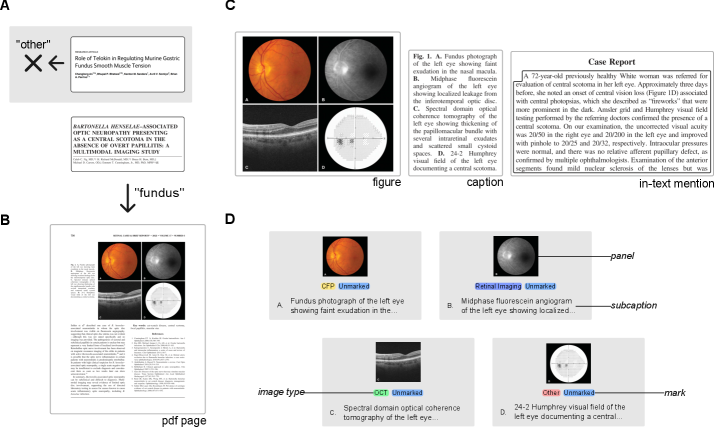
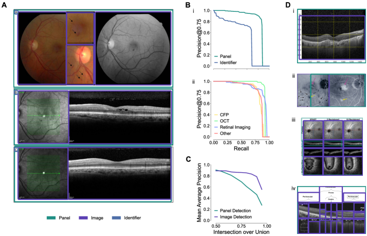
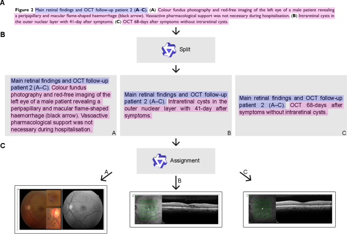

# PubMed-Ophtha: An open resource for training ophthalmology vision-language models on scientific literature

## 基本信息

- **arXiv ID:** [2605.02720v1](https://arxiv.org/abs/2605.02720v1)
- **作者:** Verena Jasmin Hallitschke, Carsten Eickhoff, Philipp Berens
- **发布日期:** 2026-05-04
- **分类:** cs.CV, cs.CL
- **PDF:** [arXiv PDF](https://arxiv.org/pdf/2605.02720v1)

## 关键图示

<figure><figcaption>Figure 1</figcaption></figure>
<figure><figcaption>Figure 2</figcaption></figure>
<figure><figcaption>Figure 3</figcaption></figure>

## 摘要

### English

Vision-language models hold considerable promise for ophthalmology, but their development depends on large-scale, high-quality image-text datasets that remain scarce. We present PubMed-Ophtha, a hierarchical dataset of 102,023 ophthalmological image-caption pairs extracted from 15,842 open-access articles in PubMed Central. Unlike existing datasets, figures are extracted directly from article PDFs at full resolution and decomposed into their constituent panels, panel identifiers, and individual images. Each image is annotated with its imaging modality -- color fundus photography, optical coherence tomography, retinal imaging, or other -- and a mark status indicating the presence of annotation marks such as arrows. Figure captions are split into panel-level subcaptions using a two-step LLM approach, achieving a mean average sentence BLEU score of 0.913 on human-annotated data. Panel and image detection models reach a mAP@0.50 of 0.909 and 0.892, respectively, and figure extraction achieves a median IoU of 0.997. To support reproducibility, we additionally release the human-annotated ground-truth data, all trained models, and the full dataset generation pipeline.

### 中文

视觉语言模型在眼科领域具有巨大潜力，但其发展依赖于目前稀缺的大规模高质量图像-文本数据集。我们提出 PubMed-Ophtha，一个从 PubMed Central 的 15,842 篇开放获取文章中提取的 102,023 对眼科图像-标题的分层数据集。与现有数据集不同，图像直接从文章 PDF 中以全分辨率提取，并分解为组成面板、面板标识符和单独图像。每张图像标注了成像模态（彩色眼底照相、光学相干断层扫描、视网膜成像或其他）以及指示箭头等标注标记的标记状态。使用两步 LLM 方法将图标题拆分为面板级子标题，在人工标注数据上达到平均句子 BLEU 0.913。面板和图像检测模型的 mAP@0.50 分别达 0.909 和 0.892，图像提取的中位 IoU 为 0.997。为支持可复现性，我们还发布了人工标注真实数据、所有训练模型和完整数据集生成流程。

## 核心贡献

1. **PubMed-Ophtha 数据集**：首个大规模（102K 对）眼科科学文献图像-标题数据集，填补了眼科视觉语言模型训练数据稀缺的空白。
2. **全分辨率 PDF 提取流程**：直接从文章 PDF 以全分辨率提取图像，区别于现有数据集的低分辨率缩略图，并分解为面板和子图像级别。
3. **LLM 驱动的标题分割**：两步 LLM 方法将图标题分割为面板级子标题（句子 BLEU 0.913），显著优于简单的正则表达式分割。
4. **完整开源**：发布数据集、人工标注真实数据、训练模型和完整数据生成流程，支持可复现研究。

## 方法概述

PubMed-Ophtha 的数据生成流程包括以下步骤：

1. **文章检索与过滤**：从 PubMed Central 检索眼科学相关的开放获取文章，筛选包含图像的文章（最终 15,842 篇）。
2. **PDF 图像提取**：使用 PDF 解析工具直接提取全分辨率图像，检测图像边框（中位 IoU 0.997），将复合图分解为面板（mAP@0.50: 0.909）和单独图像（mAP@0.50: 0.892）。
3. **模态分类与标记检测**：对每张图像标注成像模态（彩色眼底照相、OCT、视网膜成像、其他）和标记状态（是否有箭头等标注）。
4. **标题分割**：两步 LLM 方法——第一步识别标题中描述每个面板的文本片段，第二步将这些片段与对应面板关联。在人工标注子集上验证（句子 BLEU 0.913）。
5. **质量过滤**：移除低分辨率、纯文本表格、无医学内容的图像。

## 实验结果

- **数据集规模**：102,023 图像-标题对，来自 15,842 篇文章。
- **面板检测**：mAP@0.50 = 0.909（YOLO 检测器）。
- **图像检测**：mAP@0.50 = 0.892。
- **图像提取 IoU**：中位 0.997。
- **标题分割**：平均句子 BLEU 0.913（vs 人工标注）。
- **模态分布**：彩色眼底照相占比最高，其次是 OCT 和视网膜成像。
- **标注标记**：约 30% 的图像含箭头或其他标注标记。

## 局限性与注意点

- **仅限于 PubMed Central OA**：仅覆盖开放获取文章，付费订阅期刊中的眼科学图像未包含——可能存在选择偏差。
- **模态分类粒度有限**：仅分为 4 大类（彩色眼底、OCT、视网膜成像、其他），更细粒度的模态分类（如荧光血管造影、OCT-A）未标注。
- **标题质量依赖**：标题分割质量依赖于原始图标题的质量，描述不完整或不准确的标题会影响子标题的准确性。
- **临床验证缺乏**：数据集未经临床专家大规模验证，模态分类和标记检测可能存在标注噪声。
- **仅英文文献**：仅限于 PubMed Central 的英文文章，非英文眼科文献未包含。

## 相关概念（详细）

- **视觉语言模型 (Vision-Language Models)**：同时处理图像和文本的多模态模型。PubMed-Ophtha 为眼科领域提供了首个大规模科学文献训练数据。
- **医学图像数据集**：医学 AI 的基石。PubMed-Ophtha 区别于临床图像数据集（如 EyePACS），聚焦于科学文献中的图像，可用于训练文献理解模型。
- **PDF 图像提取**：从学术 PDF 中自动提取和分解图像是文献挖掘的重要技术。本文的全分辨率提取流程为后续工作提供了参考。

## 相关概念

- [大语言模型](../../concepts/large-language-model.html)
- [多模态学习](../../concepts/multimodal-learning.html)
- [基准评估](../../concepts/benchmarking.html)
- [图神经网络](../../concepts/graph-neural-networks.html)

---
*导入时间: 2026-05-05 06:01*
*来源: arXiv Daily Wiki Update 2026-05-05*
