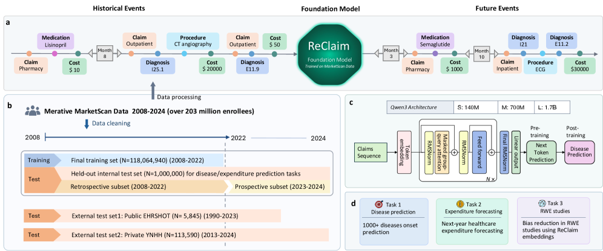
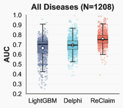
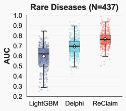

# Foundation Models to Unlock Real-World Evidence from Nationwide Medical Claims

## 基本信息

- **arXiv ID:** [2605.02740v1](https://arxiv.org/abs/2605.02740v1)
- **作者:** Fan Ma, Yuntian Liu, Xiang Lan et al.
- **发布日期:** 2026-05-04
- **分类:** cs.AI, cs.CL
- **PDF:** [arXiv PDF](https://arxiv.org/pdf/2605.02740v1)

## 关键图示

<figure><figcaption>Figure 1</figcaption></figure>
<figure><figcaption>Figure 2</figcaption></figure>
<figure><figcaption>Figure 3</figcaption></figure>

## 摘要

### English

Evidence derived from large-scale real-world data (RWD) is increasingly informing regulatory evaluation and healthcare decision-making. Administrative claims provide population-scale, longitudinal records of healthcare utilization, expenditure, and detailed coding of diagnoses, procedures, and medications, yet their potential as a substrate for healthcare foundation models remains largely unexplored. Here we present ReClaim, a generative transformer trained from scratch on 43.8 billion medical events from more than 200 million enrollees in the MarketScan claims data spanning 2008-2022. ReClaim models longitudinal trajectories across diagnoses, procedures, medications, and expenditure, and was scaled to 140 million, 700 million, and 1.7 billion parameters. Across over 1,000 disease-onset prediction tasks, ReClaim achieved a mean AUC of 75.6%, substantially outperforming disease-specific LightGBM (66.3%) and the transformer-based Delphi model (69.4%), with the largest gains for rare diseases. These advantages held across retrospective and prospective evaluations and in external validation on two independent datasets. Performance improved monotonically with scale, and post-training added 13.8 percentage points over pre-training alone. Beyond disease prediction, ReClaim captured financial outcomes and improved real-world evidence (RWE) analyses: for healthcare expenditure forecasting it increased explained variance from 0.28 to 0.37 relative to LightGBM, and in a target trial emulation it reduced systematic bias by 72% on average relative to Delphi.

### 中文

来自大规模真实世界数据的证据越来越多地影响监管评估和医疗决策。行政索赔提供了人口级别的医疗利用、支出以及诊断、程序和药物的详细编码的纵向记录，但其作为医疗基础模型基础的潜力尚未被充分探索。本文提出 ReClaim，一个从头在 MarketScan 索赔数据（2008-2022 年，超 2 亿参保人、438 亿医疗事件）上训练的生成式 Transformer。ReClaim 对诊断、程序、药物和支出的纵向轨迹进行建模，并扩展到 1.4 亿、7 亿和 17 亿参数。在 1000+ 疾病发病预测任务上，ReClaim 平均 AUC 达 75.6%，大幅优于疾病特异性 LightGBM（66.3%）和基于 Transformer 的 Delphi 模型（69.4%），罕见疾病的提升最大。这些优势在回顾性和前瞻性评估以及两个独立数据集的外部验证中均成立。性能随规模单调提升，训练后相比仅预训练增加 13.8 个百分点。除疾病预测外，ReClaim 还捕获了财务结果——医疗支出预测中将解释方差从 0.28 提升到 0.37（相对 LightGBM），目标试验模拟中平均减少 72% 的系统偏差（相对 Delphi）。

## 核心贡献

1. **医疗索赔基础模型 ReClaim**：首次将生成式 Transformer 大规模应用于全国性医疗索赔数据（438 亿事件），证明了行政索赔作为基础模型训练基质的可行性。
2. **规模定律验证**：在 140M → 700M → 1.7B 参数三个规模上验证了性能单调提升，确认了医疗基础模型的规模收益。
3. **全面临床预测**：在 1000+ 疾病发病预测任务上取得 SOTA（75.6% AUC），特别是罕见疾病（LightGBM 处理不好）获得最大收益。
4. **真实世界证据改进**：展示了基础模型在医疗支出预测（解释方差 0.28→0.37）和目标试验模拟（偏差减少 72%）中的实际价值。
5. **跨时间跨数据源泛化**：在回顾性/前瞻性评估和两个独立外部数据集上均验证了泛化能力。

## 方法概述

ReClaim 基于 GPT 风格的 decoder-only Transformer 架构，从头在 MarketScan 医疗索赔数据上训练。关键设计选择：

- **事件序列化**：将每位患者的纵向医疗事件（诊断 ICD 码、程序 CPT 码、药物 NDC 码、支出金额）序列化为时间有序的 token 序列，类似语言建模中的句子。
- **多任务训练**：预训练阶段使用下一个事件预测（类比 next-token prediction），后训练阶段（post-training）加入疾病预测、支出预测等监督任务。
- **三规模验证**：训练了 140M、700M、1.7B 三个规模的模型，验证规模定律。
- **评估协议**：1000+ 疾病发病预测（二分类）、医疗支出预测（回归）、目标试验模拟（因果推断偏差评估），覆盖回顾性、前瞻性和外部验证。

## 实验结果

- **疾病预测**：ReClaim 1.7B 平均 AUC 75.6%，LightGBM 66.3%，Delphi 69.4%。罕见病（<1000 样本）上的提升最大。
- **规模定律**：140M → 700M → 1.7B，AUC 单调增长（约每翻倍规模 +2-3 个百分点）。
- **后训练增益**：post-training 在预训练基础上额外增加 13.8 个百分点 AUC。
- **医疗支出预测**：解释方差 R² 从 LightGBM 的 0.28 提升到 0.37。
- **目标试验模拟**：平均系统性偏差相对 Delphi 减少 72%。
- **外部验证**：在两个独立数据集上的表现一致优于基线。

## 局限性与注意点

- **单一数据源**：仅基于 MarketScan（美国商业保险索赔），未包含 Medicare/Medicaid 等公共保险数据，人口覆盖有偏。
- **编码系统依赖**：严重依赖 ICD/CPT/NDC 编码体系，编码错误和编码实践变化可能影响模型泛化。
- **隐私与合规**：医疗索赔数据的隐私限制可能阻碍模型开源和广泛验证。
- **因果推断局限**：目标试验模拟减少偏差不等同于因果推断正确，仍受限于观测数据的混杂因素。
- **模型体量**：1.7B 参数在当今基础模型中仍偏小，更大规模（如 7B+）的性能上限未知。

## 相关概念（详细）

- **医疗基础模型 (Healthcare Foundation Models)**：在医疗数据上预训练的大模型。ReClaim 首次将行政索赔确立为可行的大规模训练基质。
- **真实世界证据 (Real-World Evidence, RWE)**：从真实世界数据中得出的临床证据。ReClaim 展示了基础模型在 RWE 生成中的应用潜力。
- **纵向患者建模**：对患者时间序列医疗事件的建模。ReClaim 的序列化方案为医疗 Transformer 提供了新范式。

## 相关概念

- [大语言模型](../../concepts/large-language-model.html)
- [基准评估](../../concepts/benchmarking.html)
- [医学AI](../../concepts/medical-ai.html)

---
*导入时间: 2026-05-05 06:01*
*来源: arXiv Daily Wiki Update 2026-05-05*
