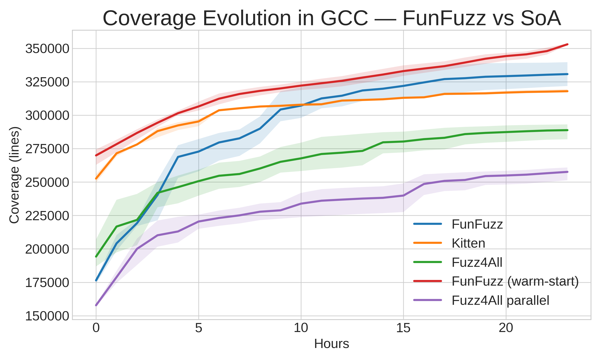

# FunFuzz: An LLM-Powered Evolutionary Fuzzing Framework

## 基本信息

- **arXiv ID:** [2605.02789v1](https://arxiv.org/abs/2605.02789v1)
- **作者:** Mario Rodríguez Béjar, B. Romera-Paredes, Jose L. Hernández-Ramos
- **发布日期:** 2026-05-04
- **分类:** cs.CR, cs.CL
- **PDF:** [arXiv PDF](https://arxiv.org/pdf/2605.02789v1)

## 关键图示

<figure><figcaption>Figure 1</figcaption></figure>
<figure><figcaption>Figure 2</figcaption></figure>
<figure><figcaption>Figure 3</figcaption></figure>

## 摘要

### English

Modern fuzzers increasingly use Large Language Models (LLMs) to generate structured inputs, but LLM-driven fuzzing is sensitive to prompt initialization and sampling variance, which can reduce exploration efficiency and lead to redundant inputs. We present FunFuzz, a multi-island evolutionary fuzzing framework that runs several isolated searches in parallel and periodically migrates high-value candidates to maintain diversity. FunFuzz derives initial generation prompts from documentation and initializes islands with topic-specific instructions, then continuously adapts prompts using feedback-guided selection. During fuzzing, candidates are prioritized by incremental compiler coverage, while compiler-internal failure signals are used to identify crash-inducing inputs. We evaluate FunFuzz on compiler fuzzing, where inputs are source programs and success is measured by compiler coverage and unique compiler-internal failures. Across repeated 24-hour campaigns on GCC and Clang, FunFuzz achieves higher compiler coverage than previous LLM-driven baselines and discovers more unique failure-triggering inputs.

### 中文

现代模糊测试器越来越多地使用大语言模型生成结构化输入，但 LLM 驱动的模糊测试对提示初始化和采样方差敏感，可能降低探索效率并产生冗余输入。我们提出 FunFuzz，一个多岛演化模糊测试框架，并行运行多个隔离搜索并周期性迁移高价值候选以维持多样性。FunFuzz 从文档中提取初始生成提示，用主题特定指令初始化各岛，然后通过反馈引导选择持续调整提示。模糊测试过程中，候选程序按增量编译器覆盖率排序，编译器内部故障信号用于识别崩溃触发输入。我们在编译器模糊测试上评估 FunFuzz（输入为源程序，成功指标为编译器覆盖率和唯一内部故障），在 GCC 和 Clang 上重复 24 小时测试，FunFuzz 实现了比以往 LLM 驱动基线更高的编译器覆盖率，并发现更多唯一的故障触发输入。

## 核心贡献

1. **多岛演化模糊测试框架**：将 FunSearch 的多岛机制适配到模糊测试领域，通过并行隔离搜索和周期性迁移，在 LLM 驱动的模糊测试中有效缓解过早收敛问题。
2. **文档驱动的提示蒸馏与双温度初始化**：从目标文档中蒸馏出高质量提示，并通过低/高温双批次采样的种子指令初始化，既保证编译通过率又鼓励语义多样性。
3. **基于编译器覆盖率的适应度评分**：以增量编译器覆盖率作为主要适应度信号，结合编译器内部故障检测的轻量级预言机，实现了编译器模糊测试的全流程自动化。
4. **跨 GCC/Clang 验证**：在两大主流编译器上 24 小时重复实验，证明方法在不同编译器目标上的泛化性。

## 方法概述

FunFuzz 分为两个阶段：

**第一阶段：提示蒸馏与初始化。** 给定目标文档（手册、语言规范等），蒸馏 LLM 生成候选提示，生成模型从每个候选中采样程序，FunFuzz 以编译通过率选择基础提示。然后通过低温和高温两次批量采样生成种子指令（如"分配模式"、"控制流"等主题），将评分更高的批次分配给各岛作为初始提示。

**第二阶段：演化模糊测试循环。** 每个岛独立运行演化搜索：生成 LLM 从当前提示采样一批候选程序 → 规范化处理（移除畸形 #include、拆分多程序输出）→ 编译并计算边际覆盖率 → 轻量级故障预言机检测编译器崩溃/内部错误 → 基于 softmax 适应度选择候选 → 更新提示（融合基础提示 + 选中程序 + 变换指令：new/mutate/rephrase）。每 3 小时触发跨岛迁移：按覆盖率排名，强岛（前 51%）共享 10% 种群给弱岛，弱岛移除最低 30% 种群但保留搜索上下文（软恢复，区别于 FunSearch 的硬重置）。

适应度函数基于增量编译器覆盖率，温度调度从探索逐渐过渡到利用。

## 实验结果

- **编译器覆盖率**：在 GCC 和 Clang 的 24 小时模糊测试中，FunFuzz 覆盖率超越先前 LLM 驱动基线（如 Fuzz4All）。
- **唯一故障发现**：发现更多唯一的编译器内部故障触发输入。
- **多岛效果**：相比单岛搜索，多岛并行 + 迁移策略在覆盖率增长曲线上持续领先，证明了多样性维护的有效性。
- **双温度初始化**：低/高温双批次种子初始化相比单一温度方案提升了初始阶段的覆盖率增长速率。

## 局限性与注意点

- **仅限编译器模糊测试**：仅在 GCC/Clang 上验证，虽然声称 SUT-agnostic（系统无关），但其他目标（如 JavaScript 引擎、数据库）的泛化性未验证。
- **超参数未调优**：迁移间隔（3 小时）、种群分享比例（10%）、弱岛恢复比例（30%）等超参数使用固定值，可能不适用于所有场景。
- **轻量级预言机限制**：仅检测编译器崩溃和内部错误，无法检测语义错误（如错误优化），可能遗漏重要的正确性 bug。
- **计算资源需求**：多岛并行需要多个 LLM 实例和编译器实例，资源消耗较大。
- **24 小时时间窗口**：实验时长固定为 24 小时，更长时间尺度上的行为（如覆盖率收益递减）未报告。

## 相关概念（详细）

- **模糊测试 (Fuzzing)**：通过生成大量输入测试目标系统稳定性的技术。FunFuzz 将 LLM 驱动的生成与演化搜索结合，开创了 LLM-Fuzzing 的新范式。
- **演化算法 (Evolutionary Algorithms)**：模拟自然选择的优化方法。FunFuzz 的岛模型 + 迁移机制直接受 FunSearch 启发，适配到模糊测试领域。
- **大语言模型代码生成**：利用 LLM 生成结构化代码（C 程序）作为模糊测试输入，核心挑战在于保持生成多样性和语法正确性。

## 相关概念

- [大语言模型](../../concepts/large-language-model.html)

---
*导入时间: 2026-05-05 06:01*
*来源: arXiv Daily Wiki Update 2026-05-05*
