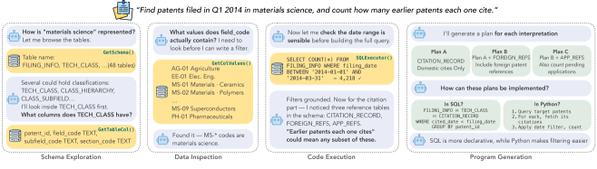
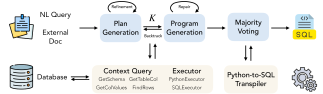
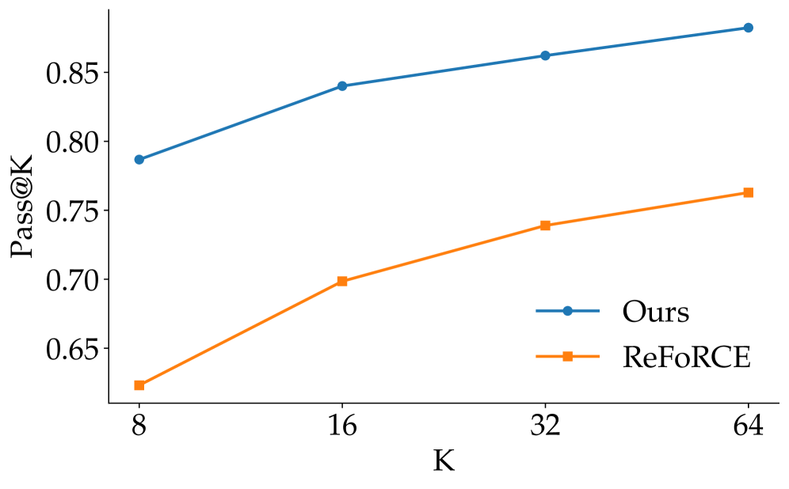

# FlexSQL: Flexible Exploration and Execution Make Better Text-to-SQL Agents

## 基本信息

- **arXiv ID:** [2605.02815v1](https://arxiv.org/abs/2605.02815v1)
- **作者:** Quang Hieu Pham, Yang He, Ping Nie et al.
- **发布日期:** 2026-05-04
- **分类:** cs.CL
- **PDF:** [arXiv PDF](https://arxiv.org/pdf/2605.02815v1)

## 关键图示

<figure><figcaption>Figure 1</figcaption></figure>
<figure><figcaption>Figure 2</figcaption></figure>
<figure><figcaption>Figure 3</figcaption></figure>

## 摘要

### English

Text-to-SQL over large analytical databases requires navigating complex schemas, resolving ambiguous queries, and grounding decisions in actual data. Most current systems follow a fixed pipeline where schema elements are retrieved once upfront and the database is only revisited for post-hoc repair, limiting recovery from early mistakes. We present FlexSQL, a text-to-SQL agent whose core design principle is flexible database interaction: the agent can explore schema structure, inspect data values, and run verification queries at any point during reasoning. FlexSQL generates diverse execution plans to cover multiple query interpretations, implements each plan in either SQL or Python depending on the task, and uses a two-tiered repair mechanism that can backtrack from code-level errors to plan-level revisions. On Spider2-Snow, using gpt-oss-120b, FlexSQL achieves a 65.4\% score, outperforming strong open-source baselines that use stronger, larger models such as gpt-o3 and DeepSeek-R1. When integrated into a general-purpose coding agent (as skills in Claude Code), our approach yields over 10\% relative improvement on Spider2-Snow. Further analysis shows that flexible exploration and flexible execution jointly contribute to the effectiveness of our approach, highlighting flexibility as a key design principle. Our code is available at: https://github.com/StringNLPLAB/FlexSQL

### 中文

面向大型分析数据库的 Text-to-SQL 需要导航复杂 schema、消歧模糊查询以及基于实际数据做出决策。现有大多数系统采用固定流水线——schema 元素一次性预先检索，数据库仅用于事后修复，限制了从早期错误中恢复的能力。我们提出 FlexSQL，一个以灵活的数据库交互为核心设计原则的 Text-to-SQL 智能体：该智能体可以在推理过程中的任何时刻探索 schema 结构、检查数据值并运行验证查询。FlexSQL 生成多样化的执行计划以覆盖多种查询解释，根据任务需求用 SQL 或 Python 实现每个计划，并使用双层修复机制，可从代码级错误回溯到计划级修正。在 Spider2-Snow 上使用 gpt-oss-120b，FlexSQL 取得 65.4% 的得分，优于使用更强更大模型（如 gpt-o3、DeepSeek-R1）的开源基线方法。当集成到通用编程智能体（Claude Code 技能）中时，该方法在 Spider2-Snow 上实现了超过 10% 的相对改进。进一步分析表明，灵活探索与灵活执行共同贡献于方法的有效性，凸显了灵活性作为关键设计原则的地位。

## 核心贡献

1. **灵活数据库交互范式**：提出 FlexSQL，首个以灵活的即时数据库交互为核心设计原则的 Text-to-SQL 智能体，区别于传统"一次性检索 schema、事后修复"的固定流水线。
2. **多样化执行计划生成**：智能体生成覆盖多种查询解释的多样化执行计划，支持 SQL 和 Python 两种实现方式，能处理需要复杂数据操作（如统计分析）的查询。
3. **双层修复机制**：独创从代码级错误回溯到计划级修正的修复策略，显著提升错误恢复能力。
4. **强基线超越**：使用 gpt-oss-120b 在 Spider2-Snow 上取得 65.4% 得分，超越使用更大更强模型（gpt-o3、DeepSeek-R1）的基线方案。

## 方法概述

FlexSQL 的工作流程分为四个阶段：

1. **数据库探索（Database Exploration）**：智能体不一次性检索所有 schema 元素，而是在推理过程中根据需要随时访问数据库——可以探索 schema 结构（表、列、关系）、检查数据值（采样实际数据）、运行验证查询确认假设。这种"按需探索"模式使得早期误解可以被及时纠正。
2. **计划生成（Plan Generation）**：基于探索结果，生成多个执行计划来覆盖不同的查询解释（如歧义消解），每个计划包含一系列 SQL 或 Python 步骤。
3. **执行与验证（Execution & Verification）**：执行生成的计划，对比结果与原始问题的语义一致性。使用数据库执行反馈来验证正确性。
4. **双层修复（Two-Tiered Repair）**：第一层是代码级修复（Code-Level Repair）——修正 SQL 语法错误、类型不匹配等；若低层修复无效则触发第二层——计划级修订（Plan-Level Revision），回溯并重新生成执行计划。

## 实验结果

- **Spider2-Snow 主结果**：FlexSQL + gpt-oss-120b 得分 65.4%，超越 gpt-o3（63.2%）、DeepSeek-R1（61.8%）等更强模型。
- **通用编程智能体集成**：作为 Claude Code 技能集成后，在 Spider2-Snow 上相对改进超过 10%。
- **消融实验**：灵活探索（flexible exploration）和灵活执行（flexible execution）各自独立贡献，两者联合效果最优。
- **SQL vs Python 选择**：PyFlex（Python 实现）和 SQLFlex（SQL 实现）在不同类型查询上各有优势，FlexSQL 的自适应选择策略优于纯 SQL 和纯 Python 方案。

## 局限性与注意点

- **单后端模型验证**：主要实验基于 gpt-oss-120b，对其他模型（如 Claude、Gemini）的泛化验证有限。
- **Spider2-Snow 单一基准**：仅在 Spider2-Snow 上评估，其他 Text-to-SQL 基准（如 BIRD、Spider 1.0）的表现未知。
- **探索开销**：灵活的按需探索增加了数据库交互次数，在大规模数据库上可能引入显著延迟。
- **多轮交互依赖**：性能依赖于智能体的多轮推理能力，弱推理模型可能无法有效利用灵活交互机制。

## 相关概念（详细）

- **Text-to-SQL**：将自然语言问题转换为 SQL 查询的任务，是大语言模型的重要应用方向。FlexSQL 通过引入灵活交互突破了传统固定流水线的限制。
- **智能体 (AI Agents)**：具备自主规划、工具使用和环境交互能力的 AI 系统。FlexSQL 是数据库领域智能体的代表性工作。
- **程序修复 (Program Repair)**：自动检测和修正代码错误的机制。FlexSQL 的双层修复机制（代码级 → 计划级）为智能体错误恢复提供了新范式。

## 相关概念

- [智能体](../../concepts/ai-agents.html)

---
*导入时间: 2026-05-05 06:01*
*来源: arXiv Daily Wiki Update 2026-05-05*
