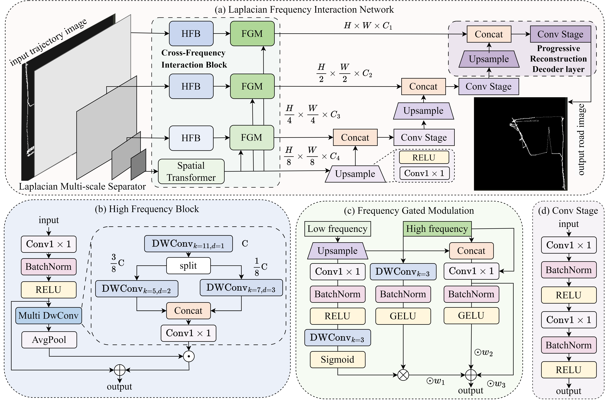

# Laplacian Frequency Interaction Network for Rural Thematic Road Extraction

## 基本信息

- **arXiv ID:** [2605.02866v1](https://arxiv.org/abs/2605.02866v1)
- **作者:** Baiyan Chen, Weixin Zhai
- **发布日期:** 2026-05-04
- **分类:** cs.CV
- **PDF:** [arXiv PDF](https://arxiv.org/pdf/2605.02866v1)

## 关键图示

<figure><figcaption>Figure 1</figcaption></figure>

## 摘要

### English

Rural thematic road network construction aims to extract topological road structures from movement trajectory images of agricultural machinery. However, this task faces challenges where downsampling methods commonly used in existing studies tend to blur the sparse high-frequency road structures, and the heavy noise from dense field operations often leads to fragmented or redundant topologies in the extracted networks. To address these challenges, we propose LFINet, a Laplacian Frequency Interaction Network. The network begins with a Laplacian Multi-scale Separator (LMS) to decouple the image into low-frequency semantic contexts and high-frequency structural details. These components are then processed by the Cross-Frequency Interaction Block (CFIB) through a dual-pathway architecture in which a High-Frequency Block (HFB) refines local structures while a Spatial Transformer (ST) captures global semantics. Subsequently, a Frequency Gated Modulation (FGM) mechanism integrates the features from pathways by leveraging semantic contexts to calibrate the structural details. Finally, a Progressive Reconstruction Decoder iteratively fuses multi-scale features to ensure topological consistency. Experiments conducted on a real-world agricultural trajectories dataset from Henan Province, China, show that LFINet establishes a new state-of-the-art. Specifically, it achieves an F1-score of 92.54% and an IoU of 86.12%, surpassing the second-ranked method by 0.64% and 1.1%, respectively.

### 中文

农村专题路网构建旨在从农业机械运动轨迹图像中提取拓扑道路结构。然而该任务面临挑战：现有方法常用的下采样会模糊稀疏的高频道路结构，密集田间作业的严重噪声常导致提取的路网碎片化或冗余。为此我们提出 LFINet，一种拉普拉斯频率交互网络。网络以拉普拉斯多尺度分离器（LMS）将图像解耦为低频语义上下文和高频结构细节；跨频率交互块（CFIB）通过双路径架构处理这些分量——高频块（HFB）细化局部结构、空间 Transformer（ST）捕获全局语义；频率门控调制（FGM）利用语义上下文校准结构细节；渐进重建解码器迭代融合多尺度特征确保拓扑一致性。在河南省真实农业轨迹数据集上的实验表明 LFINet 达到 SOTA：F1 92.54%、IoU 86.12%，分别超过第二名 0.64% 和 1.1%。

## 核心贡献

1. **拉普拉斯多尺度分离器（LMS）**：首次在路网提取中显式解耦频率分量，通过递归"模糊-减除"策略将输入图像分解为低频语义基和高频细节层级，防止 CNN 下采样造成的细粒度信息损失。
2. **跨频率交互块（CFIB）**：双路径架构并行处理低频语义（Spatial Transformer）和高频细节（High-Frequency Block），通过频率门控调制（FGM）实现语义引导的结构细节校准。
3. **渐进重建解码器（PRD）**：迭代融合多尺度特征并通过跳跃连接确保拓扑连续性，缓解编码器-解码器架构中常见的空间细节丢失。
4. **真实农业场景 SOTA**：在河南省（2021 年小麦收获季 + 2023 年南阳独立测试集）的真实农业轨迹数据上取得全面最优。

## 方法概述

LFINet 采用"分解-交互-重建"策略，包含三个核心阶段：

**阶段 1：频率分解（LMS）。** 通过递归高斯金字塔下采样（模糊）和高斯拉普拉斯残差（减除），将输入轨迹图像分解为 4 层：低频语义基 I_lf（8×下采样）和三个高频细节层 L0（原始分辨率）、L1（2×下采样）、L2（4×下采样）。L0 保留细粒度纹理和局部拓扑细节，L1/L2 捕捉中间结构特征，I_lf 捕获全局连通性。

**阶段 2：跨频率交互（CFIB）。** 
- 低频路径：Spatial Transformer 处理 I_lf，利用自注意力捕获全局依赖，生成全局语义先验。
- 高频路径：High-Frequency Block（HFB）使用级联深度可分离卷积（扩张率 1/2/3，大核 11×11），多尺度提取局部边界细节。
- FGM 融合：三条并行流——语义门控流（低频语义作为空间注意力掩码滤除背景噪声）、频率差异流（捕获频间互补信息）、细节保留流（残差路径保持原始高频边缘），通过通道注意力自适应融合。

**阶段 3：渐进重建（PRD）。** 转置卷积逐层上采样，每层通过跳跃连接融合对应尺度的 FGM 输出，经 Conv Stage（两层 3×3 卷积 + BN + ReLU）精炼，最终恢复到原始分辨率。

损失函数：Dice + BCE 联合损失以缓解类别不平衡。

## 实验结果

- **主结果**（河南省 2021 数据集）：F1 92.54%、IoU 86.12%、Precision 98.60%、Recall 87.18%、PSNR 31.14 dB，全面超越 10 个基线方法（包括 SAM-Road、DeepMG、T2R-pix2pix、AD-HRNet 等）。
- **相比 CNN 方法**：IoU 领先约 6-9 个百分点（CNN 下采样导致高频细节丢失）。
- **相比 GAN 方法**：F1 更高（92.54% vs T2R-pix2pix 91.89%），噪声区域幻觉更少。
- **计算效率**：虽引入双分支架构，但显式频率解耦使各分支操作轻量级，FLOPs 竞争力强。
- **消融实验**：移除 LMS（IoU -1.88%）、移除 ST（IoU -2.84%、PSNR -1.32 dB）、移除 PRD（IoU -19.20%——最大降幅，证明渐进重建对拓扑连续性的关键性）、移除 FGM（IoU -3.50%）、移除 HFB（F1 -0.64%）。
- **外部验证**：南阳 2023 独立测试集（400 样本）上保持性能优势。

## 局限性与注意点

- **数据集地理限制**：仅在中国河南省的平坦地形上验证，丘陵/山区地形的泛化性未测试。
- **单一作物季节**：训练数据主要来自小麦收获季（6 月），其他季节和作物的轨迹模式可能不同。
- **仅轨迹图像输入**：未融合遥感影像、GIS 数据等多源信息，在轨迹稀疏区域可能遗漏道路。
- **统计方差分析缺乏**：论文未报告多次运行的均值和标准差，单次结果的统计可靠性未知。
- **后处理依赖**：最终道路网络构建依赖图向量化后处理，非完全端到端。

## 相关概念（详细）

- **语义分割 (Semantic Segmentation)**：像素级分类任务。LFINet 通过频率解耦策略突破了传统 CNN 分割在细长结构上的限制。
- **拉普拉斯金字塔 (Laplacian Pyramid)**：多尺度图像表示方法。LFINet 将其从信号处理工具升级为深度学习架构的显式频率解耦模块。
- **轨迹挖掘 (Trajectory Mining)**：从 GNSS 轨迹提取道路网络是智慧农业的关键技术。LFINet 为农机轨迹的端到端路网提取提供了 SOTA 方案。

## 相关概念

- [大语言模型](../../concepts/large-language-model.html)
- [多模态学习](../../concepts/multimodal-learning.html)
- [基准评估](../../concepts/benchmarking.html)
- [自动驾驶](../../concepts/autonomous-driving.html)

---
*导入时间: 2026-05-05 06:01*
*来源: arXiv Daily Wiki Update 2026-05-05*
