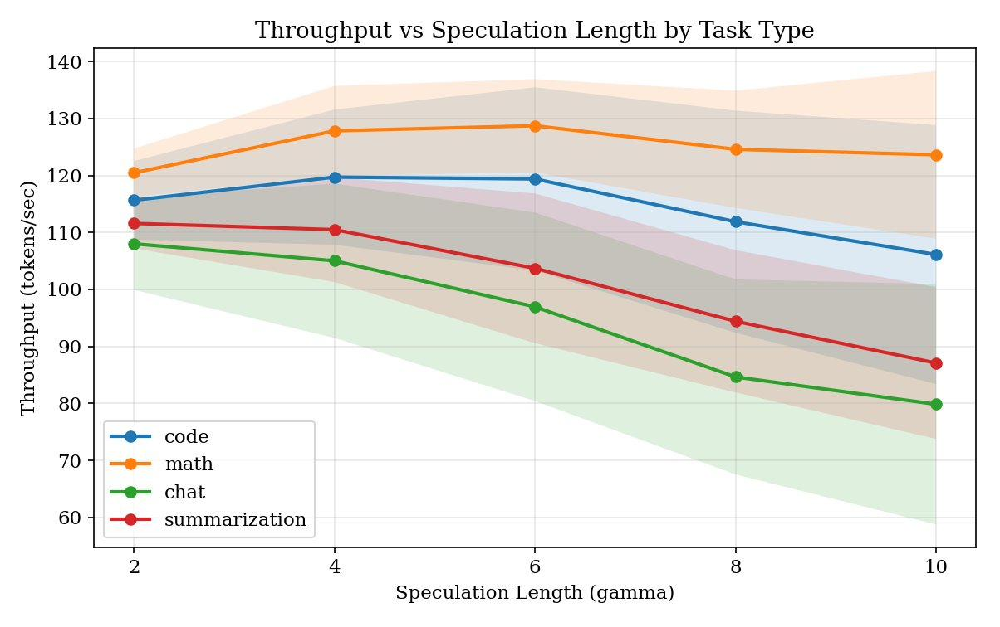
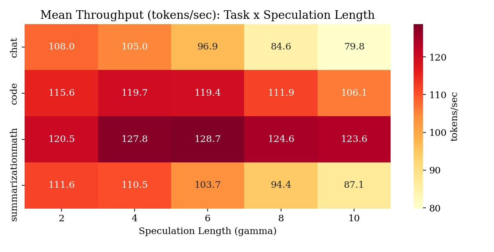
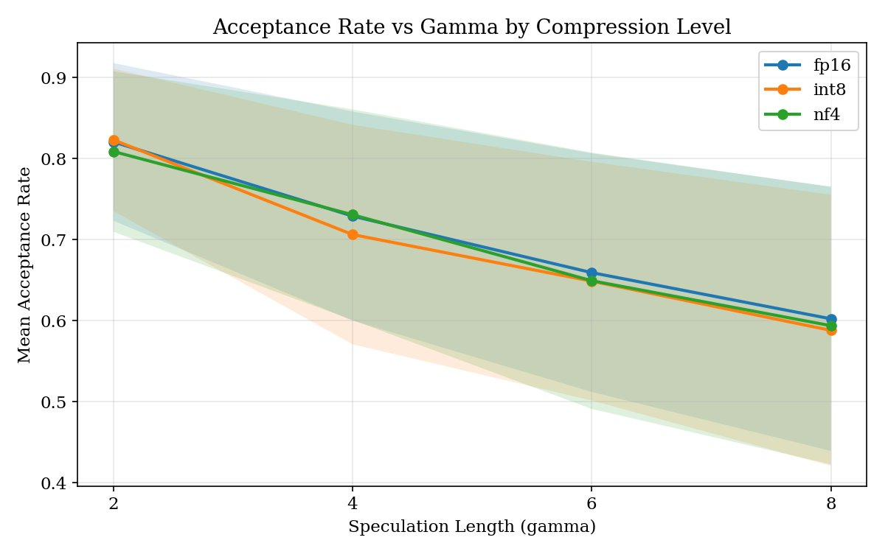

# SpecKV: Adaptive Speculative Decoding with Compression-Aware Gamma Selection

## 基本信息

- **arXiv ID:** [2605.02888v1](https://arxiv.org/abs/2605.02888v1)
- **作者:** Shikhar Shukla
- **发布日期:** 2026-05-04
- **分类:** cs.LG, cs.AI, cs.CL, cs.DC, eess.SY
- **PDF:** [arXiv PDF](https://arxiv.org/pdf/2605.02888v1)

## 关键图示

<figure><figcaption>Figure 1</figcaption></figure>
<figure><figcaption>Figure 2</figcaption></figure>
<figure><figcaption>Figure 3</figcaption></figure>

## 摘要

### English

Speculative decoding accelerates large language model (LLM) inference by using a small draft model to propose candidate tokens that a larger target model verifies. A critical hyperparameter in this process is the speculation length~$γ$, which determines how many tokens the draft model proposes per step. Nearly all existing systems use a fixed~$γ$ (typically~4), yet empirical evidence suggests that the optimal value varies across task types and, crucially, depends on the compression level applied to the target model. In this paper, we present \textbf{SpecKV}, a lightweight adaptive controller that selects~$γ$ per speculation step using signals extracted from the draft model itself. We profile speculative decoding across 4~task categories, 4~speculation lengths, and 3~compression levels (FP16, INT8, NF4), collecting 5,112 step-level records with per-step acceptance rates, draft entropy, and draft confidence. We demonstrate that the optimal~$γ$ shifts across compression regimes and that draft model confidence and entropy are strong predictors of acceptance rate (correlation~$\approx 0.56$). SpecKV uses a small MLP trained on these signals to maximize expected tokens per speculation step, achieving a 56.0\% improvement over the fixed-$γ$=4 baseline with only 0.34\,ms overhead per decision ($<$0.5\% of step time). The improvement is statistically significant ($p < 0.001$, paired bootstrap test). We release all profiling data, trained models, and notebooks as open-source artifacts.

### 中文

推测性解码通过使用小型草稿模型提出候选 token 供大模型验证来加速 LLM 推理。关键超参数推测长度 γ 决定草稿模型每步提出多少 token。几乎所有现有系统使用固定 γ（通常为 4），但实证表明最优值因任务类型而异，且关键取决于目标模型的压缩级别。本文提出 SpecKV，一个轻量级自适应控制器，利用从草稿模型自身提取的信号（草稿熵和置信度）来动态选择 γ。我们在 4 个任务类别、4 种推测长度和 3 种压缩级别（FP16、INT8、NF4）下收集了 5112 条步级记录，发现草稿置信度和熵是接受率的强预测因子（相关系数 ≈ 0.56）。SpecKV 使用一个小型 MLP（16 隐层单元）最大化每步期望 token 数，相比固定 γ=4 基线提升 56.0%，而每步决策开销仅 0.34 ms（< 步时的 0.5%），结果具有统计显著性（p < 0.001）。

## 相关概念

- [大语言模型](../../concepts/large-language-model.html)

## 核心贡献

1. **压缩-推测耦合发现**：首次系统性地揭示了模型压缩（FP16/INT8/NF4）与最优推测长度 γ 之间的耦合关系——不同压缩级别下最优 γ 会显著漂移（如 INT8 下最优 γ 从 2-4 漂移到 6-8）。
2. **零成本信号提取**：发现草稿模型的熵和置信度是接受率的强预测因子（相关系数 ≈ 0.56），且这一关系在不同压缩级别间保持一致。这些信号在标准推测解码中本就会被计算但通常被丢弃。
3. **SpecKV 自适应控制器**：提出基于小型 MLP（16 隐层单元）的轻量级控制器，每步根据草稿信号动态选择 γ，实现 56.0% 的吞吐量提升，开销仅 0.34 ms（< 步时的 0.5%）。
4. **开源发布**：释放全部 5,112 条步级 profiling 数据、训练模型和分析 notebooks。

## 方法概述

SpecKV 采用 **上下文赌博机（contextual bandit）** 框架来选择推测长度。在每个推测步，从草稿模型的概率分布中提取 4 个信号：平均草稿熵、平均草稿置信度、最大草稿熵和最小草稿置信度。这些信号与压缩级别组成上下文向量 x，训练回归模型 f(x, γ) 预测接受率 â。策略选择 γ* = arg max (f(x, γ) · γ + 1)（即最大化期望 token 数）。

实验使用 Llama 3.2-1B 作为草稿模型、3B-Instruct 作为目标模型，在 RTX 3090 上运行。数据收集覆盖 4 个任务类别（代码生成、数学推理、对话、摘要）× 3 种压缩级别（FP16/INT8/NF4）× 4 种推测长度，共 240 次实验、5112 条步级记录。对比了 Ridge 回归、MLP (16/32 隐层单元) 和 Random Forest (10/100 树) 四种预测器架构，最终选择 MLP-16（预测准确度相关系数 0.685，开销 0.34 ms）。

## 实验结果

- **最优 γ 因压缩而异**：FP16 下大多任务偏好低 γ（2 或 4），INT8 下最优 γ 漂移到 6 或 8，NF4 下则介于两者（4 或 6）。
- **SpecKV-fast vs Fixed-4**：5.82 vs 3.73 tokens/step（+56.0%），跨各压缩级别提升一致（FP16: +54.8%, INT8: +56.0%, NF4: +56.9%）。
- **与 Fixed-best 持平**：SpecKV-fast 达到 5.81 vs Fixed-best 5.82，且无需事先知道哪个固定 γ 最优。
- **统计显著性**：配对 bootstrap 检验（10,000 重采样），p < 0.001，均值差异 2.09 tokens/step，95% CI [2.02, 2.17]。
- **特征重要性**：最有信息量的特征是最小草稿置信度（30.0%）和最大草稿熵（24.1%），两者都捕获了推测步内的"最坏情况"信号。
- **开销分析**：0.34 ms 开销 vs 典型推测步 70 ms，净提升约 55.5%。

## 局限性与注意点

- **模型规模有限**：仅在 Llama 3.2-1B/3B 上验证，更大模型（如 7B/13B/70B）上的泛化性未验证。
- **提示集较小**：仅使用 20 条提示（4 类 × 5 条），可能不足以覆盖所有实际部署场景的分布。
- **离线模拟评估**：策略对比基于离线模拟（留出 20% 步记录），而非端到端在线推理评估。实际在线环境中的累积误差效应未被考虑。
- **仅覆盖三种压缩级别**：未测试 2-bit 量化或 KV cache 压缩之间的交互。
- **单草稿-目标对**：未探索多草稿模型场景或草稿模型自身也被压缩的情况。

## 相关概念（详细）

- **推测解码 (Speculative Decoding)**：使用小模型提出候选、大模型验证的加速技术。SpecKV 首次引入自适应推测长度以适配不同压缩级别。
- **模型量化 (Model Quantization)**：INT8/NF4 量化改变目标模型输出分布，进而影响推测解码的接受率——SpecKV 首次系统研究了这一交互。
- **自适应推理 (Adaptive Inference)**：区别于固定 γ 的传统方案，SpecKV 使用轻量级上下文赌博机策略实现每步动态决策。

---
*导入时间: 2026-05-05 06:01*
*来源: arXiv Daily Wiki Update 2026-05-05*
