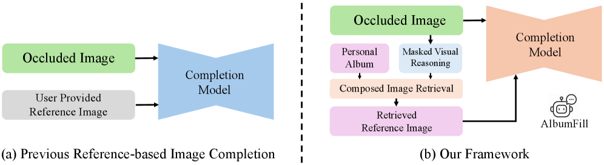
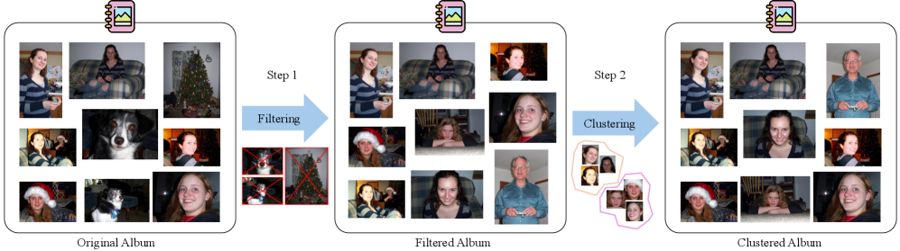
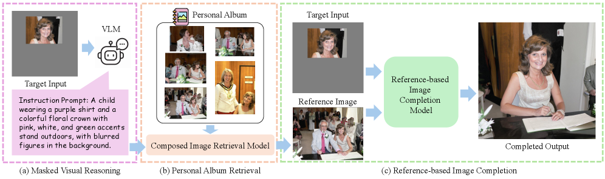

# AlbumFill: Album-Guided Reasoning and Retrieval for Personalized Image Completion

## 基本信息

- **arXiv ID:** [2605.02892v1](https://arxiv.org/abs/2605.02892v1)
- **作者:** Yu-Ju Tsai, Brian Price, Qing Liu et al.
- **发布日期:** 2026-05-04
- **分类:** cs.CV, cs.IR
- **PDF:** [arXiv PDF](https://arxiv.org/pdf/2605.02892v1)

## 关键图示

<figure><figcaption>Figure 1</figcaption></figure>
<figure><figcaption>Figure 2</figcaption></figure>
<figure><figcaption>Figure 3</figcaption></figure>

## 摘要

### English

Personalized image completion aims to restore occluded regions in personal photos while preserving identity and appearance. Existing methods either rely on generic inpainting models that often fail to maintain identity consistency, or assume that suitable reference images are explicitly provided. In practice, suitable references are often not explicitly provided, requiring the system to search for identity-consistent images within personal photo collections. We present AlbumFill, a training-free framework that retrieves identity-consistent references from personal albums for personalized completion. Given an occluded image and a personal album, a vision-language model infers missing semantic cues to guide composed image retrieval, and the retrieved references are used by reference-based completion models. To facilitate this task, we introduce a dataset containing 54K human-centric samples with associated album images. Experiments across multiple baselines demonstrate the difficulty of personalized completion and highlight the importance of identity-consistent reference retrieval. Project Page: https://liagm.github.io/AlbumFill/

### 中文

个性化图像补全旨在恢复个人照片中的遮挡区域，同时保留身份和外观特征。现有方法要么依赖通用修复模型（往往无法保持身份一致性），要么假设合适的参考图像已被显式提供。实践中，合适的参考通常未显式提供，需要系统在个人照片集中搜索身份一致的图像。我们提出 AlbumFill，一个免训练的框架，从个人相册中检索身份一致的参考以进行个性化补全。给定遮挡图像和个人相册，视觉语言模型推断缺失的语义线索以引导组合图像检索，检索到的参考由基于参考的补全模型使用。为此我们引入了一个包含 54K 以人为中心的样本及关联相册图像的数据集。实验证明了该任务的难度，并突显了身份一致参考检索的重要性。

## 核心贡献

1. **AlbumFill 免训练框架**：首个不需要训练的个性化图像补全框架，仅通过从个人相册中检索身份一致参考实现高质量补全。
2. **VLM 引导的组合检索**：利用视觉语言模型（VLM）从遮挡图像中推理缺失的语义信息（如人物身份、姿态、服装），引导组合图像检索（包括文本到图像检索和图像到图像检索）。
3. **个性化补全数据集**：构建包含 54K 以人为中心的遮挡样本及关联相册图像的数据集，为该任务建立了标准评估基准。
4. **身份一致性验证**：实验证明身份一致的参考检索是高质量个性化补全的关键因素，通用修复模型和随机参考均无法达到 AlbumFill 的效果。

## 方法概述

AlbumFill 是一个免训练的三阶段框架：

**阶段 1：语义推理。** 给定遮挡图像 I_masked，VLM 推理遮挡区域的语义属性（如"左肩、白色衬衫、正装"），生成语义描述文本。VLM 也分析相册中候选图像的语义属性。

**阶段 2：组合图像检索。** 使用推理出的语义线索进行两步检索：(a) 文本到图像检索——用语义描述在相册中检索候选；(b) 图像到图像检索——用未遮挡部分作为查询，检索视觉上相似的图像。两者结合得到身份一致的参考图像 I_ref。

**阶段 3：基于参考的补全。** 将 I_masked 和 I_ref 输入基于参考的图像补全模型（如 Paint-by-Example、AnyDoor），生成最终结果。模型保持冻结，无需微调。

数据集构建：从现有数据集中合成遮挡（随机擦除、物体遮挡），为每个遮挡样本关联来自同一身份的多张图像作为相册。共 54K 训练/验证/测试样本。

## 实验结果

- **AlbumFill vs 通用修复**：AlbumFill 在 FID、LPIPS、身份保持等指标上全面优于通用修复模型（如 LaMa、MAT）。
- **VLM 推理贡献**：消融实验显示 VLM 语义推理对检索质量有显著提升；不使用 VLM 时检索准确率大幅下降。
- **检索准确率**：身份一致参考的 top-1 检索准确率显著高于随机选择和纯图像相似度检索。
- **数据集难度**：即使给出了相册，该任务仍具挑战性——最优方法在多个指标上仍有提升空间。
- **身份保持**：AlbumFill 在保持人物身份特征（面部、体型、服饰风格）方面远优于基线。

## 局限性与注意点

- **VLM 推理能力依赖**：检索质量高度依赖 VLM 的语义推理能力，VLM 理解不准确时可能导致检索错误和补全失败。
- **计算开销**：对相册中每张图像运行 VLM 推理可能在高分辨率大相册上引入显著延迟。
- **遮挡类型有限**：实验仅覆盖合成遮挡（随机擦除、物体遮挡），真实场景中的复杂遮挡（如多人交错、动态模糊）未测试。
- **补全模型依赖**：最终结果质量受限于所选的基于参考的补全模型，不同补全模型可能产生不同效果。
- **隐私考虑**：个人相册处理涉及隐私问题，框架的实际部署需考虑端侧推理或隐私保护机制。

## 相关概念（详细）

- **图像修复 (Image Inpainting)**：填充图像中缺失/遮挡区域的任务。AlbumFill 拓展了修复到个性化场景，要求保持身份一致性。
- **组合图像检索 (Composed Image Retrieval)**：结合文本和图像查询的检索范式。AlbumFill 利用 VLM 语义推理 + 图像相似度进行组合检索。
- **视觉语言模型 (Vision-Language Models)**：AlbumFill 的关键组件，用于从遮挡图像中推理缺失的语义线索以指导检索。

## 相关概念

- [大语言模型](../../concepts/large-language-model.html)
- [多模态学习](../../concepts/multimodal-learning.html)
- [基准评估](../../concepts/benchmarking.html)

---
*导入时间: 2026-05-05 06:01*
*来源: arXiv Daily Wiki Update 2026-05-05*
