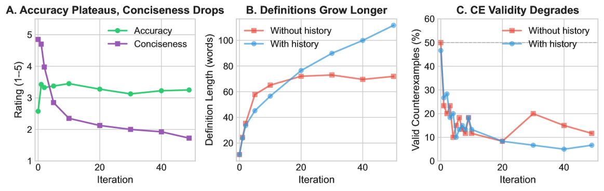
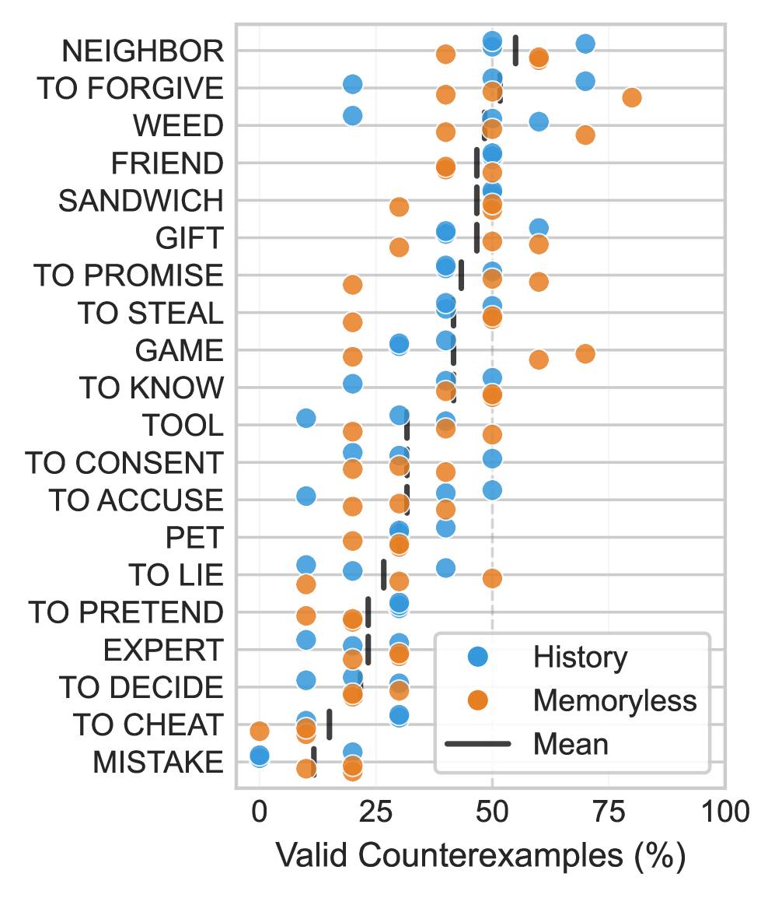

# The Counterexample Game: Iterated Conceptual Analysis and Repair in Language Models

## 基本信息

- **arXiv ID:** [2605.03936v1](https://arxiv.org/abs/2605.03936v1)
- **作者:** Daniel Drucker, Kyle Mahowald
- **发布日期:** 2026-05-05
- **分类:** cs.CL, cs.AI
- **PDF:** [arXiv PDF](https://arxiv.org/pdf/2605.03936v1)

## 关键图示

<figure><figcaption>Figure 1</figcaption></figure>
<figure><figcaption>Figure 2</figcaption></figure>
<figure><figcaption>Figure 3</figcaption></figure>

## 摘要

### English

Conceptual analysis -- proposing definitions and refining them through counterexamples -- is central to philosophical methodology. We study whether language models can perform this task through iterated analysis and repair chains: one model instance generates counterexamples to a proposed definition, another repairs the definition, and the process repeats. Across 20 concepts and thousands of counterexample-repair cycles, we find that, although many LM-generated counterexamples are judged invalid by both expert humans and an LM judge, the LM judge accepts roughly twice as many as humans do. Nonetheless, per-item validity judgments are moderately consistent across humans and between humans and the LM. We further find that extended iteration produces increasingly verbose definitions without improving accuracy. We also see that some concepts resist stable definitions in general. These findings suggest that while LMs can engage in philosophical reasoning, the counterexample-repair loop hits diminishing returns quickly and could be a fruitful test case for evaluating whether LMs can sustain high-level iterated philosophical reasoning.

### 中文

概念分析——提出定义并通过反例完善它们——是哲学方法论的核心。我们研究语言模型是否可以通过迭代分析和修复链来执行此任务：一个模型实例生成建议定义的反例，另一个模型实例修复定义，然后重复该过程。在 20 个概念和数千个反例修复周期中，我们发现，尽管许多 LM 生成的反例被人类专家和 LM 法官判定为无效，但 LM 法官接受的反例数量大约是人类的两倍。尽管如此，每个项目的有效性判断在人类之间以及人类与 LM 之间是适度一致的。我们进一步发现，扩展迭代会产生越来越冗长的定义，而不会提高准确性。我们还看到一些概念通常抵制稳定的定义。这些发现表明，虽然 LM 可以进行哲学推理，但反例修复循环很快就会出现收益递减，并且可能是评估 LM 是否能够维持高水平迭代哲学推理的富有成效的测试用例。

## 核心贡献

### English

This paper studies whether language models can perform conceptual analysis — the philosophical methodology of proposing definitions and refining them through counterexamples — through iterated analysis and repair chains. One LM generates counterexamples to a proposed definition, another repairs the definition, and the process repeats. Across 20 concepts and thousands of counterexample-repair cycles, the key findings are: (1) LM-generated counterexamples are judged valid far less often by expert humans than by an LM judge (LM accepts ~2× more), (2) extended iteration produces increasingly verbose definitions without improving accuracy, and (3) some concepts resist stable definitions entirely. This suggests the counterexample-repair loop hits diminishing returns quickly.

### 中文

本文研究语言模型是否能够通过迭代分析与修复链执行概念分析——提出定义并通过反例完善的哲学方法论。一个 LM 生成对提议定义的反例，另一个修复定义，过程循环往复。在 20 个概念和数千个反例-修复周期中，核心发现是：(1) LM 生成的反例被人类专家判定有效的比例远低于 LM 裁判（LM 接受量约 2 倍）；(2) 扩展迭代产生越来越冗长的定义但未提高准确性；(3) 某些概念完全抵制稳定定义。这表明反例-修复循环很快进入收益递减。

## 方法概述

### English

The experiment uses an iterated chain: a "Counterexample Generator" LM receives a concept definition and produces counterexamples; a "Definition Repairer" LM receives the original definition plus counterexamples and proposes a revised definition. This cycle repeats for up to N rounds. 20 concepts are tested spanning concrete, abstract, and technical categories. Validity judgments come from three sources: expert human annotators, an LM judge (same model, prompted to judge), and agreement analysis between them. Metrics include definition length growth, accuracy against held-out test cases, and validity rates of generated counterexamples.

### 中文

实验使用迭代链："反例生成器" LM 接收概念定义并产生反例；"定义修复器" LM 接收原始定义加反例并提出修订定义。此循环最多重复 N 轮。测试了 20 个概念，涵盖具体、抽象和技术类别。有效性判断来自三个来源：人类专家标注者、LM 裁判（同模型，提示判断）及两者间的一致性分析。指标包括定义长度增长、对保留测试案例的准确性、以及生成反例的有效率。

## 实验结果

### English

The LM judge accepts roughly twice as many counterexamples as valid compared to expert humans, but per-item validity judgments are moderately consistent between the two. Extended iteration produces increasingly verbose definitions — length grows substantially across rounds — without corresponding accuracy improvement, indicating verbosity without precision. Some concepts (e.g., certain abstract or contested terms) resist stable definitions regardless of iteration depth. The counterexample-repair loop shows clear diminishing returns, suggesting that while LMs can engage in philosophical reasoning, sustained high-level iterated philosophical reasoning remains challenging.

### 中文

LM 裁判接受的有效反例数量约为人类专家的两倍，但逐项有效性判断在两者间适度一致。扩展迭代产生越来越冗长的定义——长度在每轮中大幅增长——但没有相应的准确性提升，表明冗长而无精度。某些概念（如特定抽象或有争议术语）无论迭代深度如何都抵制稳定定义。反例-修复循环显示明显的收益递减，表明虽然 LM 可以进行哲学推理，但持续的高水平迭代哲学推理仍有挑战。

## 局限性与注意点

### English

Only 20 concepts are evaluated, limiting statistical power. The LM judge and the counterexample generator/repairer may share model-specific biases, inflating LM-LM agreement artificially. The study uses a single model family; cross-model generalization is not tested. The definition repair is purely text-based and does not incorporate structured knowledge or external verification. The judged "validity" of philosophical counterexamples is inherently subjective, and even human experts show only moderate agreement. The paper does not explore whether different prompting strategies or reasoning frameworks (e.g., CoT) could improve iteration effectiveness.

### 中文

仅评估 20 个概念，统计效力有限。LM 裁判与反例生成器/修复器可能共享模型特定偏差，人为抬高 LM-LM 一致性。研究使用单一模型家族；跨模型泛化未被测试。定义修复纯基于文本，未纳入结构化知识或外部验证。哲学反例的"有效性"判断本质上是主观的，即使人类专家也仅显示中等一致性。论文未探索不同提示策略或推理框架（如 CoT）是否能改善迭代效果。

## 相关概念

- [大语言模型](../../concepts/large-language-model.html)

---
*导入时间: 2026-05-06 06:02*
*来源: arXiv Daily Wiki Update 2026-05-06*
