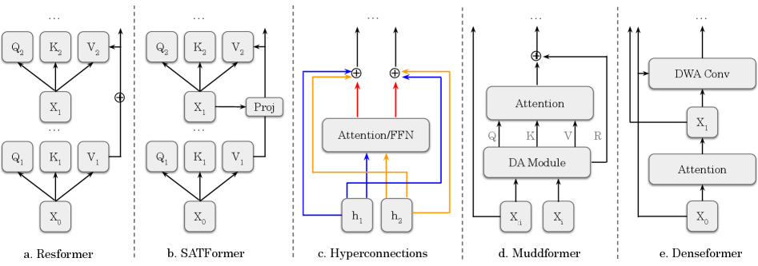
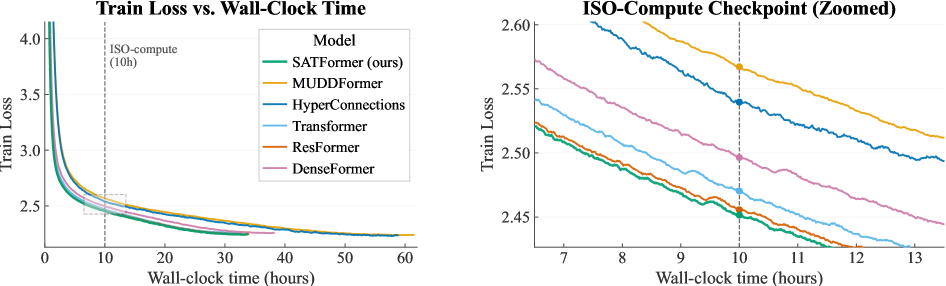
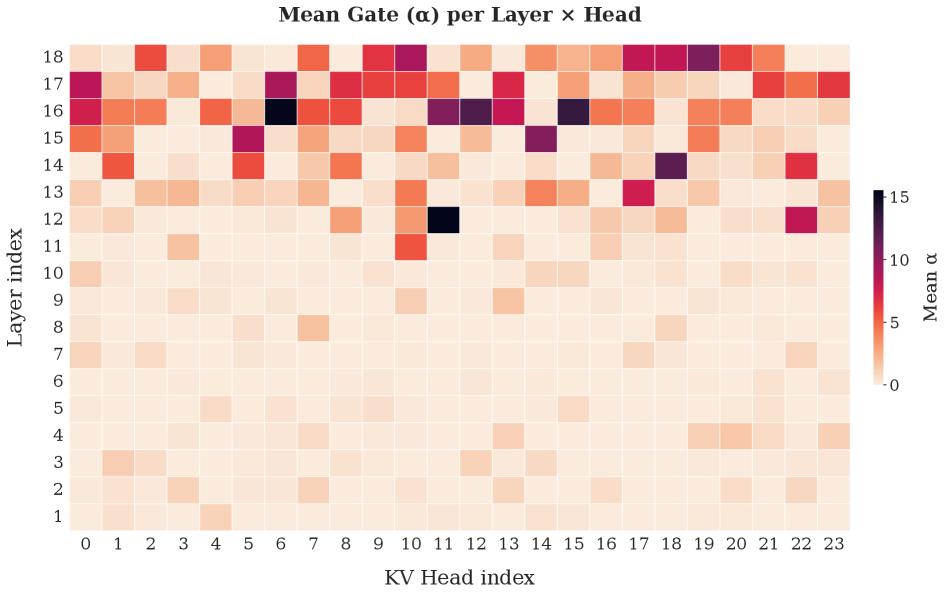

# Transformers with Selective Access to Early Representations

## 基本信息

- **arXiv ID:** [2605.03953v1](https://arxiv.org/abs/2605.03953v1)
- **作者:** Skye Gunasekaran, Téa Wright, Rui-Jie Zhu et al.
- **发布日期:** 2026-05-05
- **分类:** cs.LG, cs.CL
- **PDF:** [arXiv PDF](https://arxiv.org/pdf/2605.03953v1)

## 关键图示

<figure><figcaption>Figure 1</figcaption></figure>
<figure><figcaption>Figure 2</figcaption></figure>
<figure><figcaption>Figure 3</figcaption></figure>

## 摘要

### English

Several recent Transformer architectures expose later layers to representations computed in the earliest layers, motivated by the observation that low-level features can become harder to recover as the residual stream is repeatedly transformed through depth. The cheapest among these methods add static value residuals: learned mixing coefficients that expose the first-layer value projection V_1 uniformly across tokens and heads. More expressive dense or dynamic alternatives recover finer-grained access, but at higher memory cost and lower throughput. The usefulness of V_1 is unlikely to be constant across tokens, heads, and contexts; different positions plausibly require different amounts of access to early lexical or semantic information. We therefore treat early-representation reuse as a retrieval problem rather than a connectivity problem, and introduce Selective Access Transformer (SATFormer), which preserves the first-layer value pathway while controlling access with a context-dependent gate. Across models from 130M to 1.3B parameters, SATFormer consistently improves validation loss and zero-shot accuracy over the static value-residual and Transformer baselines. Its strongest gains appear on retrieval-intensive benchmarks, where it improves over static value residuals by approximately 1.5 average points, while maintaining throughput and memory usage close to the baseline Transformer. Gate analyses suggest sparse, depth-dependent, head-specific, and category-sensitive access patterns, supporting the interpretation that SATFormer learns selective reuse of early representations rather than uniform residual copying. Our code is available at https://github.com/SkyeGunasekaran/SATFormer.

### 中文

最近的几个 Transformer 架构将后面的层暴露给在最早的层中计算的表示，这是由于观察到随着残余流在深度上反复转换，低级特征可能变得更难恢复。这些方法中最便宜的添加静态值残差：学习混合系数，在令牌和头之间均匀地暴露第一层值投影 V_1。更具表现力的密集或动态替代方案可以恢复更细粒度的访问，但内存成本更高，吞吐量更低。 V_1 的有用性在 token、heads 和 context 中不太可能保持不变；不同的立场似乎需要不同数量的早期词汇或语义信息的访问。因此，我们将早期表示重用视为检索问题而不是连接问题，并引入选择性访问转换器（SATFormer），它保留第一层价值路径，同时使用上下文相关的门控制访问。在从 130M 到 1.3B 参数的模型中，SATFormer 在静态残差值和 Transformer 基线上持续改进了验证损失和零样本精度。其最大的收益出现在检索密集型基准测试中，它比静态值残差提高了大约 1.5 个平均点，同时保持吞吐量和内存使用量接近基线 Transformer。门分析表明稀疏、深度相关、头部特定和类别敏感的访问模式，支持 SATFormer 学习选择性重用早期表示而不是统一残留复制的解释。我们的代码可从 https://github.com/SkyeGunasekaran/SATFormer 获取。

## 核心贡献

### English

SATFormer (Selective Access Transformer) reframes early-representation reuse as a retrieval problem rather than a connectivity problem. Unlike static value residuals that expose the first-layer value projection V₁ uniformly, SATFormer uses a context-dependent gate to control which tokens and heads access V₁. This gate learns sparse, depth-dependent, head-specific, and category-sensitive access patterns. Across models from 130M to 1.3B parameters, SATFormer consistently improves validation loss and zero-shot accuracy while maintaining throughput and memory usage close to baseline.

### 中文

SATFormer（选择性访问 Transformer）将早期表示重用重新定义为检索问题而非连接问题。与静态值残差均匀暴露第一层值投影 V₁ 不同，SATFormer 使用上下文依赖的门控来控制哪些 token 和注意力头访问 V₁。该门控学习到稀疏、深度依赖、注意力头特定和类别敏感的访问模式。在 130M 到 1.3B 参数的模型中，SATFormer 持续改进验证损失和零样本准确率，同时保持吞吐量和内存使用接近基线。

## 方法概述

### English

SATFormer preserves the first-layer value pathway V₁ while adding a learned gate G that modulates access: for each attention head h at layer l, the value computation becomes V_(l,h) = V_(l,h)^standard + G_(l,h) ⊙ V₁, where G_(l,h) is a context-dependent scalar or per-dimension gate computed from the current hidden state. The gate introduces minimal overhead — only a small MLP projection per layer. This contrasts with static value residuals (learned scalar mixing coefficient per head, uniform across tokens) and dense alternatives (full attention over all early-layer representations). The gate analysis reveals that access to early representations is not uniform but follows structured patterns across depth, heads, and task categories.

### 中文

SATFormer 保留第一层值通路 V₁，同时添加学习门控 G 来调节访问：对第 l 层的每个注意力头 h，值计算变为 V_(l,h) = V_(l,h)^standard + G_(l,h) ⊙ V₁，其中 G_(l,h) 是从当前隐藏状态计算的上下文依赖标量或逐维门控。门控引入最小开销——每层仅增加一个小 MLP 投影。这与静态值残差（每头学习标量混合系数，跨 token 统一）和密集替代方案（对所有早期层表示的全注意力）形成对比。门控分析揭示对早期表示的访问并非均匀，而是遵循跨深度、注意力头和任务类别的结构化模式。

## 实验结果

### English

SATFormer consistently improves validation loss over both static value-residual and vanilla Transformer baselines across 130M, 350M, 760M, and 1.3B parameter scales. On zero-shot downstream benchmarks, the strongest gains appear on retrieval-intensive tasks where SATFormer improves over static value residuals by approximately 1.5 average points. Throughput and memory usage remain close to the baseline Transformer — the gate adds negligible overhead compared to dense or dynamic alternatives. Gate analyses show that: (1) access to V₁ is sparse (most gates are near zero), (2) deeper layers access V₁ more than shallow layers, (3) different heads within the same layer use V₁ differently, and (4) retrieval tasks elicit stronger gate activation than classification tasks.

### 中文

SATFormer 在 130M、350M、760M 和 1.3B 参数规模上持续改进验证损失，优于静态值残差和标准 Transformer 基线。在零样本下游基准测试中，最强增益出现在检索密集型任务上，SATFormer 相比静态值残差提升约 1.5 个平均点。吞吐量和内存使用保持接近基线 Transformer——门控相比密集或动态替代方案增加的额外开销可忽略。门控分析显示：(1) 对 V₁ 的访问是稀疏的（多数门控接近零）；(2) 深层比浅层更多访问 V₁；(3) 同一层内不同注意力头使用 V₁ 的方式不同；(4) 检索任务比分类任务引发更强的门控激活。

## 局限性与注意点

### English

The study evaluates on models up to 1.3B parameters — scaling behavior beyond this is untested. The gate design (scalar or per-dimension) may not capture all useful access patterns. The paper focuses on training from scratch; applicability to continued pretraining or fine-tuning of existing LLMs is not evaluated. Benchmark gains are measured in zero-shot settings; few-shot or fine-tuned evaluation is not reported. The theoretical justification for why V₁ specifically (rather than other early layers) is the most useful signal remains empirical rather than analytical.

### 中文

研究评估的最大模型为 1.3B 参数——超越此规模的扩展行为未经测试。门控设计（标量或逐维）可能无法捕获所有有用的访问模式。论文聚焦从零训练；对已有 LLM 的持续预训练或微调的适用性未被评估。基准增益在零样本设置下测量；少样本或微调评估未报告。为何选择 V₁（而非其他早期层）作为最有用的信号，其理论依据仍为经验性而非分析性。

## 相关概念

- [大语言模型](../../concepts/large-language-model.html)
- [基准评估](../../concepts/benchmarking.html)

---
*导入时间: 2026-05-06 06:01*
*来源: arXiv Daily Wiki Update 2026-05-06*
