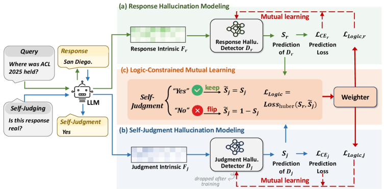
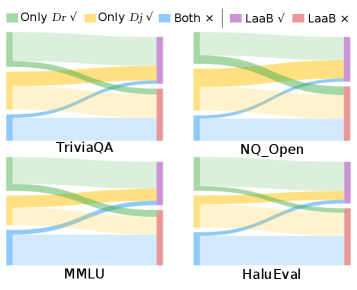

# Logical Consistency as a Bridge: Improving LLM Hallucination Detection via Label Constraint Modeling between Responses and Self-Judgments

## 基本信息

- **arXiv ID:** [2605.03971v1](https://arxiv.org/abs/2605.03971v1)
- **作者:** Hao Mi, Qiang Sheng, Shaofei Wang et al.
- **发布日期:** 2026-05-05
- **分类:** cs.CL
- **PDF:** [arXiv PDF](https://arxiv.org/pdf/2605.03971v1)

## 关键图示

<figure><figcaption>Figure 1</figcaption></figure>
<figure><figcaption>Figure 2</figcaption></figure>
<figure><figcaption>Figure 3</figcaption></figure>

## 摘要

### English

Large Language Models (LLMs) are prone to factual hallucinations, risking their reliability in real-world applications. Existing hallucination detectors mainly extract micro-level intrinsic patterns for uncertainty quantification or elicit macro-level self-judgments through verbalized prompts. However, these methods address only a single facet of the hallucination, focusing either on implicit neural uncertainty or explicit symbolic reasoning, thereby treating these inherently coupled behaviors in isolation and failing to exploit their interdependence for a holistic view. In this paper, we propose LaaB (Logical Consistency-as-a-Bridge), a framework that bridges neural features and symbolic judgments for hallucination detection. LaaB introduces a "meta-judgment" process to map symbolic labels back into the feature space. By leveraging the inherent logical bridge where response and meta-judgment labels are either the same or opposite based on the self-judgment's semantics, LaaB aligns and integrates dual-view signals via mutual learning and enhances the hallucination detection. Extensive experiments on 4 public datasets, across 4 LLMs, against 8 baselines demonstrate the superiority of LaaB.

### 中文

大型语言模型 (LLM) 很容易出现事实幻觉，从而影响其在现实应用中的可靠性。现有的幻觉检测器主要提取微观层面的内在模式进行不确定性量化或通过语言提示引发宏观层面的自我判断。然而，这些方法只解决幻觉的一个方面，要么关注隐含的神经不确定性，要么关注明确的符号推理，从而孤立地处理这些固有耦合的行为，而未能利用它们的相互依赖关系来获得整体观点。在本文中，我们提出了 LaaB（逻辑一致性桥），这是一个连接神经特征和符号判断以进行幻觉检测的框架。 LaaB 引入了“元判断”过程，将符号标签映射回特征空间。 LaaB利用固有的逻辑桥梁，根据自我判断的语义，响应和元判断标签相同或相反，通过相互学习对齐和集成双视图信号，增强幻觉检测。针对 8 个基线、跨 4 个法学硕士的 4 个公共数据集进行的广泛实验证明了 LaaB 的优越性。

## 核心贡献

### English

LaaB (Logical Consistency-as-a-Bridge) proposes a novel perspective: the LLM's self-judgment (e.g., "Is this response factual?") is itself a generated response that can be hallucinated. Rather than treating self-judgments as ground truth, LaaB introduces a "meta-judgment" process — a secondary detector that checks whether the self-judgment is factual — and then bridges the response-view and self-judgment-view predictions via a logical constraint: they share the same label if the self-judgment claims truthfulness, and opposite labels otherwise. A mutual learning framework jointly optimizes both views.

### 中文

LaaB（逻辑一致性桥）提出了一个新颖的视角：LLM 的自我判断（如"这个回答是否事实？"）本身就是一个可能产生幻觉的生成回答。LaaB 不将自我判断视为真值，而是引入"元判断"过程——一个次级检测器检查自我判断是否事实——然后通过逻辑约束桥接回答视图和自我判断视图的预测：若自我判断声称真实则标签相同，否则相反。通过互学习框架联合优化两个视图。

## 方法概述

### English

LaaB consists of two MLP-based detector modules: D_r for the original response O_r and D_j for the self-judgment O_j. D_r extracts hidden states, prediction logits, and attention scores as intrinsic features F_r. D_j similarly extracts features F_j from the self-judgment generation process. The meta-judgment process maps the self-judgment's symbolic label back into feature space. The logical constraint states that L_r = L_j if O_j = "Yes", and L_r = 1 − L_j if O_j = "No". Both detectors are trained with mutual learning where each peer's predicted distribution serves as a dynamic teacher for the other.

### 中文

LaaB 包含两个基于 MLP 的检测器模块：D_r 用于原始回答 O_r，D_j 用于自我判断 O_j。D_r 提取隐藏状态、预测 logits 和注意力分数作为内在特征 F_r。D_j 类似地从自我判断生成过程中提取特征 F_j。元判断过程将自我判断的符号标签映射回特征空间。逻辑约束规定：若 O_j = "Yes" 则 L_r = L_j，若 O_j = "No" 则 L_r = 1 − L_j。两个检测器通过互学习训练，每个同行的预测分布作为对方的动态教师。

## 实验结果

### English

LaaB is evaluated on 4 public datasets across 4 LLMs against 8 baselines, including intrinsic-pattern-based methods (hidden-state classifiers, logit-based confidence, attention-based) and self-judgment-based methods. LaaB consistently outperforms all baselines in hallucination detection accuracy. The mutual learning component provides gains over single-view baselines, and the logical constraint is shown to be critical — without it, the dual-view integration degrades. LaaB does not introduce significant additional inference cost compared to single-detector approaches.

### 中文

LaaB 在 4 个公开数据集、4 个 LLM 上针对 8 个基线进行评估，包括基于内在模式的方法（隐藏状态分类器、基于 logit 的置信度、基于注意力的方法）和基于自我判断的方法。LaaB 在幻觉检测准确率上持续优于所有基线。互学习组件相比单视图基线带来额外增益，而逻辑约束被证明至关重要——没有它，双视图集成会退化。LaaB 相比单检测器方法未引入显著的额外推理成本。

## 局限性与注意点

### English

LaaB requires access to the LLM's internal features (hidden states, logits, attention), limiting applicability to white-box/API-with-logprobs settings. The method assumes the self-judgment is generated by the same LLM as the response; cross-model self-judgment is not evaluated. The logical constraint (same/opposite label) is a simplification — real-world factuality judgments can be more nuanced. The paper evaluates on English QA datasets only (ACL 2026 Main). Performance may vary for long-form generation where factuality is multi-dimensional.

### 中文

LaaB 需要访问 LLM 内部特征（隐藏状态、logits、注意力），限制了其仅适用于白盒/提供 logprobs 的 API 场景。该方法假设自我判断由与回答相同的 LLM 生成；跨模型自我判断未被评估。逻辑约束（相同/相反标签）是一种简化——真实世界的事实性判断可能更细致。论文仅在英语 QA 数据集上评估（ACL 2026 Main）。对于事实性多维度评估的长文本生成，性能可能有所变化。

## 相关概念

- [大语言模型](../../concepts/large-language-model.html)
- [基准评估](../../concepts/benchmarking.html)

---
*导入时间: 2026-05-06 06:01*
*来源: arXiv Daily Wiki Update 2026-05-06*
