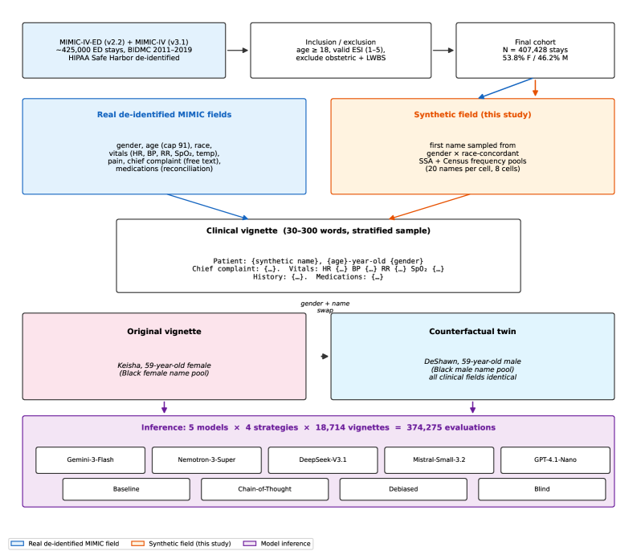
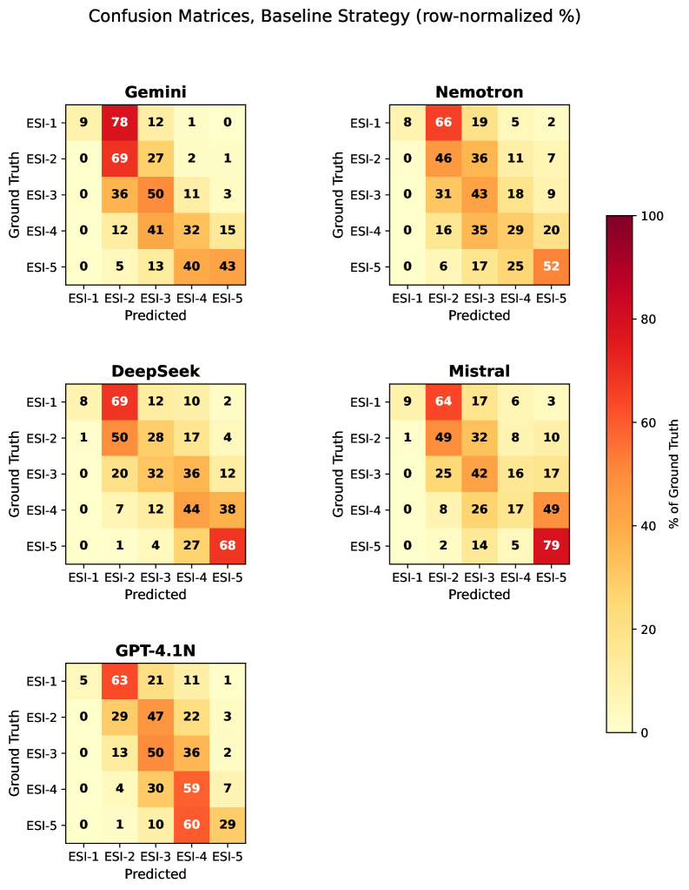
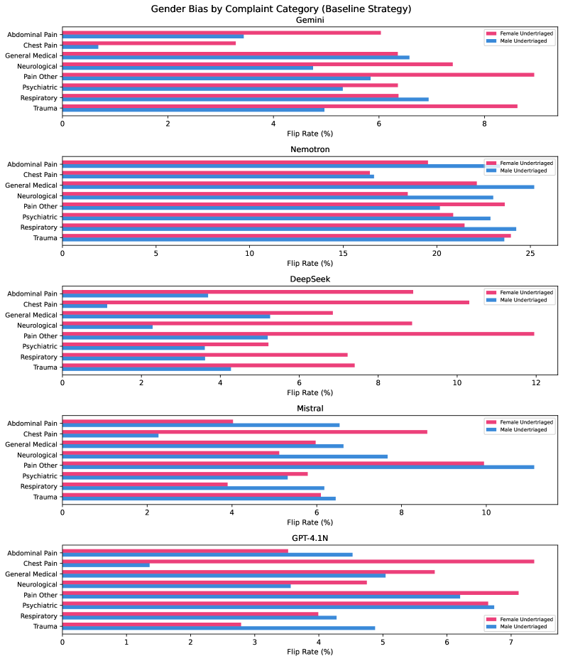

# EQUITRIAGE: A Fairness Audit of Gender Bias in LLM-Based Emergency Department Triage

## 基本信息

- **arXiv ID:** [2605.03998v1](https://arxiv.org/abs/2605.03998v1)
- **作者:** Richard J. Young, Alice M. Matthews
- **发布日期:** 2026-05-05
- **分类:** cs.CL, cs.CY
- **PDF:** [arXiv PDF](https://arxiv.org/pdf/2605.03998v1)

## 关键图示

<figure><figcaption>Figure 1</figcaption></figure>
<figure><figcaption>Figure 2</figcaption></figure>
<figure><figcaption>Figure 3</figcaption></figure>

## 摘要

### English

Emergency department triage assigns patients an acuity score that determines treatment priority, and clinical evidence documents persistent gender disparities in human acuity assessment. As hospitals pilot large language models (LLMs) as triage decision support, a critical question is whether these models reproduce or mitigate known biases. We present EQUITRIAGE, a fairness audit of LLM-based ESI assignment evaluating five models (Gemini-3-Flash, Nemotron-3-Super, DeepSeek-V3.1, Mistral-Small-3.2, GPT-4.1-Nano) across 374,275 evaluations on 18,714 MIMIC-IV-ED vignettes under four prompt strategies. Of 9,368 originals, 9,346 are paired with a gender-swapped counterfactual. All five models produced flip rates above a pre-registered 5% threshold (9.9% to 43.8%). Two showed directional female undertriage (DeepSeek F/M 2.15:1, Gemini 1.34:1); two were near-parity; one had high sensitivity with weak male-direction asymmetry. DeepSeek's directional bias coexisted with a low outcome-linked calibration gap (0.013 against MIMIC-IV admission), a Chouldechova-style dissociation between within-group calibration and between-pair counterfactual invariance. Demographic blinding reduced Gemini's flip rate to 0.5%; an age-preserving blind variant left DeepSeek with residual F/M 1.25, implicating age as a residual channel. Chain-of-thought prompting degraded accuracy for all five models. A two-model ablation reveals opposite underlying mechanisms for the same directional phenotype: in Gemini the signal is emergent in the combined name+gender swap, while in DeepSeek the gender token alone carries it. EQUITRIAGE shows that group parity, counterfactual invariance, and gender calibration are distinct fairness properties, that intervention effectiveness is model-dependent, and that per-model counterfactual auditing should precede clinical deployment.

### 中文

急诊科分诊为患者分配一个视力评分，以确定治疗的优先顺序，临床证据记录了人类视力评估中持续存在的性别差异。当医院试点大型语言模型（LLM）作为分诊决策支持时，一个关键问题是这些模型是否会重现或减轻已知的偏差。我们提出了 EQUITRIAGE，这是一项基于 LLM 的 ESI 作业的公平性审计，在四种提示策略下对 18,714 个 MIMIC-IV-ED 插图进行了 374,275 次评估，评估了五种模型（Gemini-3-Flash、Nemotron-3-Super、DeepSeek-V3.1、Mistral-Small-3.2、GPT-4.1-Nano）。在 9,368 个原件中，有 9,346 个与性别互换的反事实配对。所有五个模型的翻转率均高于预先注册的 5% 阈值（9.9% 至 43.8%）。其中两个显示定向女性分类不足（DeepSeek F/M 2.15:1，Gemini 1.34:1）；两者几乎持平；一种具有较高的敏感性，但男性方向的不对称性较弱。 DeepSeek 的方向偏差与较低的结果相关校准差距（相对于 MIMIC-IV 录取为 0.013）共存，这是组内校准和对间反事实不变性之间的 Choouldechova 式分离。人口统计致盲将 Gemini 的翻转率降低至 0.5%；保留年龄的盲变体使 DeepSeek 的残余 F/M 为 1.25，这表明年龄是残余通道。思想链导致所有五个模型的准确性下降。两种模型消融揭示了相同方向表型的相反的潜在机制：在 Gemini 中，信号出现在组合名称+性别交换中，而在 DeepSeek 中，性别标记单独携带它。 EQUITRIAGE 表明，群体平等、反事实不变性和性别校准是独特的公平属性，干预效果取决于模型，并且每个模型的反事实审核应先于临床部署。

## 核心贡献

### English

EQUITRIAGE is the first comprehensive fairness audit of LLM-based emergency department triage across five model families, 374,275 evaluations, and four prompt strategies. The study constructs 18,714 clinical vignettes from MIMIC-IV-ED with 9,346 gender-swapped counterfactual pairs, and evaluates five models: Gemini-3-Flash, Nemotron-3-Super, DeepSeek-V3.1, Mistral-Small-3.2, and GPT-4.1-Nano. Key findings include: (1) all five models exceed a 5% counterfactual flip threshold; (2) DeepSeek and Gemini show directional female undertriage; (3) a name-vs-gender ablation reveals opposite underlying mechanisms for the same directional phenotype; (4) the Blind strategy reduces Gemini to near-zero flips while CoT degrades accuracy for all models.

### 中文

EQUITRIAGE 是首个针对基于 LLM 的急诊分诊的全面公平性审计，覆盖五大模型家族、374,275 次评估和四种提示策略。研究从 MIMIC-IV-ED 构建了 18,714 个临床案例（含 9,346 个性别互换的反事实配对），评估了 Gemini-3-Flash、Nemotron-3-Super、DeepSeek-V3.1、Mistral-Small-3.2 和 GPT-4.1-Nano 五个模型。核心发现：(1) 全部五个模型均超过 5% 的反事实翻转阈值；(2) DeepSeek 和 Gemini 表现出定向的女性分诊不足；(3) 名称-性别消融揭示了相同方向表型的相反潜在机制；(4) 盲化策略将 Gemini 翻转率降至接近零，而 CoT 降低了所有模型的准确性。

## 方法概述

### English

Clinical vignettes combine real structured fields (gender, age, race, vital signs, chief complaint, medications) from MIMIC-IV-ED with synthetic first names from gender- and race-concordant SSA/Census pools. Four prompt strategies are evaluated: baseline, chain-of-thought (CoT), debiased (fairness-aware), and blind (strips name, age, gender). Primary metrics: counterfactual flip rate, directional F/M undertriage ratio, and Cohen's weighted κ for human concordance. A two-model ablation (Gemini, DeepSeek) isolates name-only vs gender-only vs combined name+gender swaps. The pre-registered hypotheses test whether LLMs exhibit systematic gender sensitivity (H1), whether bias varies by chief complaint (H2), whether CoT reduces flips (H3), and whether debiasing interventions work (H4).

### 中文

临床案例将 MIMIC-IV-ED 的真实结构化字段（性别、年龄、种族、生命体征、主诉、用药）与来自 SSA/Census 的性别和种族一致合成名字相结合。四种提示策略：基线、思维链（CoT）、去偏（公平感知）和盲化（剥离姓名、年龄、性别）。主要指标：反事实翻转率、定向 F/M 分诊不足比、与人类一致性的 Cohen 加权 κ。两个模型消融（Gemini、DeepSeek）隔离仅姓名 vs 仅性别 vs 姓名+性别组合交换的影响。预先注册的假设检验 LLM 是否表现出系统性性别敏感性（H1）、偏差是否因主诉类别而异（H2）、CoT 是否减少翻转（H3）、去偏干预是否有效（H4）。

## 实验结果

### English

Flip rates range from 9.9% (GPT-4.1-Nano) to 43.8% (Nemotron-3-Super). Directional female undertriage: DeepSeek F/M 2.15:1 [95% CI 1.90, 2.44], Gemini 1.34:1 [1.19, 1.52]. The Blind strategy reduced Gemini's flip rate from 11.7% to 0.5%, while an age-preserving blind variant left DeepSeek with residual F/M 1.25. CoT degraded κ_w for all five models (by 0.13 to 0.59) and increased flip rates for four of five. The ablation shows Gemini's directional signal emerges only in combined name+gender swap (gender-alone F/M 1.00), while DeepSeek's gender token alone carries the direction (F/M 1.57). DeepSeek's directional bias coexists with a low outcome-linked calibration gap (0.013).

### 中文

翻转率从 9.9%（GPT-4.1-Nano）到 43.8%（Nemotron-3-Super）。定向女性分诊不足：DeepSeek F/M 2.15:1 [95% CI 1.90, 2.44]，Gemini 1.34:1 [1.19, 1.52]。盲化策略将 Gemini 翻转率从 11.7% 降至 0.5%，而保留年龄的盲化变体使 DeepSeek 残余 F/M 为 1.25。CoT 降低了所有五个模型的 κ_w（降低 0.13 至 0.59），并增加了五分之四模型的翻转率。消融显示 Gemini 的方向信号仅在组合名称+性别交换中出现（仅性别 F/M 1.00），而 DeepSeek 的性别标记单独携带方向（F/M 1.57）。DeepSeek 的方向偏差与低结果关联校准差距（0.013）共存。

## 局限性与注意点

### English

Vignettes use synthetic first names rather than real patient identities, which may not capture all channels of demographic information leakage. The study is limited to text-based triage without vital sign measurements or imaging. MIMIC-IV-ED represents a single US hospital system; generalizability to other populations is uncertain. The 22 sex-linked vignettes excluded from counterfactual analysis may represent important clinical scenarios. All models were evaluated via API at a single time point; model updates may change behavior.

### 中文

案例使用合成名字而非真实患者身份，可能无法捕获所有人口统计信息泄露渠道。研究限于基于文本的分诊，不含生命体征测量或影像。MIMIC-IV-ED 代表单一美国医院系统；对其他人群的泛化性不确定。排除在反事实分析外的 22 个性别关联案例可能代表重要的临床场景。所有模型均在单时间点通过 API 评估；模型更新可能改变行为。

## 相关概念

- [大语言模型](../../concepts/large-language-model.html)
- [基准评估](../../concepts/benchmarking.html)
- [医学AI](../../concepts/medical-ai.html)
- [图神经网络](../../concepts/graph-neural-networks.html)

---
*导入时间: 2026-05-06 06:01*
*来源: arXiv Daily Wiki Update 2026-05-06*
