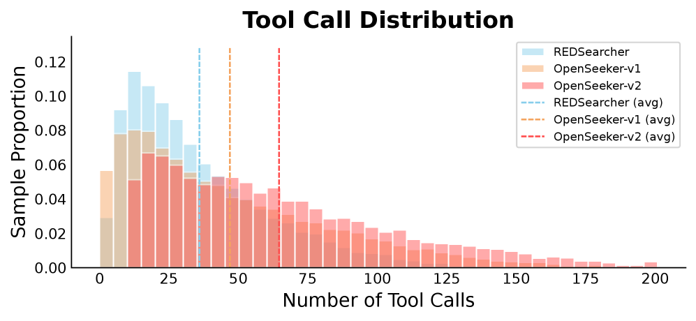

# OpenSeeker-v2: Pushing the Limits of Search Agents with Informative and High-Difficulty Trajectories

## 基本信息

- **arXiv ID:** [2605.04036v1](https://arxiv.org/abs/2605.04036v1)
- **作者:** Yuwen Du, Rui Ye, Shuo Tang et al.
- **发布日期:** 2026-05-05
- **分类:** cs.AI, cs.CL
- **PDF:** [arXiv PDF](https://arxiv.org/pdf/2605.04036v1)

## 关键图示

<figure><figcaption>Figure 1</figcaption></figure>
<figure><figcaption>Figure 2</figcaption></figure>

## 摘要

### English

Deep search capabilities have become an indispensable competency for frontier Large Language Model (LLM) agents, yet their development remains dominated by industrial giants. The typical industry recipe involves a highly resource-intensive pipeline spanning pre-training, continual pre-training (CPT), supervised fine-tuning (SFT), and reinforcement learning (RL). In this report, we show that when fueled with informative and high-difficulty trajectories, a simple SFT approach could be surprisingly powerful for training frontier search agents. By introducing three simple data synthesis modifications: scaling knowledge graph size for richer exploration, expanding the tool set size for broader functionality, and strict low-step filtering, we establish a stronger baseline. Trained on merely 10.6k data points, our OpenSeeker-v2 achieves state-of-the-art performance across 4 benchmarks (30B-sized agents with ReAct paradigm): 46.0% on BrowseComp, 58.1% on BrowseComp-ZH, 34.6% on Humanity's Last Exam, and 78.0% on xbench, surpassing even Tongyi DeepResearch trained with heavy CPT+SFT+RL pipeline, which achieves 43.4%, 46.7%, 32.9%, and 75.0%, respectively. Notably, OpenSeeker-v2 represents the first state-of-the-art search agent within its model scale and paradigm to be developed by a purely academic team using only SFT. We are excited to open-source the OpenSeeker-v2 model weights and share our simple yet effective findings to make frontier search agent research more accessible to the community.

### 中文

深度搜索能力已经成为前沿大语言模型（LLM）代理不可或缺的能力，但其发展仍然由工业巨头主导。典型的行业配方涉及资源高度密集的管道，涵盖预训练、持续预训练 (CPT)、监督微调 (SFT) 和强化学习 (RL)。在本报告中，我们表明，当提供信息丰富且高难度的轨迹时，简单的 SFT 方法对于训练前沿搜索代理可能会非常强大。通过引入三个简单的数据合成修改：缩放知识图大小以实现更丰富的探索、扩展工具集大小以实现更广泛的功能以及严格的低步过滤，我们建立了更强大的基线。仅在 10.6k 个数据点上进行训练，我们的 OpenSeeker-v2 在 4 个基准测试（具有 ReAct 范式的 30B 大小的代理）中实现了最先进的性能：在 BrowseComp 上为 46.0%，在 BrowseComp-ZH 上为 58.1%，在 Humanity's Last Exam 上为 34.6%，在 xbench 上为 78.0%，甚至超过了使用大量 CPT+SFT+RL 训练的 Tongyi DeepResearch管道，分别达到43.4%、46.7%、32.9%和75.0%。值得注意的是，OpenSeeker-v2 代表了第一个在其模型规模和范例中最先进的搜索代理，由纯学术团队仅使用 SFT 开发。我们很高兴能够开源 OpenSeeker-v2 模型权重，并分享我们简单而有效的发现，以使社区更容易理解前沿搜索代理研究。

## 核心贡献

### English

OpenSeeker-v2 demonstrates that a purely academic team using only SFT can achieve SOTA search agent performance, surpassing industrial pipelines (CPT+SFT+RL). The key insight is that trajectory quality — not training complexity — drives search agent capability. The paper introduces three data synthesis modifications: (1) scaling the knowledge graph for richer multi-hop exploration, (2) expanding the tool set for broader functionality, and (3) strict low-step filtering (T ≥ T_min) to enforce a difficulty floor. Trained on only 10.6k data points from Qwen3-30B-A3B-Thinking-2507, OpenSeeker-v2 is fully open-sourced.

### 中文

OpenSeeker-v2 证明了纯学术团队仅使用 SFT 即可达到搜索智能体的 SOTA 性能，超越工业界 CPT+SFT+RL 的全栈管线。核心洞见是：轨迹质量而非训练复杂度驱动搜索智能体能力。论文引入三项数据合成改进：(1) 扩大知识图谱规模以支持更丰富的多跳探索；(2) 扩展工具集以实现更广泛的功能；(3) 严格的低步数过滤（T ≥ T_min）以强制难度下限。基于 Qwen3-30B-A3B-Thinking-2507，仅用 10.6k 数据点训练，完全开源。

## 方法概述

### English

The training pipeline is SFT-only. Data synthesis starts from a source graph G = (V, E). For each seed node v_seed, an expanded subgraph G^(K)_sub is extracted with budget K > k (the v1 budget), providing richer topology. A synthetic query q is generated conditioned on this expanded context. The agent uses an enlarged tool set A and produces ReAct trajectories τ with T tool-call steps. Only trajectories with T ≥ T_min are retained, discarding simple lookup problems. The 30B model uses 256k context window and up to 200 tool calls per trajectory. No RL or hyperparameter tuning is applied.

### 中文

训练管线仅使用 SFT。数据合成从源图 G = (V, E) 开始。对每个种子节点 v_seed，以扩展预算 K > k（v1 预算）提取子图 G^(K)_sub，提供更丰富的拓扑结构。在此基础上生成合成查询 q。智能体使用扩展工具集 A，生成包含 T 个工具调用步骤的 ReAct 轨迹 τ。仅保留 T ≥ T_min 的轨迹，丢弃简单的查找问题。30B 模型使用 256k 上下文窗口，每轨迹最多 200 次工具调用。不应用 RL 或超参数调优。

## 实验结果

### English

OpenSeeker-v2 achieves 46.0% on BrowseComp, 58.1% on BrowseComp-ZH, 34.6% on Humanity's Last Exam (HLE), and 78.0% on xbench. These scores surpass Tongyi DeepResearch (CPT+SFT+RL: 43.4%, 46.7%, 32.9%, 75.0%) and RedSearcher-30B (CPT+SFT+RL: 42.1%, 49.8%, 34.3%). Against WebSailor-V2-30B-RL (SFT+RL), OpenSeeker-v2 leads on BrowseComp (46.0% vs 35.3%), BC-ZH (58.1% vs 44.1%), HLE (34.6% vs 30.6%), and xbench (78.0% vs 73.7%). It still trails larger proprietary models (GPT-5-High: 54.9% BrowseComp, 63.0% BC-ZH, 41.7% HLE).

### 中文

OpenSeeker-v2 在 BrowseComp 上达 46.0%、BrowseComp-ZH 58.1%、Humanity's Last Exam 34.6%、xbench 78.0%。这些成绩超越了 Tongyi DeepResearch（CPT+SFT+RL：43.4%, 46.7%, 32.9%, 75.0%）和 RedSearcher-30B（CPT+SFT+RL：42.1%, 49.8%, 34.3%）。相比 WebSailor-V2-30B-RL（SFT+RL），OpenSeeker-v2 在 BrowseComp（46.0% vs 35.3%）、BC-ZH（58.1% vs 44.1%）、HLE（34.6% vs 30.6%）和 xbench（78.0% vs 73.7%）上均领先。但仍落后于更大的闭源模型（GPT-5-High: BrowseComp 54.9%, BC-ZH 63.0%, HLE 41.7%）。

## 局限性与注意点

### English

The study is a 7-page technical report, not a full paper — methodological details are limited. The claim of "SFT-only SOTA" is relative to the 30B ReAct paradigm; larger models and different paradigms may surpass it. The ablation does not isolate which of the three modifications (KG size, tool set, low-step filtering) contributes most. Training data is synthetic and may not cover all search scenarios. The paper excludes RL entirely, so the upper bound of adding RL to this SFT baseline remains unexplored.

### 中文

本研究为 7 页技术报告而非完整论文——方法细节有限。"SFT-only SOTA" 的声明相对于 30B ReAct 范式；更大模型和不同范式可能超越它。消融实验未区分三项修改（知识图谱规模、工具集、低步数过滤）各自贡献。训练数据为合成数据，可能未覆盖所有搜索场景。论文完全不使用 RL，因此在此 SFT 基线上添加 RL 的上限仍未探索。

## 相关概念

- [大语言模型](../../concepts/large-language-model.html)
- [强化学习](../../concepts/reinforcement-learning.html)
- [基准评估](../../concepts/benchmarking.html)
- [图神经网络](../../concepts/graph-neural-networks.html)

---
*导入时间: 2026-05-06 06:01*
*来源: arXiv Daily Wiki Update 2026-05-06*
