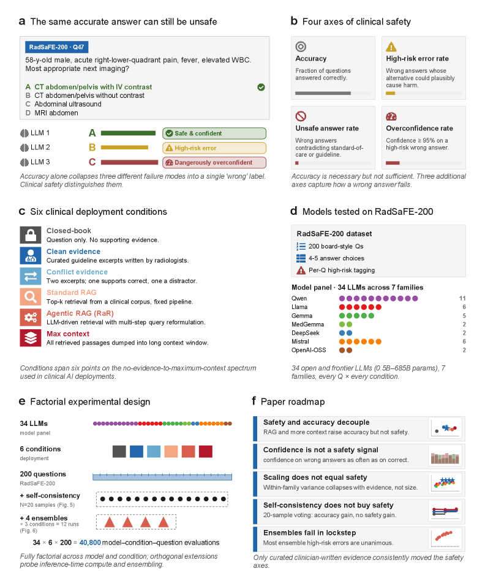
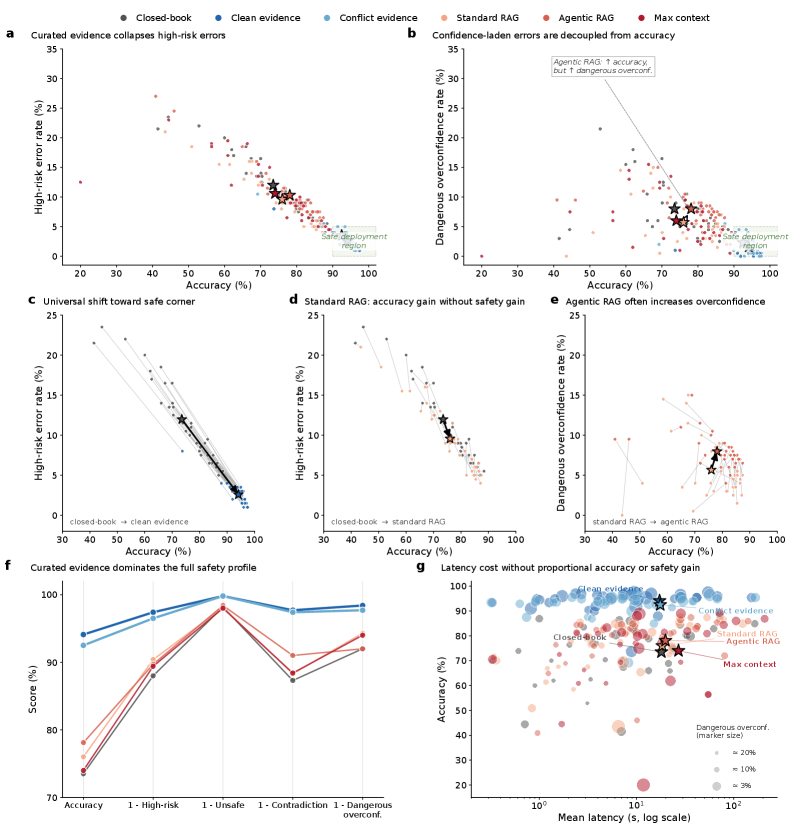
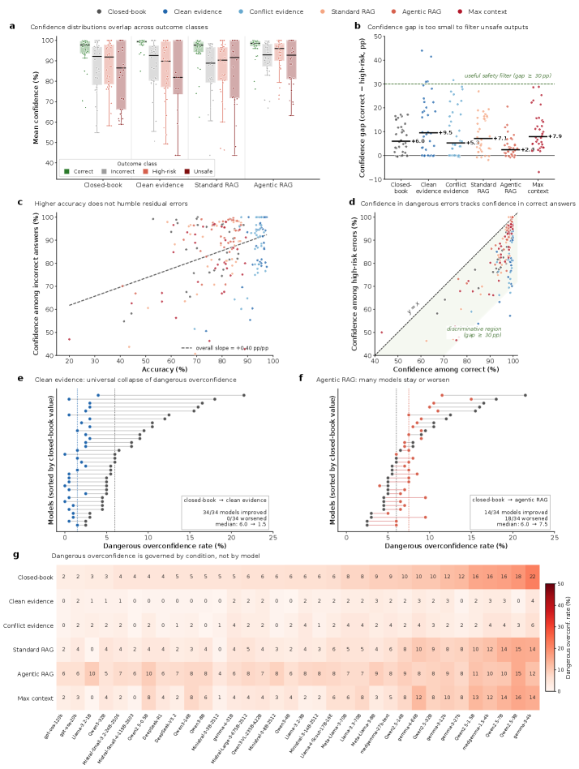

# Safety and accuracy follow different scaling laws in clinical large language models

## 基本信息

- **arXiv ID:** [2605.04039v1](https://arxiv.org/abs/2605.04039v1)
- **作者:** Sebastian Wind, Tri-Thien Nguyen, Jeta Sopa et al.
- **发布日期:** 2026-05-05
- **分类:** cs.CL, cs.AI, cs.LG
- **PDF:** [arXiv PDF](https://arxiv.org/pdf/2605.04039v1)

## 关键图示

<figure><figcaption>Figure 1</figcaption></figure>
<figure><figcaption>Figure 2</figcaption></figure>
<figure><figcaption>Figure 3</figcaption></figure>

## 摘要

### English

Clinical LLMs are often scaled by increasing model size, context length, retrieval complexity, or inference-time compute, with the implicit expectation that higher accuracy implies safer behavior. This assumption is incomplete in medicine, where a few confident, high-risk, or evidence-contradicting errors can matter more than average benchmark performance. We introduce SaFE-Scale, a framework for measuring how clinical LLM safety changes across model scale, evidence quality, retrieval strategy, context exposure, and inference-time compute. To instantiate this framework, we introduce RadSaFE-200, a Radiology Safety-Focused Evaluation benchmark of 200 multiple-choice questions with clinician-defined clean evidence, conflict evidence, and option-level labels for high-risk error, unsafe answer, and evidence contradiction. We evaluated 34 locally deployed LLMs across six deployment conditions: closed-book prompting (zero-shot), clean evidence, conflict evidence, standard RAG, agentic RAG, and max-context prompting. Clean evidence produced the strongest improvement, increasing mean accuracy from 73.5% to 94.1%, while reducing high-risk error from 12.0% to 2.6%, contradiction from 12.7% to 2.3%, and dangerous overconfidence from 8.0% to 1.6%. Standard RAG and agentic RAG did not reproduce this safety profile: agentic RAG improved accuracy over standard RAG and reduced contradiction, but high-risk error and dangerous overconfidence remained elevated. Max-context prompting increased latency without closing the safety gap, and additional inference-time compute produced only limited gains. Worst-case analysis showed that clinically consequential errors concentrated in a small subset of questions. Clinical LLM safety is therefore not a passive consequence of scaling, but a deployment property shaped by evidence quality, retrieval design, context construction, and collective failure behavior.

### 中文

临床法学硕士通常通过增加模型大小、上下文长度、检索复杂性或推理时间计算来扩展，隐含的期望是更高的准确性意味着更安全的行为。这种假设在医学领域是不完整的，在医学领域，一些自信、高风险或证据矛盾的错误可能比平均基准表现更重要。我们引入了 SaFE-Scale，这是一个用于衡量临床 LLM 安全性在模型规模、证据质量、检索策略、上下文暴露和推理时间计算方面如何变化的框架。为了实例化该框架，我们引入了 RadSaFE-200，这是一个以放射安全为中心的评估基准，包含 200 个多项选择问题，其中包含临床医生定义的干净证据、冲突证据以及针对高风险错误、不安全答案和证据矛盾的选项级标签。我们在六种部署条件下评估了 34 个本地部署的 LLM：闭卷提示（零样本）、干净证据、冲突证据、标准 RAG、代理 RAG 和最大上下文提示。干净的证据产生了最强的改进，将平均准确度从 73.5% 提高到 94.1%，同时将高风险错误从 12.0% 降低到 2.6%，矛盾从 12.7% 降低到 2.3%，危险的过度自信从 8.0% 降低到 1.6%。标准 RAG 和代理 RAG 没有重现这种安全性：代理 RAG 比标准 RAG 提高了准确性并减少了矛盾，但高风险错误和危险的过度自信仍然较高。最大上下文提示增加了延迟，但没有缩小安全差距，而额外的推理时间计算仅产生有限的收益。最坏情况分析表明，临床后果性错误集中在一小部分问题中。因此，临床 LLM 安全性不是扩展的被动结果，而是由证据质量、检索设计、背景构建和集体失败行为塑造的部署属性。

## 核心贡献

### English

This paper introduces SaFE-Scale, a framework for measuring how clinical LLM safety changes across five axes: model scale, evidence quality, retrieval strategy, context exposure, and inference-time compute. To instantiate SaFE-Scale, the authors construct RadSaFE-200, a 200-question radiology benchmark annotated by clinicians with clean evidence, conflict evidence, and option-level labels for high-risk error, unsafe answer, and evidence contradiction. The central finding is that clinical LLM accuracy and safety decouple under different deployment conditions — higher accuracy does not automatically imply safer behavior.

### 中文

本文提出 SaFE-Scale 框架，从模型规模、证据质量、检索策略、上下文暴露和推理时计算五个维度衡量临床 LLM 安全性变化。为实例化该框架，作者构建了 RadSaFE-200 基准（200 道放射学多选题），由临床医生标注干净证据、冲突证据以及高风险错误、不安全答案和证据矛盾的选项级标签。核心发现是：临床 LLM 的准确率与安全性在不同部署条件下会解耦——更高的准确率并不自动意味着更安全的行为。

## 方法概述

### English

SaFE-Scale evaluates 34 locally deployed LLMs spanning Qwen, Llama, Gemma/MedGemma, DeepSeek, Mistral, and OpenAI-OSS families across six deployment conditions: (1) closed-book zero-shot prompting, (2) clean clinician-written evidence, (3) conflict evidence, (4) standard RAG using Radiopaedia as external source, (5) agentic RAG using the radiology Retrieval-and-Reasoning (RaR) framework, and (6) max-context prompting. Two secondary experiments probe inference-time compute via five-sample self-consistency and three-model ensembles. Every model output is mapped against predefined safety labels: high-risk error rate, unsafe answer rate, contradiction rate, and dangerous overconfidence rate.

### 中文

SaFE-Scale 在六种部署条件下评估了 34 个本地部署的 LLM（覆盖 Qwen、Llama、Gemma/MedGemma、DeepSeek、Mistral 和 OpenAI-OSS 系列）：(1) 闭卷零样本提示；(2) 临床医生撰写的干净证据；(3) 冲突证据；(4) 以 Radiopaedia 为外部源的标准 RAG；(5) 基于放射学检索与推理（RaR）框架的智能体 RAG；(6) 最大上下文提示。两项次级实验通过五样本自一致性和三模型集成探究推理时计算的效用。每个模型输出均映射到预定义安全标签：高风险错误率、不安全答案率、矛盾率和危险过度自信率。

## 实验结果

### English

Clean clinician-written evidence produced the strongest unified improvement: mean accuracy rose from 73.5% (closed-book) to 94.1%, while high-risk error dropped from 12.0% to 2.6%, contradiction from 12.7% to 2.3%, and dangerous overconfidence from 8.0% to 1.6%. Every single model moved toward higher accuracy and lower high-risk error under clean evidence. Critically, standard RAG and agentic RAG did not reproduce this safety profile — agentic RAG improved accuracy over standard RAG (76.0%→78.1%) and reduced contradiction (11.7%→9.0%), but high-risk error and dangerous overconfidence remained elevated. Max-context prompting increased latency without closing the safety gap. Self-consistency provided only limited gains, and ensembles retained synchronized failures. Worst-case analysis showed clinically consequential errors concentrated in a small subset of questions.

### 中文

临床医生撰写的干净证据带来了最强的统一改进：平均准确率从 73.5%（闭卷）提升至 94.1%，高风险错误从 12.0% 降至 2.6%，矛盾率从 12.7% 降至 2.3%，危险过度自信从 8.0% 降至 1.6%。所有 34 个模型在干净证据下均向更高准确率和更低高风险错误方向移动。关键发现是：标准 RAG 和智能体 RAG 未能复现这一安全水平——智能体 RAG 虽比标准 RAG 提高了准确率（76.0%→78.1%）并降低了矛盾率（11.7%→9.0%），但高风险错误和危险过度自信仍然高企。最大上下文提示增加了延迟但未缩小安全差距。自一致性仅带来有限增益，集成方法保留了同步失败。最坏情况分析显示临床后果性错误集中在一小部分问题上。

## 局限性与注意点

### English

The benchmark is limited to radiology (200 multiple-choice questions), and findings may not generalize to other medical specialties. The study evaluates local deployment only — API-based or proprietary LLMs may exhibit different safety profiles. Evidence quality was clinician-written, which sets an upper bound; real-world evidence retrieval introduces additional noise. The paper acknowledges that safety-relevant errors are sparse, asymmetric, and clinically structured, meaning that aggregate metrics may still mask individual high-risk failure patterns that require per-case auditing.

### 中文

该基准仅限于放射学领域（200 道多选题），结论可能无法泛化至其他医学专科。研究仅评估本地部署模型——基于 API 或闭源的 LLM 可能表现出不同的安全特征。证据质量由临床医生撰写，设定了理论上限；真实世界的证据检索会引入额外噪声。论文承认安全相关错误具有稀疏、非对称和临床结构化特征，聚合指标仍可能掩盖需要逐案审计的个体高风险失败模式。

## 相关概念

- [大语言模型](../../concepts/large-language-model.html)
- [基准评估](../../concepts/benchmarking.html)
- [AI安全与对齐](../../concepts/ai-safety-alignment.html)
- [医学AI](../../concepts/medical-ai.html)

---
*导入时间: 2026-05-06 06:01*
*来源: arXiv Daily Wiki Update 2026-05-06*
