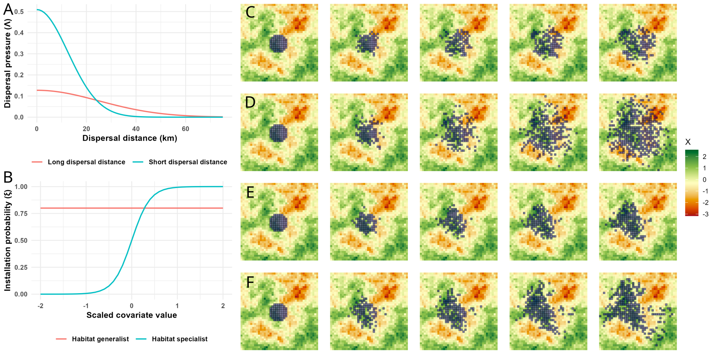
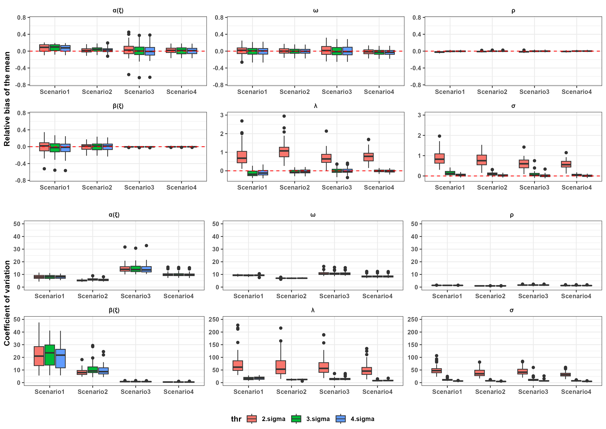
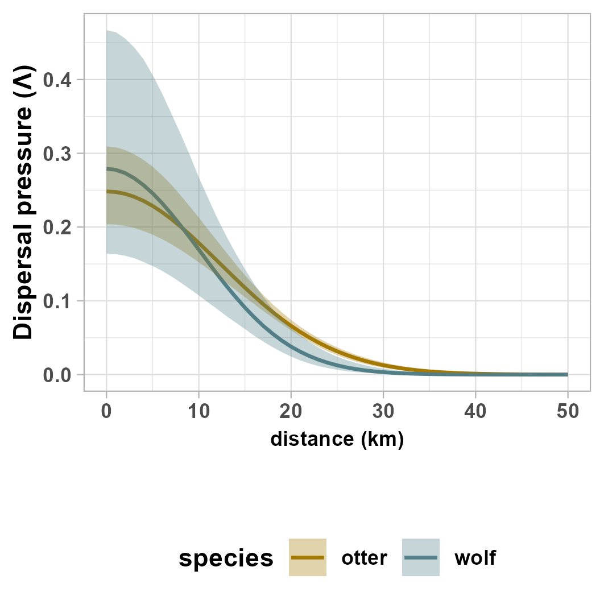

# A process-based dynamic occupancy model to study range dynamics under non-equilibrium conditions

## 基本信息

- **arXiv ID:** [2605.04807v1](https://arxiv.org/abs/2605.04807v1)
- **作者:** Simon Lacombe, Sébastien Devillard, Cécile Kauffmann et al.
- **发布日期:** 2026-05-06
- **分类:** q-bio.PE
- **PDF:** [arXiv PDF](https://arxiv.org/pdf/2605.04807v1)

## 关键图示

<figure><figcaption>Figure 1</figcaption></figure>
<figure><figcaption>Figure 2</figcaption></figure>
<figure><figcaption>Figure 3</figcaption></figure>

## 摘要

### English

Failing to account for ecological processes such as dispersal and connectivity when modeling distributions can lead to biased inference about environmental drivers and reduced predictive performance. Spatial dynamic occupancy models are promising to study range dynamics while accounting for dispersal and connectivity, but they currently rely on restrictive formulations of the colonization process, and computational constraints prevent their application at large spatial scales. Here, we propose a process-based dynamic occupancy model to study the distribution of range-expanding species while accounting for connectivity and effects of the environment. We introduce a formulation based on dispersal-pressure that provides a flexible and ecologically interpretable representation of the colonization process, and develop a computational approach based on sparse distance matrices that enables its application to national and transnational scales. We conducted a simulation study that showed unbiased parameter estimation across various ecological scenarios. We also applied our model to two range-expanding carnivores offering complementary insights: the grey wolf and the Eurasian otter. Our model revealed contrasting colonization dynamic, with wolves primarily constrained by altitude and forest cover while otters where only marginally affected by the environment, suggesting that their distribution is limited by dispersal history rather than habitat preferences. By explicitly disentangling the influence of dispersal and environment on distributions, our model provides better insight into occupancy-environment relationships under non-equilibrium conditions, and help identifies what limits species distributions. In light of the increasing availability of large-scale biodiversity data, our framework offers opportunities to study range dynamics using mechanistic approaches across entire landscapes.

### 中文

在对分布进行建模时未能考虑分散和连通性等生态过程可能会导致对环境驱动因素的有偏见的推断并降低预测性能。空间动态占用模型有望在考虑分散和连通性的同时研究范围动态，但它们目前依赖于殖民过程的限制性公式，并且计算限制阻碍了它们在大空间尺度上的应用。在这里，我们提出了一种基于过程的动态占用模型来研究范围扩大的物种的分布，同时考虑环境的连通性和影响。我们引入了一种基于分散压力的公式，该公式提供了殖民过程的灵活且生态上可解释的表示，并开发了一种基于稀疏距离矩阵的计算方法，使其能够应用于国家和跨国规模。我们进行了一项模拟研究，显示了各种生态场景中的无偏参数估计。我们还将我们的模型应用于两种范围扩大的食肉动物：灰狼和欧亚水獭，提供了互补的见解。我们的模型揭示了对比的殖民动态，狼主要受到海拔和森林覆盖的限制，而水獭仅受环境的轻微影响，这表明它们的分布受到扩散历史而不是栖息地偏好的限制。通过明确地解开扩散和环境对分布的影响，我们的模型可以更好地洞察非平衡条件下的占用与环境关系，并帮助确定限制物种分布的因素。鉴于大规模生物多样性数据的可用性不断增加，我们的框架提供了使用整个景观的机械方法来研究范围动态的机会。

## 相关概念

- [世界模型](../../concepts/world-models.html)
- [智能体](../../concepts/ai-agents.html)

## 核心贡献

本文提出了一种**基于过程的动态占据模型（process-based dynamic occupancy model）**，用于研究非平衡条件下物种分布范围的动态变化。核心创新包括：(1) 引入**扩散压力（dispersal-pressure）**公式化殖民化过程——将殖民概率建模为来自所有已占据位点的加权扩散压力函数 `γ_{i,t-1} = ξ_i × [1 − exp(−Λ_{i,t-1})]`，比传统独立殖民尝试公式更灵活且生态可解释；(2) 开发了基于**稀疏距离矩阵（CSR 格式）**的计算方法，将模型从几十至上千位点的限制扩展到国家及跨国尺度；(3) 通过灰狼（Canis lupus）和欧亚水獭（Lutra lutra）两个范围扩张食肉动物的对比应用，揭示了截然不同的殖民化动态。

## 方法概述

模型构建在传统动态占据模型（MacKenzie et al. 2017）之上：(1) 给定 N 个位点的检测/非检测数据，定义潜在占据状态 z_{i,t} 和检测概率 ρ_{i,t,k}，占据状态遵循 Markov 过程；(2) 殖民概率通过扩散压力 Λ_{i,t} = (A/(2πσ²)) × Σⱼ z_{j,t-1} λⱼ exp(−d²_{i,j}/(2σ²)) 和安装概率 ξ_i 共同决定；(3) 将安装概率 ξ_i 建模为环境协变量的 logistic 函数，扩散距离 σ 和扩散率 λ 为可估参数；(4) 通过设置最大扩散距离 d_max 并采用 CSR 稀疏矩阵格式，将计算复杂度从 O(N²T) 大幅降低；(5) 通过四类场景的模拟研究验证参数无偏性。

## 实验结果

- **模拟研究**（图1）：四个场景（短距离/长距离扩散 × 泛化种/专化种）下参数恢复无偏；稀疏近似（d_max）不影响准确性，并提供了验证阈值选取的实用指南。
- **灰狼案例**：狼的殖民化主要受**海拔和森林覆盖**制约，与先前研究（Louvrier et al. 2018）一致，但本文的扩散压力公式提供了更机械的解释——狼通过森林和山地走廊扩展。
- **欧亚水獭案例**：水獭的分布**仅受环境微弱影响**，表明其分布主要由**扩散历史**而非栖息地偏好限制——即水獭尚未到达其潜在分布边界。这一发现直接证明了解开扩散与环境效应的重要性。
- **方法论贡献**：稀疏矩阵方法使模型可应用于数千位点尺度，突破了此前动态占据模型在≤1000 位点的规模限制。

## 局限性与注意点

- 最大扩散距离 d_max 需要先验设定，且文中仅用模拟研究验证其影响可忽略，对实际系统的适用条件仍需更多验证。
- 模型假设所有位点面积 A 和扩散率 λ 相同，抑制了空间异质性的表达。
- 检测概率建模为位点-时间-复测的函数，但模型对检测异质性的敏感性未被系统评估。
- 两案例均来自法国单一国家尺度，跨国应用（更大 d_max 需求）的可行性仍需验证。

## 相关概念

- [世界模型](../../concepts/world-models.html) — 基于过程的动态占据模型实质上是从不完全观测的时间序列中学习扩散-占据动力学的过程模型，与时空世界模型中的隐状态推断在方法论上有直接对应。

---
*分析完成时间: 2026-05-10*
*来源: arXiv Daily Wiki Update 2026-05-10*
