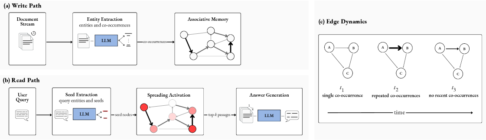
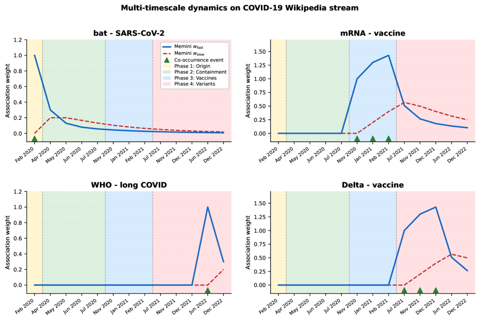

# Continual Knowledge Updating in LLM Systems: Learning Through Multi-Timescale Memory Dynamics

## 基本信息

- **arXiv ID:** [2605.05097v1](https://arxiv.org/abs/2605.05097v1)
- **作者:** Andreas Pattichis, Constantine Dovrolis
- **发布日期:** 2026-05-06
- **分类:** cs.LG, cs.AI, cs.CL
- **PDF:** [arXiv PDF](https://arxiv.org/pdf/2605.05097v1)

## 关键图示

<figure><figcaption>Figure 1</figcaption></figure>
<figure><figcaption>Figure 2</figcaption></figure>

## 摘要

### English

LLMs are trained once, then deployed into a world that never stops changing. External memory compensates for this, but most systems manage it explicitly rather than letting it adapt on its own. Biological memory works differently: coupled multi-timescale dynamics make new associations immediately usable, strengthen what repetition confirms, and let the rest fade. We argue that external memory should follow a similar principle. In Memini, this view takes the form of an associative memory that organizes knowledge as a directed graph. Each edge carries two coupled internal variables, one fast and one slow, following the Benna-Fusi model of synaptic consolidation. From this coupling, episodic sensitivity, gradual consolidation, and selective forgetting emerge as facets of a single mechanism, reframing external memory as a learning substrate that reorganizes through its own dynamics.

### 中文

法学硕士接受一次培训，然后部署到一个永不停息变化的世界。外部存储器弥补了这一点，但大多数系统显式管理它而不是让它自行适应。生物记忆的工作方式有所不同：耦合的多时间尺度动态使新的联想立即可用，加强重复所确认的内容，并让其余的消失。我们认为外部记忆应该遵循类似的原则。在 Memini 中，这种视图采用联想记忆的形式，将知识组织为有向图。每条边都带有两个耦合的内部变量，一个快，一个慢，遵循突触巩固的 Benna-Fusi 模型。在这种耦合中，情景敏感性、逐渐巩固和选择性遗忘作为单一机制的各个方面出现，将外部记忆重新构建为通过自身动态进行重组的学习基质。

## 核心贡献

1. 提出 **Memini** 系统——一种将外部记忆重新定义为**通过学习自身动态进行重组的学习基质**的新型范式，而非传统的静态检索存储。
2. 将生物突触巩固的 **Benna-Fusi 模型**（多时间尺度耦合动力学）应用于 LLM 外部记忆：每条有向边带有两个耦合变量 w_fast（快速访问，响应共现事件）和 w_slow（慢速巩固，通过双向耦合间接积累）。
3. 从单一机制中涌现出三种行为：**情景敏感性**（新关联立即可用）、**渐进巩固**（重复共现增强关联）和**选择性遗忘**（未被强化的关联自然衰减），无需独立的存储模块、显式规则或门控。
4. 系统设计了三个原则：(a) 动态性——关联通过强化和衰减演化；(b) 多时间尺度学习——快变量捕获近期证据，慢变量巩固重复确认的内容；(c) 选择性——系统不存储一切，遗忘与保留同等重要。

## 方法概述

Memini 的记忆架构是一个有向图 G=(V,E)，节点表示实体/概念，边表示有向关联。每条边 (A,B) 携带两个耦合变量，遵循以下动力学方程：

dw_fast/dt = −w_fast/τ_fast + C·(w_slow − w_fast) + I(t)
dw_slow/dt = −w_slow/τ_slow + C·(w_fast − w_slow)

其中 τ_slow ≫ τ_fast，I(t) 在 A 和 B 共现时为 b，否则为 0。

写路径：LLM 从到达文档中提取实体及共现关系，每个共现事件更新对应边。读路径：用户查询中的实体激活种子节点，激活沿 w_fast 加权边传播固定步数，激活最高的节点关联的文档段落作为生成上下文返回。

关键创新：记忆系统和骨干 LLM 处于不同层次——LLM 读写文本，记忆做学习。骨干 LLM 可以替换或升级而不会干扰记忆学到的内容。

## 实验结果

论文为概念性论文（9 页预印本，2 张图），主要贡献在于系统设计和范式论证，而非大规模实证评估。其贡献通过以下方式呈现：
- 与现有系统的**定性对比**（Table 1）：展示了 Memini 在边动态演化、多时间尺度和选择性遗忘三个维度上与 RAG、GraphRAG、HippoRAG、A-MEM、MemoryBank 等系统的差异。
- **玩具示例**演示了耦合动力学如何区分单次共现（瞬态痕迹）和重复共现（巩固关联）。
- 当前版本缺少在标准基准上的定量实验。

## 局限性与注意点

1. **缺乏实证评估**：未在标准持续学习、知识更新或问答基准上进行定量比较，主要贡献留在概念和系统设计层面。
2. **实体提取瓶颈**：写路径依赖 LLM 进行实体和共现提取，此过程的质量和成本未量化分析。
3. **图规模扩展性**：随着文档流持续输入，图的规模增长可能带来计算和存储挑战，未讨论图剪枝或压缩策略。
4. **两变量模型的简化**：Benna-Fusi 模型理论上可用 n>2 变量链实现更丰富的记忆动力学，当前 n=2 的选择可能限制巩固深度。
5. **预印本状态**：论文明确标注为 Preprint（2026年5月7日），未经同行评审。

## 相关概念

- [大语言模型](../../concepts/large-language-model.html)
- [图神经网络](../../concepts/graph-neural-networks.html)
- [世界模型](../../concepts/world-models.html)

---
*导入时间: 2026-05-07 06:01*
*来源: arXiv Daily Wiki Update 2026-05-07*
