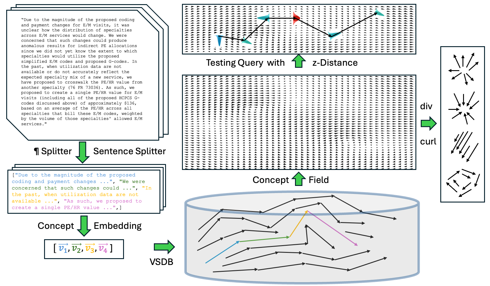
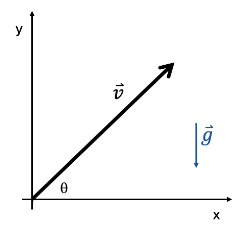
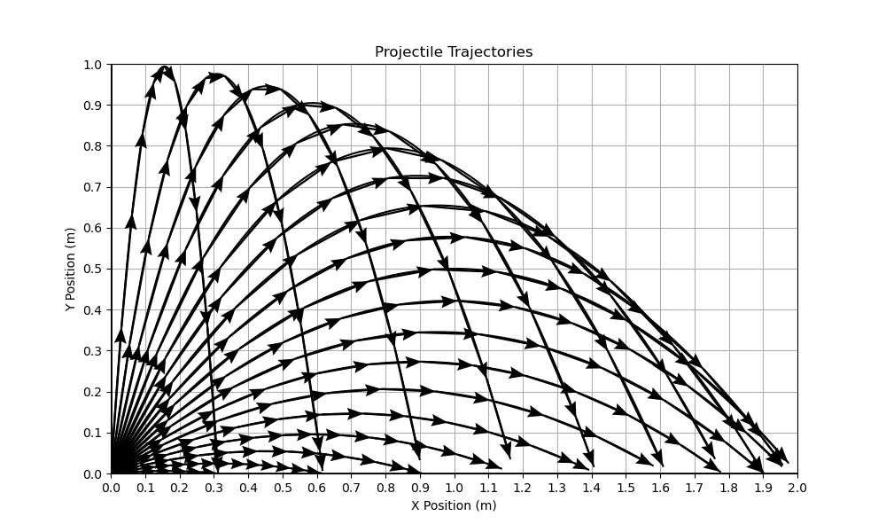

# Text Corpora as Concept Fields: Black-Box Hallucination and Novelty Measurement

## 基本信息

- **arXiv ID:** [2605.05103v1](https://arxiv.org/abs/2605.05103v1)
- **作者:** Nicholas S. Kersting, Vittorio Castelli, Chieh Ting Yeh et al.
- **发布日期:** 2026-05-06
- **分类:** cs.CL, cs.AI, cs.CY
- **PDF:** [arXiv PDF](https://arxiv.org/pdf/2605.05103v1)

## 关键图示

<figure><figcaption>Figure 1</figcaption></figure>
<figure><figcaption>Figure 2</figcaption></figure>
<figure><figcaption>Figure 3</figcaption></figure>

## 摘要

### English

We introduce the **Concept Field** of a text corpus: a local drift field with pointwise uncertainty, estimated in sentence-embedding space from the deltas between consecutive sentences. Given a candidate sentence transition, we score its agreement with the field by $ζ$, the mean absolute z-distance between the observed delta and the field's local Gaussian estimate. The score is black-box (no model internals), corpus-attributable (every score traces to nearby corpus sentences), and admits a direct probabilistic reading. We support the computation with the introduction of a **Vector Sequence Database (VSDB)** that stores embeddings together with sequence-position and next-delta metadata. We evaluate this approach on two large-scale settings: hallucination-style groundedness detection over the U.S. Code of Federal Regulations, and novelty detection over Project Gutenberg. Using controlled LLM-generated rewrites, Concept Fields achieve strong selective classification performance under a grounded / ungrounded / unsure triage policy, which unlike retrieval-centric baselines have similar coverage-risk behavior across both domains, supporting a probability-based interpretation that transfers across domains. We also sketch how divergence and curl of the Concept Field, computed on dense clusters, surface qualitatively meaningful semantic patterns (logic sources, sinks, and implicit topics), which we offer as hypothesis-generating rather than as a quantitative result. Concept Fields provide a fast, lightweight, and interpretable signal for groundedness and novelty, complementary to LLM-as-judge and white-box detectors.

### 中文

我们引入文本语料库的**概念场**：具有逐点不确定性的局部漂移场，根据连续句子之间的增量在句子嵌入空间中估计。给定一个候选句子转换，我们通过 $z$ 对其与场的一致性进行评分，$z$ 是观察到的增量与场的局部高斯估计之间的平均绝对 z 距离。分数是黑盒的（没有模型内部），可归因于语料库（每个分数都追溯到附近的语料库句子），并且允许直接概率阅读。我们通过引入**向量序列数据库（VSDB）**来支持计算，该数据库将嵌入以及序列位置和下一个增量元数据存储在一起。我们在两个大规模环境中评估这种方法：对美国联邦法规的幻觉式接地性检测，以及对古腾堡计划的新颖性检测。使用受控的 LLM 生成的重写，概念字段在有根据/无根据/不确定的分类策略下实现了强大的选择性分类性能，与以检索为中心的基线不同，它在两个领域具有类似的覆盖风险行为，支持跨领域转移的基于概率的解释。我们还概述了在密集集群上计算的概念场的散度和旋度如何呈现定性有意义的语义模式（逻辑源、汇和隐含主题），我们将其作为假设生成而不是作为定量结果提供。 Concept Fields 提供快速、轻量且可解释的信号，以实现接地性和新颖性，与法学硕士作为法官和白盒检测器互补。

## 核心贡献

1. 提出**概念场（Concept Field）**：将文本语料库建模为句子嵌入空间中的局部漂移向量场，附带逐点不确定性（局部高斯分布估计），完全黑盒操作（无需模型内部信息），每个评分可追溯到训练语料中邻近句子。
2. 引入**向量序列数据库（VSDB）**：存储嵌入向量及其序列位置和下一个增量元数据，支持快速最近邻检索、序列重排序、局部增量聚合和 IDW 插值，为概念场计算提供高效基础设施。
3. 提出 ζ 评分系统：计算观测增量与场的局部高斯估计之间的平均绝对 z-距离，支持直接概率解释，用于**接地性检测**（groundedness）和**新颖性检测**（novelty）。
4. 在两个大规模场景中验证——美国联邦法规（CFR）的接地性检测和 Project Gutenberg 的新颖性检测——实现了强选择性分类性能；散度和旋度的探索性分析揭示了语料库中有意义的语义模式（逻辑源、汇和隐式主题）。

## 方法概述

概念场的构建：将语料库文本按句子分割 → 使用 SONAR 嵌入模型获得句子级概念向量 → 在 VSDB 中存储每个向量及其 (ID, 位置, 下一增量)。场估计采用反距离加权（IDW）插值：对任意查询点，利用其 topN 最近邻的增量进行局部高斯估计，得到均值向量 μ 和标准差 σ̃。ζ 评分取分量级平均绝对 z-距离的前 k = topN_ζ 个最大分量。

可选分类策略基于两个阈值 ζ_low 和 ζ_high：ζ < ζ_low 判定为接地（grounded）、ζ > ζ_high 判定为非接地（ungrounded）、中间为不确定（unsure）。超参数通过开发集调优。

为了验证，作者使用 LLM 对 CFR 和 Gutenberg 语料库进行受控重写（引入不同程度的偏离），然后评估概念场区分原始/偏离序列的能力。

## 实验结果

- **接地性检测（CFR）**：在 grounded/ungrounded/unsure 三分类策略下，概念场在接受的判定上实现了低错误率。与基于检索的基线（余弦相似度、Chamfer 距离）相比，概念场在两个领域上具有相似的覆盖-风险行为，支持跨领域的概率解释迁移。
- **新颖性检测（Gutenberg）**：同一 ζ 评分框架同时支持合规性检测（小 ζ 好）和新颖性检测（大 ζ 好），无需方法修改。
- **散度/旋度分析**：在 VSDB 密集簇上计算概念场的散度和旋度，定性揭示出逻辑源（高散度）、汇（低散度）和隐式主题区域。此分析被谨慎标记为假设生成而非定量结果。
- **2D 弹道玩具示例**：在已知物理轨迹（抛物线）上验证了概念场的可行性——轨迹输入区域不确定性高、输出区域一致性好，散度/旋度正确识别了动态边界。

## 局限性与注意点

1. **嵌入质量依赖**：概念场的有效性高度依赖句子嵌入模型（SONAR）的表达质量，不同嵌入模型可能导致不同结果。
2. **超参数敏感性**：topN、d_max、topN_ζ、ζ_low/ζ_high 等超参数需要按语料库调优，缺少自动化选择方法。论文采用启发式设置，可能非最优。
3. **散度/旋度分析的探索性**：概念场几何分析被明确标注为定性、假设生成性质，不宜作为定量性能指标引用。
4. **句子级粒度限制**：在句子级别操作，无法捕捉词级或子句级的精细语义偏离。
5. **企业背景**：作者全部来自 Oracle，未提及代码或数据开源计划。

## 相关概念

- [大语言模型](../../concepts/large-language-model.html)
- [AI安全与对齐](../../concepts/ai-safety-alignment.html)

---
*导入时间: 2026-05-07 06:01*
*来源: arXiv Daily Wiki Update 2026-05-07*
