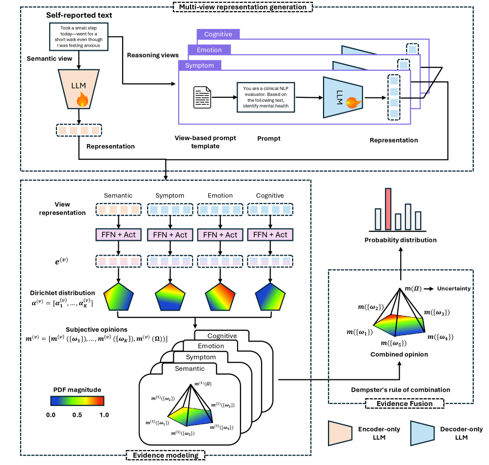
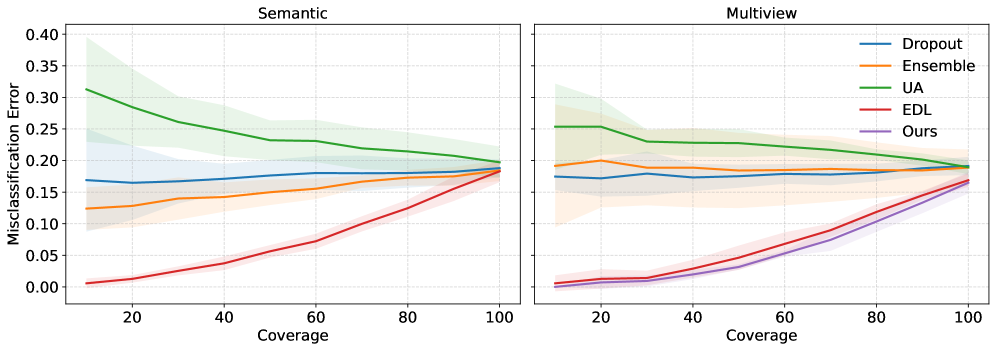

# Beyond Semantics: An Evidential Reasoning-Aware Multi-View Learning Framework for Trustworthy Mental Health Prediction

## 基本信息

- **arXiv ID:** [2605.05121v1](https://arxiv.org/abs/2605.05121v1)
- **作者:** Yucheng Ruan, Ling Huang, Qika Lin et al.
- **发布日期:** 2026-05-06
- **分类:** cs.CL
- **PDF:** [arXiv PDF](https://arxiv.org/pdf/2605.05121v1)

## 关键图示

<figure><figcaption>Figure 1</figcaption></figure>
<figure><figcaption>Figure 2</figcaption></figure>
<figure><figcaption>Figure 3</figcaption></figure>

## 摘要

### English

Automated mental health prediction using textual data has shown promising results with deep learning and large language models. However, deploying these models in high-stakes real-world settings remains challenging, as existing approaches largely rely on semantic representations and often produce overconfident predictions under ambiguous, noisy, or shifted data. Moreover, most methods lack reliable uncertainty estimation, undermining trust in risk-sensitive mental health applications. To address these limitations, we formulate the task as a multi-view learning problem that integrates semantic information from encoder-only models with higher-level reasoning information from decoder-only models, where reasoning-aware representations and uncertainty modeling are obtained in a trustworthy manner. To ensure reliable fusion, we adopt an evidential learning framework based on Subjective Logic to explicitly model uncertainty and introduce an evidential fusion strategy that balances complementary views while discounting unreliable evidence. Benchmarking on three real-world datasets, Dreaddit, SDCNL, and DepSeverity, reports accuracies of 0.835, 0.731, and 0.751, respectively, demonstrating its potential for reliable mental health prediction. Additional experiments on robustness to noise and case studies for interpretability confirm that our proposed framework not only improves predictive performance but also provides trustworthy uncertainty estimates and human-understandable reasoning signals, making it suitable for risk-sensitive applications in mental health assessment.

### 中文

使用文本数据进行的自动心理健康预测通过深度学习和大型语言模型显示出了有希望的结果。然而，在高风险的现实环境中部署这些模型仍然具有挑战性，因为现有的方法在很大程度上依赖于语义表示，并且经常在模糊、噪声或变化的数据下产生过度自信的预测。此外，大多数方法缺乏可靠的不确定性估计，破坏了对风险敏感的心理健康应用的信任。为了解决这些限制，我们将该任务制定为一个多视图学习问题，它将来自仅编码器模型的语义信息与来自仅解码器模型的高级推理信息集成在一起，其中推理感知表示和不确定性建模是以值得信赖的方式获得的。为了确保可靠的融合，我们采用基于主观逻辑的证据学习框架来明确建模不确定性，并引入一种证据融合策略，在平衡互补观点的同时忽略不可靠的证据。对三个现实世界数据集 Dreaddit、SDCNL 和 DepSeverity 进行基准测试，报告的准确度分别为 0.835、0.731 和 0.751，展示了其可靠的心理健康预测的潜力。关于噪声鲁棒性和可解释性案例研究的其他实验证实，我们提出的框架不仅提高了预测性能，而且还提供了值得信赖的不确定性估计和人类可理解的推理信号，使其适合心理健康评估中的风险敏感应用。

## 核心贡献

1. 提出**推理感知的多视图学习框架**：将编码器模型（BERT）的语义视图与解码器模型（LLAMA-3-8B-Instruct）的推理视图（症状、情绪、认知三个推理维度）相结合，超越了仅依赖语义的传统方法。
2. 基于**主观逻辑（Subjective Logic）的证据融合策略**：使用 Dirichlet 分布显式建模不确定性和信念质量，通过 Dempster 组合规则融合多视图证据，同时根据各视图的不确定性动态加权。
3. 在 Dreaddit、SDCNL、DepSeverity 三个真实世界心理健康数据集上达到准确率 **0.835、0.731、0.751**，在多个指标上优于现有基线。
4. **噪声鲁棒性**：在文本注入 25% 和 50% 字符级噪声的条件下，模型保持了较强的预测性能和可靠的不确定性估计，不确定性分布清晰地分离了正确和错误预测。

## 方法概述

框架分为三阶段：(1) **多视图表示生成**：语义视图使用 BERT 的 [CLS] token 隐藏状态；推理视图使用 LLAMA-3-8B-Instruct 在 T 个不同指令提示下生成链式思维分析（如临床诊断提示、认知行为提示），取最后 token 的隐藏状态作为固定维度特征。(2) **证据建模**：将每个视图的 logit 映射为 Dirichlet 分布的参数 α_k = e_k + 1（其中 e_k 为类 k 的证据量），总不确定性 u = K/∑α_k。(3) **证据融合**：应用 Dempster 组合规则融合语义视图和 T 个推理视图的信念分配，冲突度量 κ 用于识别不可靠视图进行降权。

## 实验结果

- **主要结果**：在 Dreaddit（Reddit 压力检测）上准确率 0.835、F1 0.832；在 SDCNL（中文抑郁检测）上准确率 0.731、F1 0.730；在 DepSeverity（抑郁严重度）上准确率 0.751。在所有三个数据集上超越单一 BERT 和单一 LLAMA-3 基线。
- **不确定性校准**（Figure 8）：在噪声数据下（p=0.25, 0.50），正确预测的不确定性分布峰明显低于错误预测的分布峰，表明方法在高不确定性场景下仍能提供可靠的不确定性信号。
- **案例研究**（Table VI, Figure 9）：高不确定性样本涉及隐含痛苦、人际冲突和长期家庭问题（语义积极但推理揭示认知扭曲），而低不确定性样本含有明确的生理症状和强烈情绪信号，推理视图与语义视图概率分布一致且尖锐。
- **视图消融**（Figure 9）：推理视图（尤其是认知视图）在语义模糊的样本上独立做出正确预测，展现了多视图互补的价值。

## 局限性与注意点

1. **数据集规模有限**：三个数据集均为中等规模，且仅覆盖英文（Dreaddit、DepSeverity）和中文（SDCNL），跨语言泛化性未充分评估。
2. **推理质量依赖 LLM**：推理视图的质量取决于 LLAMA-3-8B-Instruct 的零样本推理能力，推理偏差可能传播到最终预测。
3. **仅二分类/有限类别**：Dreaddit（二分类）、DepSeverity（多级）相对简单，更细粒度的心理健康评估需要进一步验证。
4. **计算开销**：每个视图的 LLM 推理增加了推理时间成本，不适合实时部署。
5. **理论框架的基础假设**：主观逻辑的有效性依赖于视图间条件独立的近似假设，在实际中可能不完全成立。

## 相关概念

- [大语言模型](../../concepts/large-language-model.html)
- [基准评估](../../concepts/benchmarking.html)
- [AI安全与对齐](../../concepts/ai-safety-alignment.html)
- [医学AI](../../concepts/medical-ai.html)

---
*导入时间: 2026-05-07 06:01*
*来源: arXiv Daily Wiki Update 2026-05-07*
