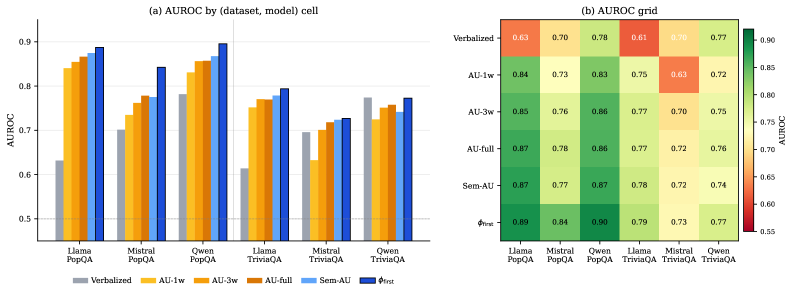

# The First Token Knows: Single-Decode Confidence for Hallucination Detection

## 基本信息

- **arXiv ID:** [2605.05166v1](https://arxiv.org/abs/2605.05166v1)
- **作者:** Mina Gabriel
- **发布日期:** 2026-05-06
- **分类:** cs.CL, cs.AI
- **PDF:** [arXiv PDF](https://arxiv.org/pdf/2605.05166v1)

## 关键图示

<figure><figcaption>Figure 1</figcaption></figure>

## 摘要

### English

Self-consistency detects hallucinations by generating multiple sampled answers to a question and measuring agreement, but this requires repeated decoding and can be sensitive to lexical variation. Semantic self-consistency improves this by clustering sampled answers by meaning using natural language inference, but it adds both sampling cost and external inference overhead. We show that first-token confidence, phi_first, computed from the normalized entropy of the top-K logits at the first content-bearing answer token of a single greedy decode, matches or modestly exceeds semantic self-consistency on closed-book short-answer factual question answering. Across three 7-8B instruction-tuned models and two benchmarks, phi_first achieves a mean AUROC of 0.820, compared with 0.793 for semantic agreement and 0.791 for standard surface-form self-consistency. A subsumption test shows that phi_first is moderately to strongly correlated with semantic agreement, and combining the two signals yields only a small AUROC improvement over phi_first alone. These results suggest that much of the uncertainty information captured by multi-sample agreement is already available in the model's initial token distribution. We argue that phi_first should be reported as a default low-cost baseline before invoking sampling-based uncertainty estimation.

### 中文

自我一致性通过生成问题的多个采样答案并测量一致性来检测幻觉，但这需要重复解码，并且可能对词汇变化敏感。语义自一致性通过使用自然语言推理对采样答案进行聚类来改善这一点，但它增加了采样成本和外部推理开销。我们表明，第一个令牌置信度 phi_first 是根据单个贪婪解码的第一个内容承载答案令牌处的前 K 个逻辑的归一化熵计算得出的，匹配或适度超过了闭卷简答事实问答的语义自洽性。在三个 7-8B 指令调整模型和两个基准测试中，phi_first 的平均 AUROC 为 0.820，而语义一致性为 0.793，标准表面形式自一致性为 0.791。包含测试表明 phi_first 与语义一致性具有中度至强相关性，并且结合两个信号仅比单独使用 phi_first 产生较小的 AUROC 改进。这些结果表明，多样本一致性捕获的大部分不确定性信息已经在模型的初始令牌分布中可用。我们认为，在调用基于采样的不确定性估计之前，应将 phi_first 报告为默认的低成本基线。

## 核心贡献

1. 提出了 **ϕ_first（第一 token 置信度）**：仅需**单次贪婪解码**中第一个内容承载答案 token 的 top-K logits 归一化熵，即可达到甚至超越语义自一致性（Semantic Self-Consistency）的幻觉检测性能。
2. 在 PopQA 和 TriviaQA 两个闭卷短答案事实问答基准上，ϕ_first 在三个 7-8B 指令微调模型（Llama-3.1-8B、Mistral-7B-v0.3、Qwen2.5-7B）上平均 AUROC 达 **0.820**，对比语义自一致性 0.793 和表面形式自一致性 0.791。
3. **成本效率**：ϕ_first 仅需单次前向传递，而语义自一致性需 1 次贪婪解码 + 10 次采样生成 + NLI 聚类，ϕ_first 约为其 **1/11 的生成成本**。
4. **子集测试**：ϕ_first 与语义一致性呈中到强相关（Pearson 0.54–0.76），两者的逻辑回归集成仅带来 +0.02 AUROC，说明多样本采样捕获的大部分不确定性信息已经在单次解码的初始 token 分布中可用。

## 方法概述

ϕ_first 的计算流程：(1) 对问题执行单次贪婪解码；(2) 定位**第一个内容承载答案 token 位置 t⋆**（跳过空白符、标点符号和聊天模板前缀如 "Answer:"）；(3) 取该位置 top-K=100 logits，重新归一化为概率；(4) 计算归一化熵：ϕ_first = 1 − H_t⋆/log K。ϕ_first ∈ [0, 1]，0 表示均匀分布（最高不确定性），1 表示全部概率质量集中在一个 token（最高确定性）。

基线方法包括：(a) AU-full：将 10 次采样（temperature=0.7, top-p=0.95）的完整答案字符串与贪婪答案比较；(b) AU-3w/AU-1w：逐步放宽到前 3 词/前 1 词匹配；(c) Semantic AU：使用 DeBERTa-v3-large-mnli 进行双向 NLI 蕴含聚类；(d) Verbalized confidence：让模型自评置信度（0-100 整数）。

## 实验结果

- **AUROC 对比**（Figure 1b）：ϕ_first 在 5/6 个模型-数据集组合中达到最高 AUROC（Llama/PopQA 0.89, Llama/TriviaQA 0.84, Mistral/PopQA 0.90, Qwen/PopQA 0.79, Qwen/TriviaQA 0.77），仅 Mistral/TriviaQA 略低于 AU-full（0.73 vs 0.78）。
- **子集测试**：ϕ_first 与 Semantic AU 的 Pearson 相关系数：Llama 0.76, Mistral 0.54, Qwen 0.66。逻辑回归集成 ϕ_first + Semantic AU 仅将 AUROC 平均提升了 0.02。
- **答案长度与置信度的关系**：偏相关分析显示，控制正确性后，ϕ_first 与答案长度的表观关联基本消失，说明 ϕ_first 主要反映的是模型对答案不确定性的真实估计，而非简单反问长度。

## 局限性与注意点

1. **仅适用于闭卷短答案事实问答**：方法假设答案以实体/名称/关系值开头，不适合长文本生成或多轮对话场景。
2. **7-8B 模型规模限制**：未在更大规模模型上测试，ϕ_first 在不同模型规模下的表现可能不同。
3. **未调优的超参数**：所有 AUROC 结果为未调优估计（untuned estimates），K=100 的选择需要进一步验证。
4. **单作者论文**：实用性评估范围有限，未包含检索增强生成（RAG）或多语言设置。

## 相关概念

- [大语言模型](../../concepts/large-language-model.html)
- [基准评估](../../concepts/benchmarking.html)

---
*导入时间: 2026-05-07 06:01*
*来源: arXiv Daily Wiki Update 2026-05-07*
