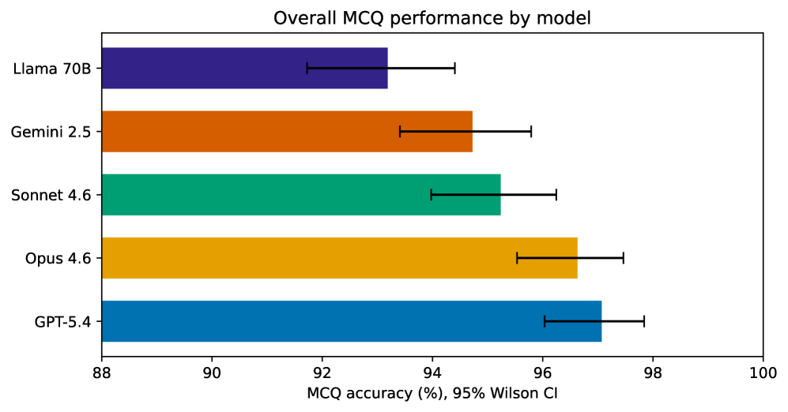
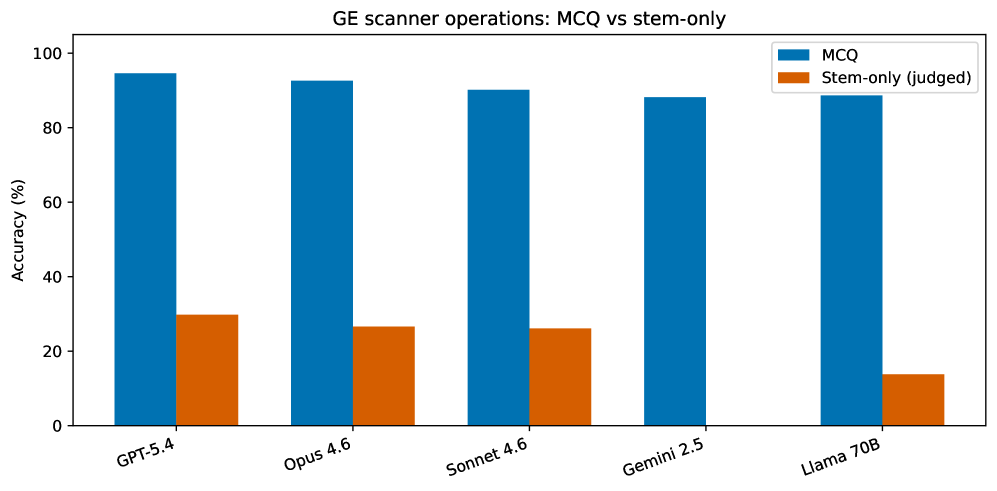
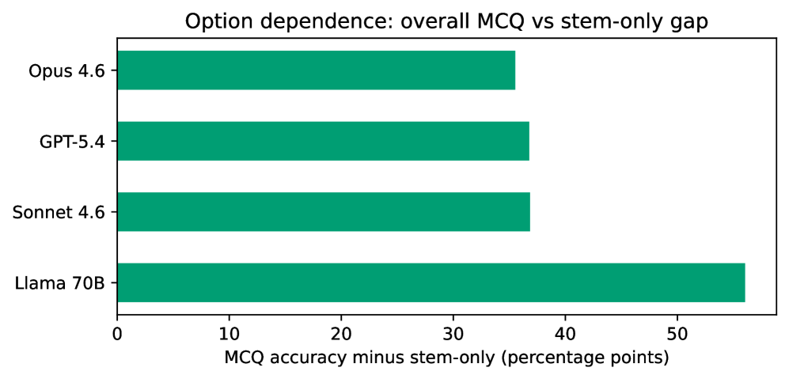

# MRI-Eval: A Tiered Benchmark for Evaluating LLM Performance on MRI Physics and GE Scanner Operations Knowledge

## 基本信息

- **arXiv ID:** [2605.05175v1](https://arxiv.org/abs/2605.05175v1)
- **作者:** Perry E. Radau
- **发布日期:** 2026-05-06
- **分类:** eess.IV, cs.CL, physics.med-ph
- **PDF:** [arXiv PDF](https://arxiv.org/pdf/2605.05175v1)

## 关键图示

<figure><figcaption>Figure 1</figcaption></figure>
<figure><figcaption>Figure 2</figcaption></figure>
<figure><figcaption>Figure 3</figcaption></figure>

## 摘要

### English

Background: Existing MRI LLM benchmarks rely mainly on review-book multiple-choice questions, where top proprietary models already score highly, limiting discrimination. No systematic benchmark has evaluated vendor-specific scanner operational knowledge central to research MRI practice. Purpose: We developed MRI-Eval, a tiered benchmark for relative model comparison on MRI physics and GE scanner operations knowledge using primary multiple-choice questions (MCQ), with stem-only and primed diagnostic conditions as complementary analyses. Methods: MRI-Eval includes 1365 scored items across nine categories and three difficulty tiers from textbooks, GE scanner manuals, programming course materials, and expert-generated questions. Five model families were evaluated (GPT-5.4, Claude Opus 4.6, Claude Sonnet 4.6, Gemini 2.5 Pro, Llama 3.3 70B). MCQ was primary; stem-only removed options and used an independent LLM judge; primed stem-only tested responses to incorrect user claims. Results: Overall MCQ accuracy was 93.2% to 97.1%. GE scanner operations was the lowest category for every model (88.2% to 94.6%). In stem-only, frontier-model accuracy fell to 58.4% to 61.1%, and Llama 3.3 70B fell to 37.1%; GE scanner operations stem-only accuracy was 13.8% to 29.8%. Conclusion: High MCQ performance can mask weak free-text recall, especially for vendor-specific operational knowledge. MRI-Eval is most informative as a relative comparison benchmark rather than an absolute competency measure and supports caution in using raw LLM outputs for GE-specific protocol guidance.

### 中文

背景：现有的 MRI LLM 基准主要依赖于复习书籍的多项选择题，其中顶级专有模型已经得分很高，限制了歧视。没有系统的基准评估对研究 MRI 实践至关重要的特定供应商扫描仪操作知识。目的：我们开发了 MRI-Eval，这是一种使用初级多项选择题 (MCQ) 进行 MRI 物理和 GE 扫描仪操作知识的相对模型比较的分层基准，并以纯干和启动诊断条件作为补充分析。方法：MRI-Eval 包括来自教科书、GE 扫描仪手册、编程课程材料和专家生成的问题的 9 个类别和 3 个难度等级的 1365 个评分项目。评估了五个模型系列（GPT-5.4、Claude Opus 4.6、Claude Sonnet 4.6、Gemini 2.5 Pro、Llama 3.3 70B）。 MCQ 是主要的； Stem-only 删除了选项并使用了独立的 LLM 法官；对不正确的用户声明进行仅干测试的响应。结果：MCQ 总体准确率为 93.2% 至 97.1%。 GE 扫描仪操作是所有型号中最低的类别（88.2% 至 94.6%）。在纯干分析中，前沿模型准确率下降至 58.4% 至 61.1%，Llama 3.3 70B 下降至 37.1%； GE 扫描仪操作的仅干准确度为 13.8% 至 29.8%。结论：高 MCQ 性能可以掩盖较弱的自由文本回忆，尤其是对于特定于供应商的操作知识。 MRI-Eval 作为相对比较基准而不是绝对能力衡量标准提供了最丰富的信息，并且支持谨慎使用原始 LLM 输出进行 GE 特定协议指导。

## 核心贡献

1. 提出了 **MRI-Eval** 基准，包含 **1365 个评分题目**，覆盖 9 个类别（GE 扫描仪操作、脉冲序列、安全性、k-空间与图像形成、伪影、T1/T2 弛豫与对比等）和 3 个难度层级。
2. 首次系统评估 LLM 对**供应商特定（GE）扫描仪操作知识**的掌握——这是日常 MRI 研究工作的核心，但在通用训练语料中代表性严重不足。
3. 设计了**三项互补评估条件**：(a) 标准 MCQ；(b) Stem-only（去除选项，要求自由文本回答）；(c) Primed stem-only（向模型提供错误答案建议，测试其辨别能力）。
4. 揭示了 MCQ 高分与自由文本回忆之间的**巨大鸿沟**：前沿模型 MCQ 准确率达 93-97%，但 stem-only 骤降至 58-61%；GE 扫描仪操作的 stem-only 准确率更是低至 **13.8-29.8%**。

## 方法概述

MRI-Eval 的题目来源包括三本 MRI 物理教材、GE SIGNA Works 扫描仪应用手册、GE EPIC 编程课程材料以及 35 道作者自编题目。每个题目被分配到 9 个类别之一和 3 个难度层级之一：Tier 1（单概念回忆，83.1%）、Tier 2（跨概念整合，15.6%）、Tier 3（专家级综合场景，1.3%）。

评估了 5 个模型家族的模型：GPT-5.4、Claude Opus 4.6、Claude Sonnet 4.6、Gemini 2.5 Pro 和 Llama 3.3 70B。所有模型在 zero-shot、temperature=0 条件下运行，选项顺序随机打乱。Stem-only 评估使用独立的 LLM 评判器（Grok-4-1-fast-non-reasoning）进行二元正确/错误评分；人工校验子集（n=136）获得 89.7% 的评判-人类一致性。统计检验使用 Wilson 置信区间、McNemar 检验（含 Bonferroni 校正）和 Cohen's kappa。

## 实验结果

- **MCQ 总体表现**（Table 1）：GPT-5.4 最高 97.1%，Opus 4.6 紧随其后 96.6%，Llama 3.3 70B 最低 93.2%。前沿模型间仅 2.4 个百分点差异。
- **GE 扫描仪操作是最大短板**（Table 3）：所有模型在该类别得分最低（88.2-94.6%），类别内差异最大（6.4 pp），且 McNemar 检验中显著差异集中在该类别。
- **Stem-only 揭露知识假象**（Table 5）：GPT-5.4 从 97.1% 降至 60.3%（-36.8 pp），Llama 3.3 70B 从 93.2% 降至 37.1%（-56.1 pp）。前沿模型在 stem-only 上高度聚集（58.4-61.1%）。
- **GE 扫描仪操作 stem-only 近乎地板**：13.8%（Llama）至 29.8%（Sonnet），说明 MCQ 接近满分的能力几乎不转化为自由文本知识回忆。
- **重复性**（Table 4）：4 个模型运行间 Cohen's kappa 0.983–0.998，不一致项集中在 GE 扫描仪操作类别。
- **Primed 条件**：错误答案提示整体提高了准确率，主要归因于答案提示效应（answer-cueing）而非谄媚。

## 局限性与注意点

1. **单一评判器**：Stem-only 使用 Grok 作为唯一评判器，仅进行有限人工校验（n=136）。人工一致性 89.7% 反映了评判器偏严格而非偏宽松的倾向，因此报告的 stem-only 准确率可能略微保守。
2. **小样本 Tier 3**：仅 18 个题目（1.3%），统计功效受限。
3. **选项长度偏差**：事后审计发现 84.9% 的 MCQ 题目中正确答案选项长于平均干扰项，长度信号可能人为抬高了 MCQ 准确率（Tier 2/3 题目中差距达 +8.3 至 +20.0 pp）。
4. **缺少人类专家基线**：未校准人类专家在相同题目上的表现，因此计算结果主要适合相对模型比较而非绝对能力评估。
5. **非公开题库**：为防止训练数据污染，完整题库未公开。

## 相关概念

- [大语言模型](../../concepts/large-language-model.html)
- [基准评估](../../concepts/benchmarking.html)

---
*导入时间: 2026-05-07 06:01*
*来源: arXiv Daily Wiki Update 2026-05-07*
