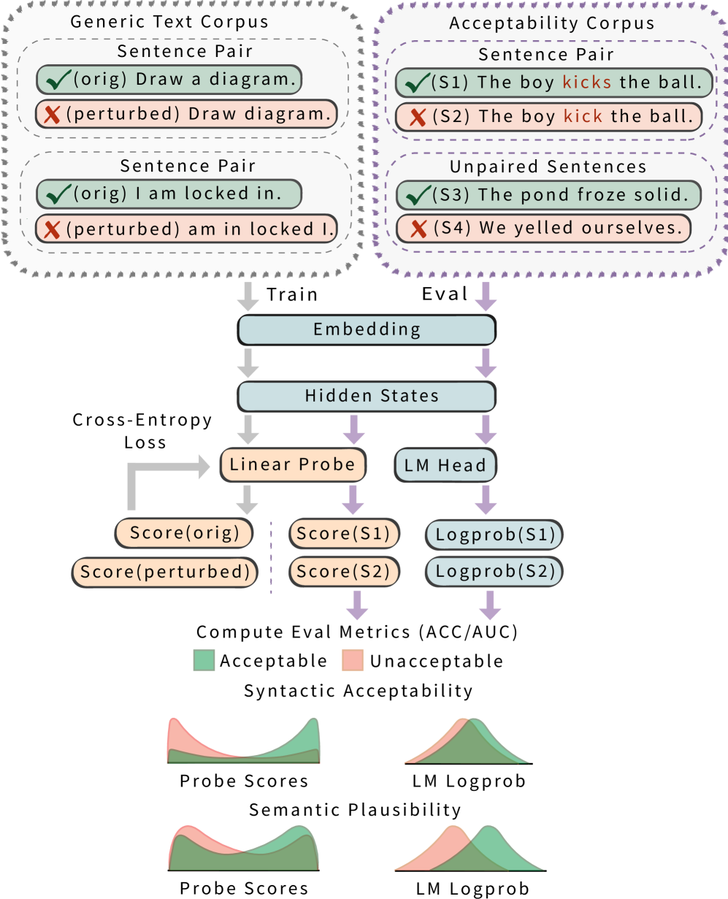
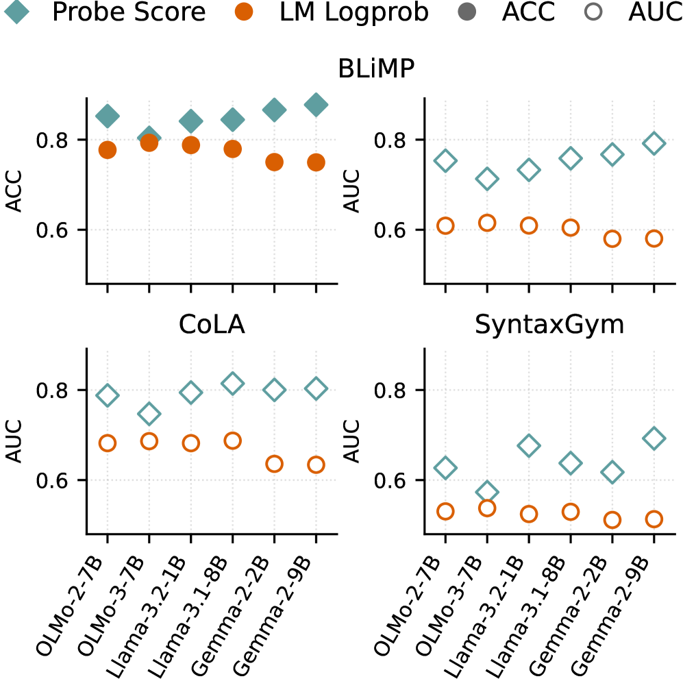
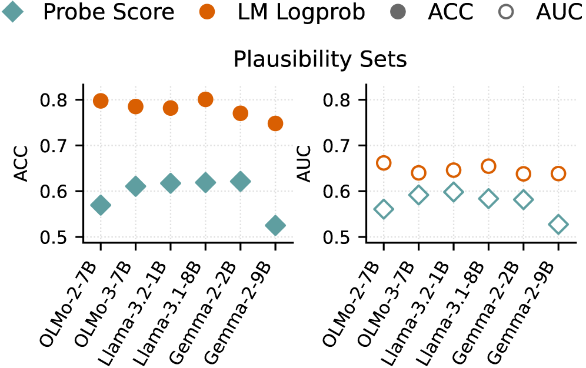

# Implicit Representations of Grammaticality in Language Models

## 基本信息

- **arXiv ID:** [2605.05197v1](https://arxiv.org/abs/2605.05197v1)
- **作者:** Yingshan Susan Wang, Linlu Qiu, Zhaofeng Wu et al.
- **发布日期:** 2026-05-06
- **分类:** cs.CL
- **PDF:** [arXiv PDF](https://arxiv.org/pdf/2605.05197v1)

## 关键图示

<figure><figcaption>Figure 1</figcaption></figure>
<figure><figcaption>Figure 2</figcaption></figure>
<figure><figcaption>Figure 3</figcaption></figure>

## 摘要

### English

Grammaticality and likelihood are distinct notions in human language. Pretrained language models (LMs), which are probabilistic models of language fitted to maximize corpus likelihood, generate grammatically well-formed text and discriminate well between grammatical and ungrammatical sentences in tightly controlled minimal pairs. However, their string probabilities do not sharply discriminate between grammatical and ungrammatical sentences overall. But do LMs implicitly acquire a grammaticality distinction distinct from string probability? We explore this question through studying internal representations of LMs, by training a linear probe on a dataset of grammatical and (synthetic) ungrammatical sentences obtained by applying perturbations to a naturalistic text corpus. We find that this simple grammaticality probe generalizes to human-curated grammaticality judgment benchmarks and outperforms LM probability-based grammaticality judgments. When applied to semantic plausibility benchmarks, in which both members of a minimal pair are grammatical and differ in only plausibility, the probe however performs worse than string probability. The English-trained probe also exhibits nontrivial cross-lingual generalization, outperforming string probabilities on grammaticality benchmarks in numerous other languages. Additionally, probe scores correlate only weakly with string probabilities. These results collectively suggest that LMs acquire to some extent an implicit grammaticality distinction within their hidden layers.

### 中文

语法性和可能性是人类语言中不同的概念。预训练语言模型 (LM) 是一种适合最大化语料库可能性的语言概率模型，生成语法良好的文本，并在严格控制的最小对中很好地区分语法句子和不语法句子。然而，它们的字符串概率总体上并不能严格区分语法句子和非语法句子。但是 LM 是否隐含地获得了与字符串概率不同的语法区别？我们通过研究 LM 的内部表示来探索这个问题，方法是在通过对自然文本语料库应用扰动而获得的语法和（合成）非语法句子数据集上训练线性探针。我们发现这个简单的语法性探测可以推广到人类策划的语法性判断基准，并且优于 LM 基于概率的语法性判断。当应用于语义合理性基准时，其中最小对的两个成员都是语法上的并且仅在合理性上有所不同，但是探针的性能比字符串概率更差。经过英语训练的探针还表现出非凡的跨语言泛化能力，在许多其他语言的语法基准上优于字符串概率。此外，探测分数与字符串概率的相关性很弱。这些结果共同表明语言模型在其隐藏层中获得了一定程度的隐式语法区别。

## 核心贡献

1. 提出了一种**无需人类标注数据**的语法性探测方法：通过对自然文本施加插入、删除、局部打乱三种扰动，自动构造语法/不合语法的训练对。
2. 实验证明，基于该合成数据训练的线性探针（grammaticality probe）在 BLiMP、CoLA、SyntaxGym 等人类标注的语法性判断基准上**优于 LM 字符串概率（logprob）**，实现了 AUC 平均提升。
3. 发现英文训练的探针具有**跨语言泛化能力**：在瑞典语、荷兰语、意大利语、俄语、日语、中文等语言的语法性基准上零样本迁移，且性能普遍超过字符串概率。
4. 揭示了语法性与似然性的**双重分离**：探针对语法性敏感而对语义合理性不敏感（在语义合理性基准上探针表现反而弱于 logprob），且探针分数与字符串概率仅呈弱相关（Spearman ρ 中等）。

## 方法概述

论文的核心思路是在 LM 的隐藏状态上训练一个线性分类器来检测语法性。训练数据完全来自合成：从 Penn Treebank 和 Project Gutenberg 中抽取 50,000 个句子作为"语法"样本，然后对每个句子随机施加三种扰动之一——**插入**（随机插入 1-5 个词）、**删除**（随机删除 1-5 个词）、**局部打乱**（随机打乱连续 5 词窗口）——作为"不合语法"样本。验证显示 93.72% 的扰动子集确实不合语法。

探针采用 ℓ₂ 正则化的逻辑回归，输入为 LM 最后一个 token 位置（通常是标点符号）的隐藏状态。实验覆盖 OLMo-2-7B、OLMo-3-7B、Llama-3.2-1B、Llama-3.1-8B、Gemma-2-2B、Gemma-2-9B 共 6 个基座模型。探针训练使用合成数据的 80% 作为训练集、20% 作为开发集。

## 实验结果

- **英语语法性基准**：探针在 BLiMP 上的 AUC 在所有模型上均超过 logprob 基线，例如在 Llama-3.1-8B 上探针 AUC 达 0.87 vs. logprob 0.76。
- **跨语言泛化**（Table 2）：英文探针零样本迁移到 6 种语言，在 34/36 个模型-语言-指标组合中优于 logprob。例如 Gemma-2-9B 探针在瑞典语 ScaLA 上 AUC 达 0.83，而 logprob 仅 0.66。
- **语义合理性基准**（Figure 2b）：探针在区分语义合理/不合理句子时表现始终弱于 logprob，说明探针更专注于句法可接受性。
- **神经元定位**（Figure 3）：LASSO 正则化实验表明，仅需 **0.01% 的神经元**（约 10 个）即可达到较好性能，且即使是随机选择的同数量神经元也能达到不差的性能，说明语法性信号在大部分层呈分布式编码。
- **探针与 logprob 的相关性**：Spearman 相关系数仅中等水平，进一步验证探针捕获了与字符串概率不同的信息。

## 局限性与注意点

1. **合成训练数据的偏差**：扰动方法生成的"不合语法"句子可能引入了语义不合理性而非纯句法错误，尽管 93.72% 的质量检查通过率较高，但仍有小部分噪声。
2. **自然不合语法句子的稀缺性**：真实的语法错误很少是简单的插入/删除/打乱变体，合成训练的探针能否完全覆盖真实错误类型需要进一步验证。
3. **跨语言泛化的限制**：非英语训练的探针迁移效果较差，这归因于预训练数据中英语的主导地位。
4. **未测试指令微调模型**：实验仅使用基座模型，未评估指令微调版本，限制了与当前主流应用场景的直接关联。

## 相关概念

- [大语言模型](../../concepts/large-language-model.html)
- [基准评估](../../concepts/benchmarking.html)

---
*导入时间: 2026-05-07 06:01*
*来源: arXiv Daily Wiki Update 2026-05-07*
