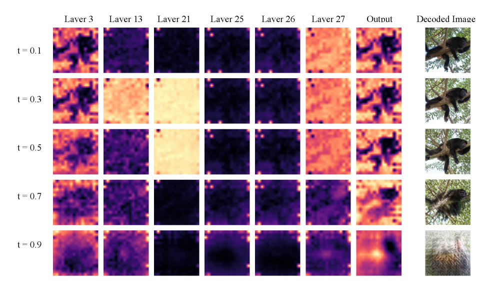
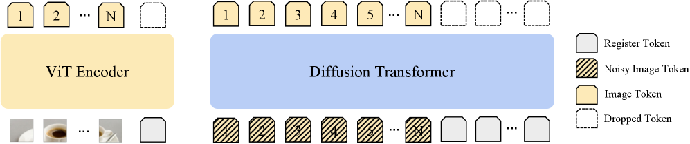

# Taming Outlier Tokens in Diffusion Transformers

## 基本信息

- **arXiv ID:** [2605.05206v1](https://arxiv.org/abs/2605.05206v1)
- **作者:** Xiaoyu Wu, Yifei Wang, Tsu-Jui Fu et al.
- **发布日期:** 2026-05-06
- **分类:** cs.CV, cs.AI, cs.LG
- **PDF:** [arXiv PDF](https://arxiv.org/pdf/2605.05206v1)

## 关键图示

<figure><figcaption>Figure 1</figcaption></figure>
<figure><figcaption>Figure 2</figcaption></figure>
<figure><figcaption>Figure 3</figcaption></figure>

## 摘要

### English

We study outlier tokens in Diffusion Transformers (DiTs) for image generation. Prior work has shown that Vision Transformers (ViTs) can produce a small number of high-norm tokens that attract disproportionate attention while carrying limited local information, but their role in generative models remains underexplored. We show that this phenomenon appears in both the encoder and denoiser of modern Representation Autoencoder (RAE)-DiT pipelines: pretrained ViT encoders can produce outlier representations, and DiTs themselves can develop internal outlier tokens, especially in intermediate layers. Moreover, simply masking high-norm tokens does not improve performance, indicating that the problem is not only caused by a few extreme values, but is more closely related to corrupted local patch semantics. To address this issue, we introduce Dual-Stage Registers (DSR), a register-based intervention for both components: trained registers when available, recursive test-time registers otherwise, and diffusion registers for the denoiser. Across ImageNet and large-scale text-to-image generation, these interventions consistently reduce outlier artifacts and improve generation quality. Our results highlight outlier-token control as an important ingredient in building stronger DiTs.

### 中文

我们研究用于图像生成的扩散变压器（DiT）中的异常标记。先前的工作表明，视觉变压器（ViT）可以产生少量高规范令牌，这些令牌在携带有限的本地信息的同时吸引了过多的注意力，但它们在生成模型中的作用仍未得到充分探索。我们证明这种现象出现在现代表示自动编码器（RAE）-DiT 管道的编码器和降噪器中：预训练的 ViT 编码器可以产生离群表示，而 DiT 本身可以开发内部离群标记，尤其是在中间层。此外，简单地屏蔽高范数标记并不能提高性能，这表明问题不仅是由少数极值引起的，而且与损坏的本地补丁语义更密切相关。为了解决这个问题，我们引入了双级寄存器（DSR），这是一种针对两个组件的基于寄存器的干预：可用时训练寄存器，否则递归测试时间寄存器，以及用于降噪器的扩散寄存器。在 ImageNet 和大规模文本到图像生成中，这些干预措施不断减少异常伪影并提高生成质量。我们的结果强调了异常值令牌控制是构建更强大 DiT 的重要组成部分。

## 核心贡献

1. 首次系统研究了**扩散 Transformer（DiT）中的离群 token 现象**：揭示离群 token 同时存在于 RAE-DiT 管道的编码器和去噪器中，且 DiT 的离群模式与标准 ViT 不同——主要集中在中间层而非最终层。
2. 发现简单屏蔽高范数 token **不能改善生成性能**，表明问题不仅是极值效应，更与受损的局部 patch 语义密切相关。
3. 提出**双阶段寄存器（Dual-Stage Registers, DSR）**：针对编码器使用训练寄存器（可用时）或递归测试时寄存器（否则），针对去噪器引入扩散寄存器，统一解决管道两端的离群 token 问题。
4. 在 ImageNet-256 类条件生成和文本到图像生成上取得一致改进：RAE-DiT with SigLIP2-B 的 FID 从 5.89 降至 **4.58**，GenEval 从 0.426 提升至 **0.466**。

## 方法概述

DSR 包含三个组件：(1) **编码器寄存器**：对于预训练时已包含寄存器 token 的编码器（如 DINOv2-reg），直接使用；对于未包含的（如 SigLIP 2），在测试时通过递归算法将离群激活转移到额外寄存器 token。(2) **扩散寄存器**：在 DiT 的 patch token 之外引入专用寄存器 token，这些 token 在去噪过程中充当注意力汇（attention sink），吸收离群行为而不干扰 patch token 的语义信息。(3) **联合训练**：寄存器 token 与 DiT 参数一起从随机初始化开始训练。

DSR 的设计动机来自两个关键发现：(a) 扩散噪声水平越低（即 t 越小，越接近干净图像），离群 token 现象越严重，表明编码器异常被去噪目标放大；(b) 离群 token 集中在 DiT 的中间层（约第 21-26 层），而标准 ViT 的离群 token 通常出现在最终层。

## 实验结果

- **ImageNet-256 类条件生成**：相比无寄存器基线，DSR 将 SiT-XL 的 FID 从 2.66 降至 2.48，将 RAE-DiT（SigLIP2-B 编码器）的 FID 从 5.89 降至 4.58。
- **Token 损失掩蔽实验**：仅丢弃最高范数 token 的损失项，生成质量未改善，进一步证实问题根源在于受损的局部语义结构而非统计极值。
- **文本到图像生成**：在大规模 T2I 任务上，DSR 将 GenEval 从 0.426 提升至 0.466。
- **编码器分析**（Figure 1）：SigLIP2-B 编码器的倒数第二层展现出最强的离群 token 模式，最终输出层由于 SigLIP 的重建相关训练目标而相对稳定。
- **去噪器分析**（Figure 2）：离群 token 集中在中间层，且严重程度随扩散时间步 t 下降而增加（t=0.1 时最强，t=0.7 时温和）。

## 局限性与注意点

1. **仅评估 DiT 架构**：未在 UNet 基或其他非 Transformer 扩散模型上测试，DSR 的通用性有待验证。
2. **编码器依赖**：对于无法修改的闭源编码器模型，测试时寄存器方法的效果可能受限。
3. **计算开销**：引入额外寄存器 token 增加了一定计算成本，未报告推理速度/显存开销的定量对比。
4. **受审状态**：论文标注为 "Under review"，可能在未来版本中更新。
5. **寄存器 token 数量**：未系统消融寄存器 token 数量的影响（论文使用了固定数量）。

## 相关概念

- [大语言模型](../../concepts/large-language-model.html)
- [多模态学习](../../concepts/multimodal-learning.html)

---
*导入时间: 2026-05-07 06:01*
*来源: arXiv Daily Wiki Update 2026-05-07*
