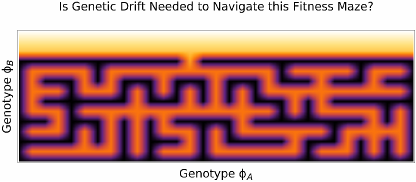
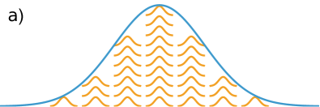
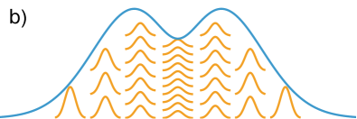

# Direct From Darwin: Deriving Advanced Optimizers From Evolutionary First Principles

## 基本信息

- **arXiv ID:** [2605.05284v1](https://arxiv.org/abs/2605.05284v1)
- **作者:** Daniel Grimmer
- **发布日期:** 2026-05-06
- **分类:** cs.NE, cs.LG, q-bio.PE, q-bio.QM
- **PDF:** [arXiv PDF](https://arxiv.org/pdf/2605.05284v1)

## 关键图示

<figure><figcaption>Figure 1</figcaption></figure>
<figure><figcaption>Figure 2</figcaption></figure>
<figure><figcaption>Figure 3</figcaption></figure>

## 摘要

### English

Evolutionary computation has long promised to deliver both high-performance optimization tools as well as rigorous scientific simulations of Darwinian evolution. However, modern algorithms frequently abandon evolutionary fidelity for physics-inspired heuristics or superficial biological metaphors. This paper derives a suite of advanced gradient-based optimization algorithms directly from evolutionary first principles. We introduce Darwinian Lineage Simulations (DLS) to prove that, in an asexual context, Fisher's and Wright's historically opposed views of evolution are actually formally equivalent. This unification requires carefully partitioning Fisher's deterministically-evolving total population into Wright's randomly-drifting sub-populations. We prove that proper bookkeeping requires introducing a specific kind of structured noise (the DLS noise relation). Crucially, however, any bookkeeping choices which satisfy this relation will result in a faithful simulation of evolution. Using this vast representational freedom, we prove that a broad family of battle-tested optimization algorithms are already perfectly compatible with evolutionary dynamics. These include: Stochastic Gradient Descent, Natural Gradient Descent, and the Damped Newton's method among many others. By simply adding DLS noise (i.e., evolutionarily faithful genetic drift), these algorithms become scientifically valid in silico simulations of Darwinian evolution. Finally, we demonstrate that even the state-of-the-art Adam optimizer can be brought into evolutionary compliance through a minor mathematical surgery.

### 中文

进化计算长期以来一直致力于提供高性能优化工具以及达尔文进化论的严格科学模拟。然而，现代算法经常放弃进化保真度，转而采用物理启发式或肤浅的生物隐喻。本文直接从进化第一原理推导出一套先进的基于梯度的优化算法。我们引入达尔文谱系模拟（DLS）来证明，在无性背景下，费舍尔和赖特历史上对立的进化论实际上在形式上是等价的。这种统一需要仔细地将费舍尔确定性演化的总种群划分为赖特随机漂移的子种群。我们证明，正确的簿记需要引入一种特定类型的结构化噪声（DLS 噪声关系）。然而，至关重要的是，任何满足这种关系的簿记选择都将导致对进化的忠实模拟。利用这种巨大的表征自由度，我们证明了一系列经过实战检验的优化算法已经与进化动力学完美兼容。其中包括：随机梯度下降、自然梯度下降和阻尼牛顿法等。通过简单地添加 DLS 噪声（即，进化上忠实的遗传漂变），这些算法在达尔文进化论的计算机模拟中变得科学有效。最后，我们证明即使是最先进的 Adam 优化器也可以通过一个小的数学手术来实现进化合规性。

## 相关概念

- [世界模型](../../concepts/world-models.html)

## 核心贡献

本文从进化第一原理直接推导出一系列先进的基于梯度的优化算法。核心创新是提出**达尔文谱系模拟（Darwinian Lineage Simulations, DLS）**框架，证明了在无性繁殖背景下 **Fisher 的大群体确定论选择**与 **Wright 的小群体随机漂变论**在形式上是等价的。这一统一的关键是：(1) 引入 **DLS 噪声关系** W_g = µ²I − (V_{g+1} − V_g)，将遗传漂变严格耦合于突变率和群体方差变化；(2) 证明了广泛的优化算法（SGD、自然梯度下降、阻尼牛顿法等）只需加入 DLS 噪声就成为进化上忠实的达尔文进化模拟；(3) 对 Adam 优化器的动量项进行了小幅"数学手术"使其符合进化约束。

## 方法概述

从 Fisher 的大群体理论和 Wright 的转移平衡理论出发：(1) Fisher 视角：选择作用于群体遗传方差 V_g 作为各向异性预条件器/学习率，产生确定性更新；(2) Wright 视角：将总群体划分为子群体（demes），各子群体独立进行随机遗传漂变；(3) DLS 框架通过 Price 方程 `Δθ = V_g ∇ ln W̄ + b + ξ_g` 统一二者，其中 ξ_g ∼ N(0, W_g) 的协方差结构由 DLS 噪声关系精确限制；(4) 利用无性繁殖下无基因流的特性，子群体划分方式完全自由，从而使框架能涵盖各类梯度优化器。

## 实验结果

- **兼容性证明**：SGD、自然梯度下降（NGD）、阻尼牛顿法、RMSprop 及多种近似和正则化变体，均被证明天然符合 DLS 进化更新规则。
- **Adam 手术**：Adam 的动量项 `m_g = β₁ m_{g-1} + (1-β₁)ĝ_g` 引入了不在 DLS 噪声关系允许范围内的额外自由度，导致其不能严格对应进化动力学。解决方案是移除偏差修正项或调整 `β₁` 与 `β₂` 的关系，使之与 DLS 约束兼容。代码已开源（github.com/danielgrimmer/adam-dls）。
- **科学价值**：DLS 噪声关系的引入使进化生物学家不必再使用物理学中的"热噪声"概念来模拟遗传漂变，提供了真正进化论的漂变模型。

## 局限性与注意点

- 严格限于**无性繁殖**背景（无基因重组）。有性繁殖下的 Fisher-Wright 等价性仍是开放问题。
- 所有算法均假设连续基因型空间和梯度可用性；在真正离散分子进化场景中的适用性需进一步验证。
- Adam 的"手术"虽然数学上简洁，但修改后的优化器在标准 ML 基准上的性能是否与原始 Adam 相当尚未在本文中检验。
- 论文目前处于提交审查阶段（Submitted to Evolutionary Computation, May 2026），尚未经过同行评议。

## 相关概念

- [世界模型](../../concepts/world-models.html) — DLS 框架证明了梯度优化就是进化动力学，这意味着将优化理论嵌入世界模型构建时，可以借鉴进化生物学中关于适应度景观、漂变和选择平衡的丰富理论。

---
*分析完成时间: 2026-05-10*
*来源: arXiv Daily Wiki Update 2026-05-10*
