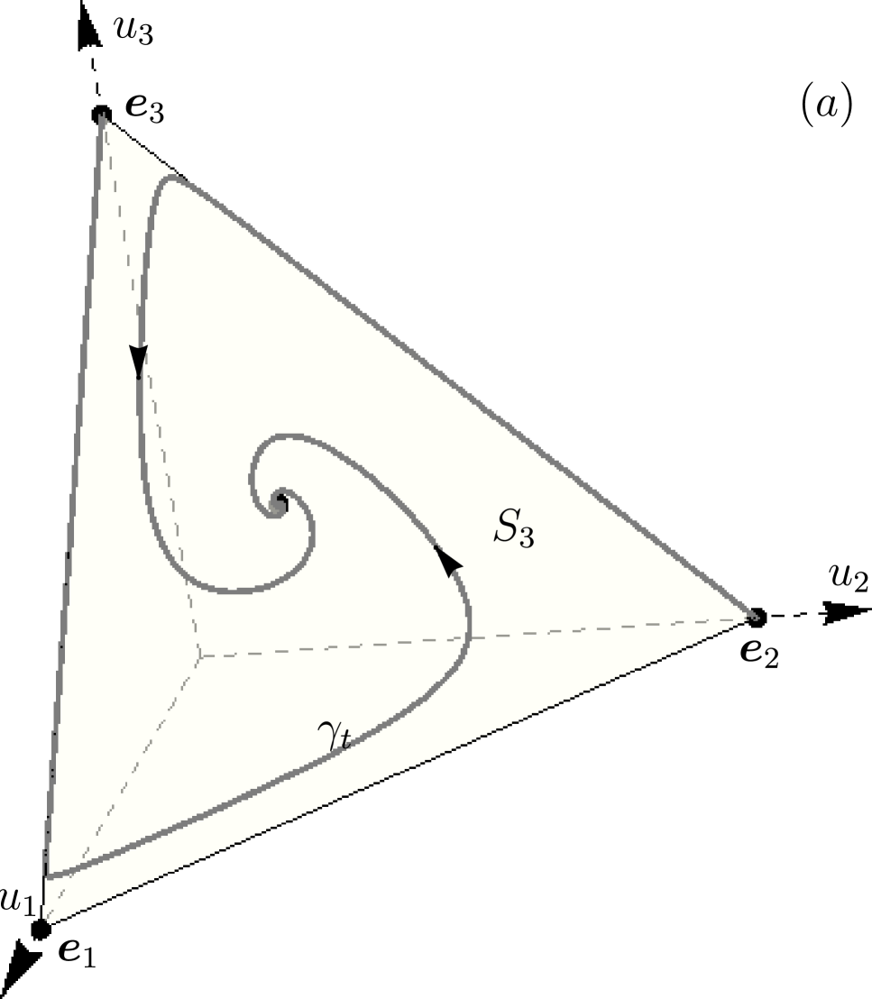
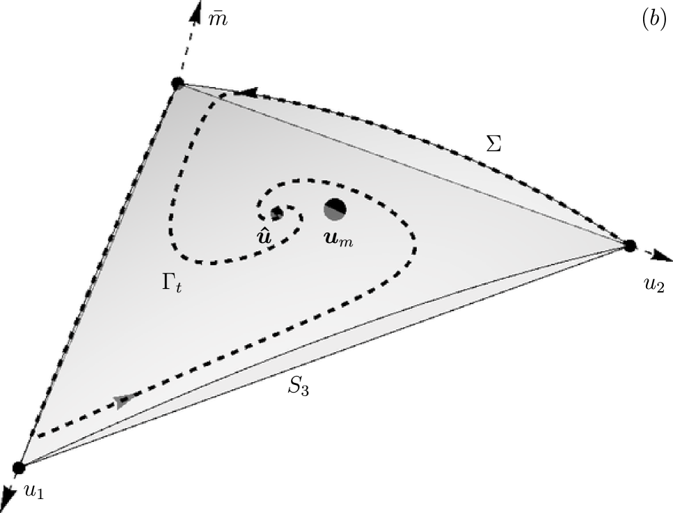
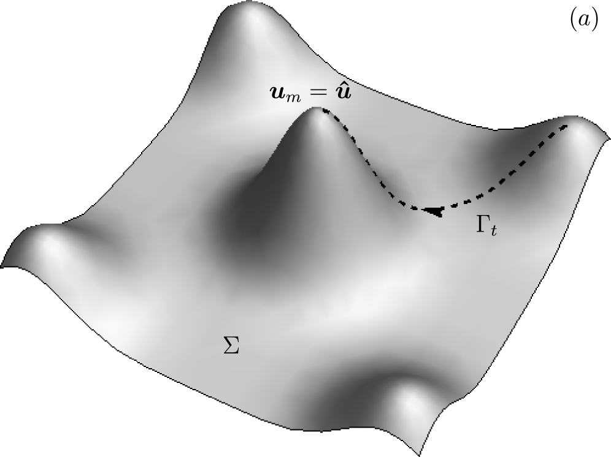

# Chapter 2: Geometry of the Fitness Surface and Trajectory Dynamics of Replicator Systems

## 基本信息

- **arXiv ID:** [2605.05385v1](https://arxiv.org/abs/2605.05385v1)
- **作者:** A. S. Bratus, S. Drozhzhin, T. Yakushkina
- **发布日期:** 2026-05-06
- **分类:** q-bio.PE, math.DS
- **PDF:** [arXiv PDF](https://arxiv.org/pdf/2605.05385v1)

## 关键图示

<figure><figcaption>Figure 1</figcaption></figure>
<figure><figcaption>Figure 2</figcaption></figure>
<figure><figcaption>Figure 3</figcaption></figure>

## 摘要

### English

We study the geometry of the mean fitness surface of replicator systems and its relationship to evolutionary trajectory dynamics. Using the symmetric--antisymmetric decomposition of the fitness landscape matrix, we derive an explicit formula for the rate of change of mean fitness and establish necessary conditions for its monotonicity along trajectories. In general, replicator trajectories do not reach the maximum of the fitness surface, even in the presence of a unique asymptotically stable equilibrium. We characterise, in terms of the symmetric and antisymmetric parts of the fitness matrix, the precise conditions under which an equilibrium coincides with a local extremum of the fitness surface. Circulant matrices are identified as a natural and nontrivial class satisfying these conditions. We establish a two-way connection between fitness surface maxima and evolutionarily stable states: evolutionary stability implies a local fitness maximum, and the converse holds under the identified structural conditions. When the unique asymptotically stable equilibrium is a local maximum, it is evolutionarily stable and realises the global maximum of the fitness surface; an unstable equilibrium forces the global maximum to the boundary of the simplex. The framework is extended to general Lotka--Volterra systems, where an analogue of mean fitness is shown to share the same extremal properties. Results are illustrated through six examples spanning autocatalytic and hypercyclic replication, a parametric family exhibiting Andronov--Hopf bifurcation and heteroclinic cycles, and the Eigen quasispecies model.

### 中文

我们研究复制系统平均适应度表面的几何形状及其与进化轨迹动力学的关系。利用适应度景观矩阵的对称-反对称分解，我们推导出平均适应度变化率的显式公式，并为其沿轨迹的单调性建立了必要条件。一般来说，即使存在唯一的渐近稳定平衡，复制器轨迹也不会达到适应表面的最大值。我们根据适应度矩阵的对称和反对称部分来描述平衡与适应度表面的局部极值一致的精确条件。循环矩阵被认为是满足这些条件的自然且非平凡的类。我们在适应度表面最大值和进化稳定状态之间建立了双向联系：进化稳定性意味着局部适应度最大值，反之亦然。当唯一渐近稳定平衡为局部极大值时，是进化稳定的，实现了适应度面的全局极大值；不稳定的平衡迫使全局最大值到达单纯形的边界。该框架被扩展到一般的 Lotka-Volterra 系统，其中平均适应度的类似物被证明具有相同的极值属性。结果通过涵盖自催化和超循环复制、展示安德罗诺夫-霍普夫分岔和异宿循环的参数族以及本征准种模型的六个示例进行说明。

## 相关概念

- [基准评估](../../concepts/benchmarking.html)
- [自动驾驶](../../concepts/autonomous-driving.html)
- [世界模型](../../concepts/world-models.html)

## 核心贡献

本章系统研究了复制器动力学的**适应度曲面几何**与进化轨迹之间的关系。核心发现包括：(1) 推导了平均适应度沿轨迹变化率的显式公式 `ḟ(u(t)) = 2(‖Bu‖² - 〈Bu,Cu〉 - f(u)²)`，当适应度矩阵 A 对称时退化为方差形式（Fisher 基本定理）; (2) **一般情况下，复制器轨迹不会达到适应度曲面的最大值**——即使存在唯一的渐近稳定平衡点，该平衡点与曲面最大值点也是分离的（超循环例子中 f(ū) < f(u_m)）; (3) 建立了适应度曲面极大值与进化稳定状态（ESS）之间的双向联系；(4) 将框架扩展到一般 Lotka-Volterra 系统。

## 方法概述

基于适应度矩阵的**对称-反对称分解** A = B + C（式2）。B 决定适应度曲面几何（Σ = {z = 〈Bu,u〉}），C 决定流的旋转分量（〈Cu,u〉=0）。通过该分解，(1) 推导平均适应度变化率的显式方程并建立单调性必要条件；(2) 利用变异数与新倾斜概率测度 v 给出等价条件 `E_B[v] ≥ E_A[u]`；(3) 用 LaSalle 不变性原理刻画收敛集；(4) 通过六个涵盖不同动力学机制的实例（自催化复制、超循环复制、Andronov-Hopf 分岔与异宿环、Eigen 准种模型等）验证理论。

## 实验结果

文中通过详细计算展示了六个实例：
- **自催化复制（例1）**：适应度曲面最大值在单纯形顶点，轨迹收敛到顶点，适应度单调递增。
- **超循环复制（例2）**：k₁=0.25, k₂=0.3, k₃=0.35 的参数下（图1），唯一稳定平衡 ū=(0.3272, 0.2803, 0.3925)，而适应度曲面最大值在 u_m=(0.2692, 0.3846, 0.3462)，f(ū) < f(u_m)——轨迹达不到曲面顶峰。
- **四物种系统（例3, μ 参数族）**：|μ|<1 时系统持久，μ=0 发生 Andronov-Hopf 分岔产生稳定极限环；|μ|>1 时系统不持久。
- **与 ESS 的联系**：当唯一稳定平衡是局部极大值时，它也是进化稳定的，且实现适应度曲面的全局最大值；不稳定平衡将全局最大值推到边界。

## 局限性与注意点

- 作为教材章节（Chapter 2），理论框架建立在前一章对复制器方程基础讨论之上，独立阅读需补充先验知识。
- 仅处理确定性动力学；突变和遗传漂变等随机效应不在本章范围内。
- 六个实例多为 3-4 维系统，高维情况下的推广验证仍待进行。
- 对一般 Lotka-Volterra 系统的扩展只在最后简要提及，未充分展开。代码/开源工具不可用。

## 相关概念

- [世界模型](../../concepts/world-models.html) — 适应度曲面与进化动力学轨迹的关系直接类比于 AI 中损失曲面的几何结构对优化轨迹的约束，对理解学习动力学具有跨领域启发意义。

---
*分析完成时间: 2026-05-10*
*来源: arXiv Daily Wiki Update 2026-05-10*
