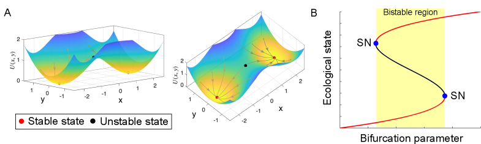
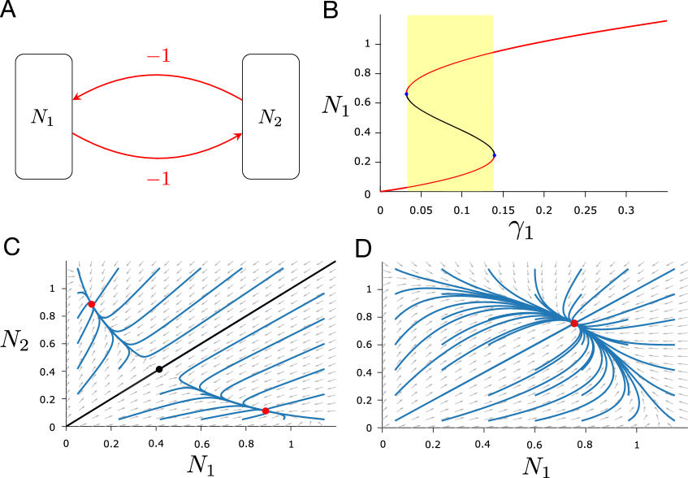
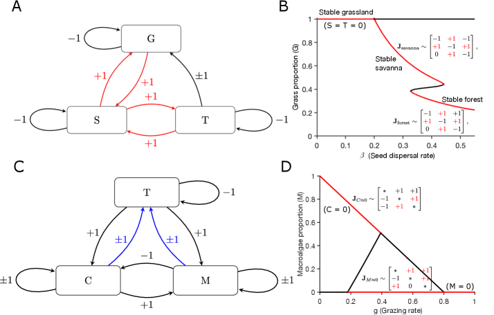

# Towards a unified framework for multiple stable states in ecological systems

## 基本信息

- **arXiv ID:** [2605.05966v1](https://arxiv.org/abs/2605.05966v1)
- **作者:** Jennifer Paige, Denis D. Patterson, Alan Hastings
- **发布日期:** 2026-05-07
- **分类:** q-bio.PE
- **PDF:** [arXiv PDF](https://arxiv.org/pdf/2605.05966v1)

## 关键图示

<figure><figcaption>Figure 1</figcaption></figure>
<figure><figcaption>Figure 2</figcaption></figure>
<figure><figcaption>Figure 3</figcaption></figure>

## 摘要

### English

Multiple stable states - the coexistence of two or more distinct ecological configurations under identical environmental conditions - have attracted sustained interest in ecology, yet the field still lacks a unified framework connecting ecological mechanisms to dynamical models. Here, we review empirical and theoretical approaches to multiple stable states, synthesising perspectives on stability, tipping, hysteresis, and transient dynamics, and contextualise these within a common mathematical framework. Drawing on examples of well-known ecosystem models, we highlight the central and necessary role of positive feedback loops and identify other common, unifying features of ecological systems that exhibit multiple stable states. We further discuss the relationship between stable and transient dynamics, the roles of spatial and temporal scales in feedback identification, and the implications for ecological restoration and management. We conclude with open questions and challenges for the field, including extending multistability theory to persistent-transient frameworks and harnessing emerging data-collection technologies to sharpen empirical inference.

### 中文

多重稳定状态——相同环境条件下两种或多种不同生态配置的共存——引起了生态学的持续关注，但该领域仍然缺乏连接生态机制和动力学模型的统一框架。在这里，我们回顾了多种稳定状态的经验和理论方法，综合了稳定性、倾斜、滞后和瞬态动力学的观点，并将这些观点置于共同的数学框架中。借鉴著名的生态系统模型的例子，我们强调了正反馈循环的核心和必要作用，并确定了表现出多种稳定状态的生态系统的其他共同的、统一的特征。我们进一步讨论稳定动态和瞬态动态之间的关系、时空尺度在反馈识别中的作用以及对生态恢复和管理的影响。最后，我们提出了该领域的开放性问题和挑战，包括将多稳定性理论扩展到持续瞬态框架，并利用新兴的数据收集技术来加强经验推理。

## 相关概念

- [世界模型](../../concepts/world-models.html)
- [智能体](../../concepts/ai-agents.html)

## 核心贡献

本文对生态学中的**多重稳定状态（multiple stable states）**现象进行了系统综述与理论综合。作者将分散在经验观察、数学建模、稳定性理论和生态管理中的概念整合进一个统一的数学框架。核心发现是：**正反馈回路（positive feedback loops）是多重稳定状态的中心且必要的机制**——它们同时充当每个稳定状态的自我维持引擎和状态间转换的开关（图1用势能景观和分岔图进行了直观阐释）。文中还系统梳理了空间代时间（space-for-time）替代法的数学基础及其局限性。

## 方法概述

这是一篇综述性论文，采用自上而下的综合方法：(1) 回顾历史发展脉络（1947年 Watt 的群落格局→1974年 Sutherland 的污损群落→现代定义）；(2) 综合浅湖、珊瑚礁、热带森林-稀树草原等经典案例的数学模型和实证证据；(3) 构建统一的动力学框架：用向量场和势能景观的语言形式化稳定性、倾覆（tipping）、滞后（hysteresis）和瞬态动力学（transient dynamics）的定义；(4) 识别正反馈回路作为跨系统的统一特征；(5) 讨论空间-时间替代法的遍历理论（ergodic theory）基础及其在实际应用中的断裂。

## 实验结果

由于是综述，无原创实验。主要综合发现包括：
- **正反馈的普遍性**：三个经典系统（浅湖、珊瑚礁、森林-稀树草原）中，每个稳定状态都由特定的正反馈回路维持：浅湖中大型水生植物抑制沉积物再悬浮；珊瑚礁中食草鱼类抑制大型藻类；稀树草原中火干扰抑制森林冠层闭合。
- **空间代时间的局限性**：该替代法依赖于两个假设——各斑块已充分趋近其局部吸引子，且斑块集合采样了多个吸引盆地。实际生态系统很少满足均匀环境条件，且增加干扰频率可能进一步复杂化检测与分析。
- **瞬态 vs. 稳定**：观察到的"状态"可能不是真正稳定的稳态，而是**持久瞬态（persistent transients）**，这对经验推断构成根本性挑战。

## 局限性与注意点

- 作为综述，本文未提供新的定量模型或实验验证；统一框架的提出主要是概念层面的。
- 对正反馈回路的"必要且中心"角色的论断，主要基于三个经典案例的归纳，更广泛的实证支持仍有待积累。
- 空间代时间替代法的数学基础（遍历理论）仅给出部分论证，更严谨的分析需要未来工作。
- 将多稳定性理论扩展到"持久瞬态"框架的具体路径未给出。

## 相关概念

- [世界模型](../../concepts/world-models.html) — 多重稳定状态与势能景观（potential landscape）框架直接对应世界模型中环境动力学的多模态特征，系统的分岔与倾覆行为是环境建模的核心挑战。
- [智能体](../../concepts/ai-agents.html) — 生态系统的正反馈机制与多智能体系统中的自我强化和共识锁定现象在动力学结构上有深层共通性。

---
*分析完成时间: 2026-05-10*
*来源: arXiv Daily Wiki Update 2026-05-10*
