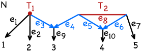
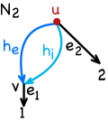
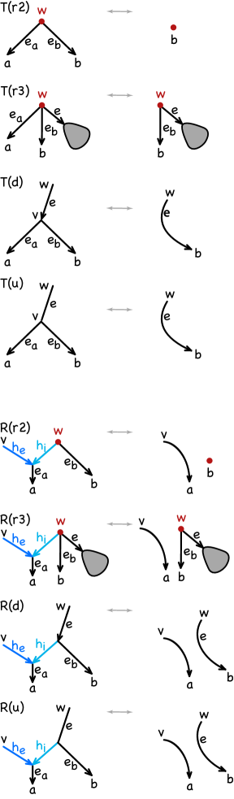

# A $μ$-distance for semidirected orchard phylogenetic networks

## 基本信息

- **arXiv ID:** [2605.06243v1](https://arxiv.org/abs/2605.06243v1)
- **作者:** Gerard Ribas, Joan Carles Pons, Cécile Ané
- **发布日期:** 2026-05-07
- **分类:** math.CO, q-bio.PE
- **PDF:** [arXiv PDF](https://arxiv.org/pdf/2605.06243v1)

## 关键图示

<figure><figcaption>Figure 1</figcaption></figure>
<figure><figcaption>Figure 2</figcaption></figure>
<figure><figcaption>Figure 3</figcaption></figure>

## 摘要

### English

In evolutionary biology, phylogenetic networks are now widely used to represent the historical relationships between species and population, when this history includes reticulation events such as hybridization, gene flow and admixture between populations. Semidirected phylogenetic networks are appropriate models when the direction of some edges and the root position are not identifiable from data. Comparing semidirected networks is important in many applications. For rooted and directed networks, a $μ$-representation was originally introduced to distinguish tree-child networks, and has since been extended in two different directions: to the larger class of orchard directed networks by adding an extra component that counts paths to reticulations; and to semidirected networks, through an edge-based variant. However, the latter does not provide a distance between semidirected and orchard networks. We introduce here a new edge-based $μ$-representation capable of distinguishing distinct orchard binary semidirected networks. For this class, we provide a reconstruction algorithm and therefore obtain a true distance that is computable in polynomial time.

### 中文

在进化生物学中，系统发育网络现在被广泛用于表示物种和种群之间的历史关系，其中这种历史包括网状事件，例如种群之间的杂交、基因流动和混合。当某些边的方向和根位置无法从数据中识别时，半定向系统发育网络是合适的模型。比较半定向网络在许多应用中都很重要。对于有根网络和有向网络，$μ$ 表示最初是为了区分树子网络而引入的，此后已在两个不同的方向上扩展：通过添加计算网状路径的额外组件，扩展到更大的果园有向网络类别；以及通过基于边缘的变体实现半定向网络。然而，后者不提供半定向网络和果园网络之间的距离。我们在这里引入一种新的基于边缘的 $μ$ 表示，能够区分不同的果园二元半有向网络。对于此类，我们提供了一种重建算法，从而获得可在多项式时间内计算的真实距离。

## 相关概念

- [图神经网络](../../concepts/graph-neural-networks.html)

## 核心贡献

本文为**半有向果园系统发育网络（semidirected orchard phylogenetic networks）**引入了一种新的基于边的 μ-表示（μ-representation），并证明它能够区分不同的二元半有向果园网络。在此基础上，作者给出了一个**多项式时间复杂度的重建算法**，从而获得了该网络类上的**真实距离度量**。该工作填补了此前的空白：先前的 μ-表示要么针对有根网络，要么针对半有向网络但不适用于果园网络类。

## 方法概述

核心思路来自三个方向的综合：（1）Cardona 等人对树子有根网络的 μ-表示——为每个节点记录到达各叶子的路径数；（2）Pons & Ané 将路径计数扩展至包含到杂交节点的路径，以适应更大的果园网络类；（3）Maxfield 等人提出的基于边的 μ-表示——将编码从节点转移到边上，使之适用于半有向网络。本文合并了这些扩展：在每个边上存储两个向量（对应根在边的两侧的两种可能位置），并包含到杂交节点的路径计数。通过定义树樱桃（tree cherry）和网状樱桃（reticulate cherry）的约简操作及其8种类型（图3），证明了樱桃约简与 μ-表示可交换，从而构建了重建算法（**定理4.2**：两个果园 L-网络同构当且仅当其 μ-表示相同）。

## 实验结果

- **理论结果**：证明了果园 L-网络的空间距离具有多项式时间复杂度（构造 μ-表示的复杂度为多项式级），且在该类上是真正的距离（区分性、对称性、三角不等式均成立）。
- **方法对比**：与 Maxfield 等人的 μ-表示相比，新表示通过额外记录到杂交节点的路径数以及在根分量两侧分别编码，显著提高了区分力。文中通过具体对比例子说明新表示能区分旧表示无法区分的网络对。
- **非果园反例**：文中也构造了非果园网络的例子，展示 μ-表示可能无法唯一标识的局限性（图6）。

## 局限性与注意点

- 结果严格限定在**果园（orchard）二元半有向网络**类中。对于非果园网络，μ-表示可能不是单射（即不同的网络可能有相同的 μ-表示）。
- 网络要求为**完整的（complete）**且**二元的**；非二元网络需要额外的技术处理。
- 作为纯数学/算法论文，没有对真实生物数据进行实证评估。实际中从基因数据推断的半有向网络是否属于果园类仍是开放问题。
- 距离计算的精确多项式复杂度边界未在文中显式给出。

## 相关概念

- [图神经网络](../../concepts/graph-neural-networks.html) — 系统发育网络作为带标签的有向无环图结构，其 μ-表示编码了图的路径信息，与图表示学习及结构编码方法有密切联系。

---
*分析完成时间: 2026-05-10*
*来源: arXiv Daily Wiki Update 2026-05-10*
