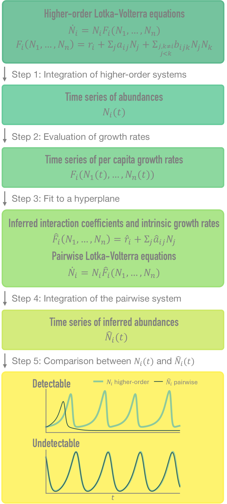
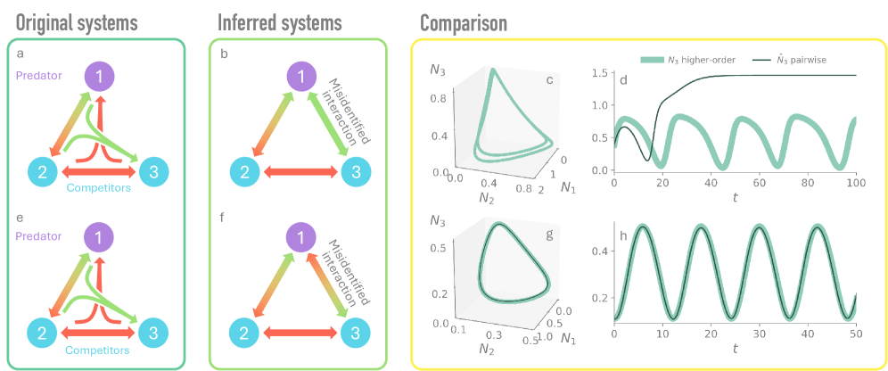
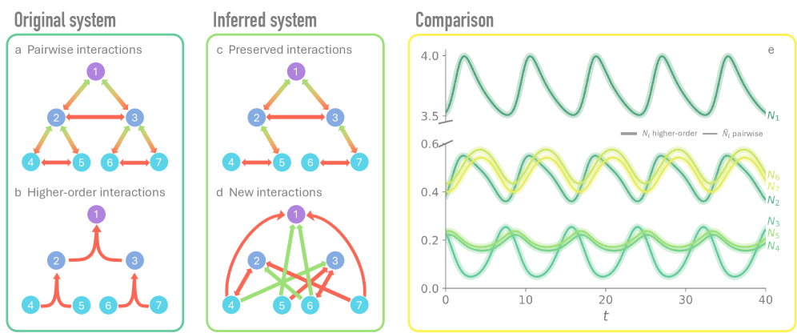

# Higher-order interactions in ecology can be hidden in plain sight

## 基本信息

- **arXiv ID:** [2605.06301v1](https://arxiv.org/abs/2605.06301v1)
- **作者:** Violeta Calleja-Solanas, Santiago Lamata-Otín, Carlos Gómez-Ambrosi et al.
- **发布日期:** 2026-05-07
- **分类:** q-bio.PE, cond-mat.stat-mech, physics.soc-ph
- **PDF:** [arXiv PDF](https://arxiv.org/pdf/2605.06301v1)

## 关键图示

<figure><figcaption>Figure 1</figcaption></figure>
<figure><figcaption>Figure 2</figcaption></figure>
<figure><figcaption>Figure 3</figcaption></figure>

## 摘要

### English

Higher-order interactions are increasingly recognized as a key component of ecological dynamics. However, we show that higher-order Lotka-Volterra dynamics can, in some scenarios, be accurately reproduced by effective pairwise models fitted to the same abundance time series. Consequently, higher-order interactions cannot, in general, be inferred from time-series data alone. We further identify a fundamental problem of mechanistic identifiability, whereby distinct interaction mechanisms generate nearly indistinguishable dynamics, potentially leading to accurate yet misleading ecological interpretations. Our results highlight the need to complement time-series data with additional ecological information to infer interaction structure reliably.

### 中文

高阶相互作用越来越被认为是生态动力学的关键组成部分。然而，我们表明，在某些情况下，高阶 Lotka-Volterra 动力学可以通过拟合相同丰度时间序列的有效成对模型来准确再现。因此，通常不能仅从时间序列数据推断出高阶相互作用。我们进一步确定了机械可识别性的一个基本问题，即不同的相互作用机制产生几乎无法区分的动力学，可能导致准确但误导性的生态解释。我们的结果强调需要用额外的生态信息来补充时间序列数据，以可靠地推断相互作用结构。

## 相关概念

- [世界模型](../../concepts/world-models.html)

## 核心贡献

本文揭示了一个根本性的生态建模问题：**高阶相互作用（HOI）在许多情况下无法仅从物种丰度时间序列中探测**。作者构建了一个系统化的计算流水线（图1），将从高阶 Lotka-Volterra 系统生成的时间序列拟合为标准成对模型，发现拟合出的成对模型能够以极高精度再现原始动力学（某些情况下 ρ_i ≈ 0.99），但其推断的相互作用系数可能与真实机制在符号和量级上完全不同（图2, 图3）。作者将这一现象定义为**机制不可识别性（mechanistic identifiability）**问题，并指出：当系统被驱离已观测状态空间区域时（如生物入侵、气候异常、管理干预），基于成对推断的模型可能做出错误预测。

## 方法概述

采用五步流水线（图1）：(1) 对含三体高阶项的 Lotka-Volterra 系统（hoLV）进行数值积分产生丰度时间序列；(2) 计算各物种的人均增长率；(3) 对吸引子上的点用线性最小二乘回归拟合超平面，获得成对近似系数；(4) 用推断系数组建成对 gLV 系统并积分；(5) 对比原始与推断系统的动力学、吸引子和相互作用网络。关键量化指标包括：高阶相互作用相对权重 θ（式4），短期行为的 Pearson 相关系数 ρ_i，以及长期吸引子对比。以 3-物种（捕食者-猎物-竞争者）和 7-物种两类系统进行数值实验。

## 实验结果

- **可探测情形（System 1, θ≈0.18, β=1.1）**：高阶项的影响清晰可辨——原始系统稳定到极限环，而成对近似收敛到不动点，二者的吸引子完全不同（图2c,d）。
- **不可探测情形（System 2, θ≈0.22, β=0.4, a_32=-0.5）**：成对近似几乎完美再现原始动力学（ρ_i≈0.99），但其推断网络不仅缺失高阶相互作用，还出现了**相互作用符号反转**和**虚假新边**（图2g,h）。两种情景的 θ 值相近，说明不可探测性并非仅由高阶项权重决定。
- **多物种系统**（7物种，图3）：成对近似在忠实再现时间序列的同时，产生了2处错误的相互作用识别和多个虚假边，彻底改变了生态学解读。

## 局限性与注意点

- 研究在**理想化条件**下进行：无观测噪声、高分辨率轨迹、模型函数形式完全已知。在此类最优条件下结论已是"不可探测"，实证数据的挑战只会更大。
- 仅考虑了二阶（三体）HOI 的 Lotka-Volterra 框架；更高阶的 HOI 可能进一步加剧不可识别性。
- 成对近似在吸引子上的拟合可能高估了不可探测性——当系统处于瞬态或被驱离观测区域时，成对模型的预测能力尚未被系统检验。
- 作者建议用额外的生态信息（如实验操作、独立测量的相互作用数据）来补充时间序列推断，但没有给出具体的补充策略设计。

## 相关概念

- [世界模型](../../concepts/world-models.html) — 从动力学时间序列推断系统底层机制的不可识别性问题，与从观测数据学习世界模型的结构可辨识性挑战直接相关。

---
*分析完成时间: 2026-05-10*
*来源: arXiv Daily Wiki Update 2026-05-10*
