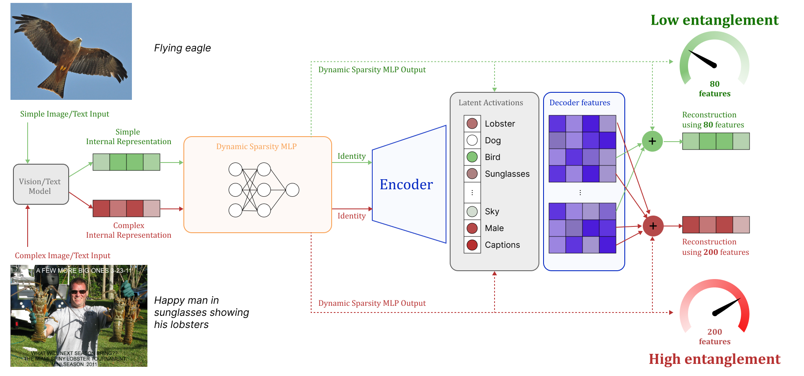
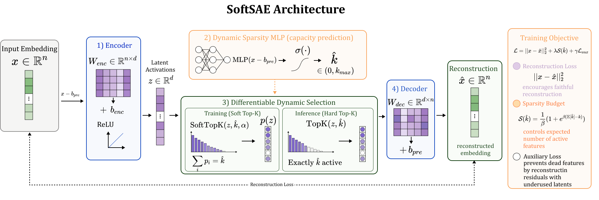
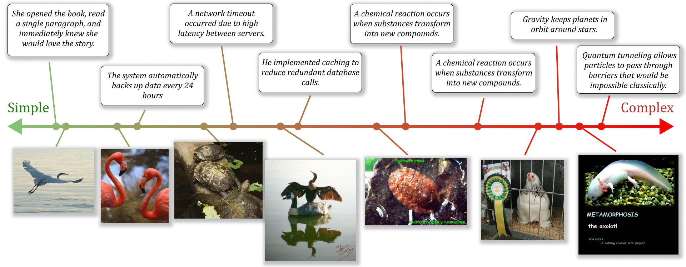

# SoftSAE: Dynamic Top-K Selection for Adaptive Sparse Autoencoders

## 基本信息

- **arXiv ID:** [2605.06610v1](https://arxiv.org/abs/2605.06610v1)
- **作者:** Jakub Stępień, Marcin Mazur, Jacek Tabor et al.
- **发布日期:** 2026-05-07
- **分类:** cs.LG, cs.CV
- **PDF:** [arXiv PDF](https://arxiv.org/pdf/2605.06610v1)

## 关键图示

<figure><figcaption>Figure 1</figcaption></figure>
<figure><figcaption>Figure 2</figcaption></figure>
<figure><figcaption>Figure 3</figcaption></figure>

## 摘要

### English

Sparse Autoencoders (SAEs) have become an important tool in mechanistic interpretability, helping to analyze internal representations in both Large Language Models (LLMs) and Vision Transformers (ViTs). By decomposing polysemantic activations into sparse sets of monosemantic features, SAEs aim to translate neural network computations into human-understandable concepts. However, common architectures such as TopK SAEs rely on a fixed sparsity level. They enforce the same number of active features (K) across all inputs, ignoring the varying complexity of real-world data. Natural data often lies on manifolds with varying local intrinsic dimensionality, meaning the number of relevant factors can change significantly across samples. This suggests that a fixed sparsity level is not optimal. Simple inputs may require only a few features, while more complex ones need more expressive representations. Using a constant K can therefore introduce noise in simple cases or miss important structure in more complex ones. To address this issue, we propose SoftSAE, a sparse autoencoder with a Dynamic Top-K selection mechanism. Our method uses a differentiable Soft Top-K operator to learn an input-dependent sparsity level k. This allows the model to adjust the number of active features based on the complexity of each input. As a result, the representation better matches the structure of the data, and the explanation length reflects the amount of information in the input. Experimental results confirm that SoftSAE not only finds meaningful features, but also selects the right number of features for each concept. The source code is available at: https://anonymous.4open.science/r/SoftSAE-8F71/.

### 中文

稀疏自动编码器 (SAE) 已成为机械可解释性的重要工具，有助于分析大型语言模型 (LLM) 和视觉变换器 (ViT) 中的内部表示。通过将多语义激活分解为稀疏的单语义特征集，SAE 旨在将神经网络计算转化为人类可理解的概念。然而，诸如 TopK SAE 之类的常见架构依赖于固定的稀疏级别。它们在所有输入中强制执行相同数量的活动特征 (K)，忽略现实世界数据的不同复杂性。自然数据通常位于具有不同局部固有维数的流形上，这意味着相关因素的数量在样本中可能会发生显着变化。这表明固定的稀疏度水平并不是最佳的。简单的输入可能只需要几个特征，而更复杂的输入则需要更具表现力的表示。因此，使用常数 K 可能会在简单情况下引入噪声，或者在更复杂的情况下错过重要结构。为了解决这个问题，我们提出了 SoftSAE，一种具有动态 Top-K 选择机制的稀疏自动编码器。我们的方法使用可微的 Soft Top-K 算子来学习依赖于输入的稀疏度 k。这允许模型根据每个输入的复杂性来调整活动特征的数量。结果，表示更好地匹配数据的结构，并且解释长度反映了输入中的信息量。实验结果证实，SoftSAE 不仅可以找到有意义的特征，而且可以为每个概念选择正确数量的特征。源代码位于：https://anonymous.4open.science/r/SoftSAE-8F71/。

## 相关概念

- [大语言模型](../../concepts/large-language-model.html)
- [智能体](../../concepts/ai-agents.html)

## 核心贡献

1. **动态 Top-K 选择机制**：提出 SoftSAE，使用可微 Soft Top-K 算子学习输入依赖的稀疏度水平 k̂，替代传统 SAE 中固定的全局稀疏度参数 K。
2. **自适应可解释性**：将解释长度与输入数据的局部内在维度对齐——简单输入激活较少特征，复杂输入激活更多特征，避免噪声引入或信息丢失。
3. **理论支撑**：将自适应稀疏度与神经激活空间的局部内在维度（LID）联系起来，为动态可解释性提供理论基础。
4. **训练-推理分离设计**：训练阶段使用可微 Soft Top-K 实现梯度流动，推理阶段使用硬 Top-K 保证精确稀疏度和可解释性。

## 方法概述

SoftSAE 在传统 SAE 架构之上引入 Dynamic Sparsity MLP，用于估计输入相关的稀疏度 k̂。训练阶段使用 Soft Top-K 算子使梯度能够通过选择机制回传；推理阶段切换为硬 Top-K 保证精确的可解释性。完整训练目标包括重建损失和稀疏度预算机制，平衡重建保真度与动态特征分配。架构如图 2 所示，包含预编码偏置、编码器矩阵和动态稀疏度 MLP 三个核心组件。

## 实验结果

实验在语言模型和视觉 Transformer 的激活上验证了 SoftSAE。结果表明：SoftSAE 不仅能发现与 TopK SAE、BatchTopK 和 JumpReLU SAE 相当的有意义单语义特征，而且能根据输入复杂度自动调整活跃特征数量——简单概念（如"飞鹰"）使用较少特征，复杂概念（如包含多个对象的复杂场景）自动分配更多特征。在重建保真度和可解释性之间取得了更好的平衡。

## 局限性与注意点

- Dynamic Sparsity MLP 本身引入了额外的可学习参数，增加了模型复杂度。
- Soft Top-K 的梯度估计在大字典尺寸下可能存在近似误差。
- 论文实验规模相对较小，主要在中等规模模型激活上验证，扩展到更大模型（如 70B+ LLM）的效果有待确认。
- 输入复杂度与最优稀疏度之间的关系可能因模型层和任务而异，需进一步研究。

## 相关概念

关于稀疏自编码器和机制可解释性的更多文献，参见 [大语言模型](../../concepts/large-language-model.html) 和 [智能体](../../concepts/ai-agents.html)。

---
*导入时间: 2026-05-09 06:00*
*来源: arXiv Daily Wiki Update 2026-05-09*
