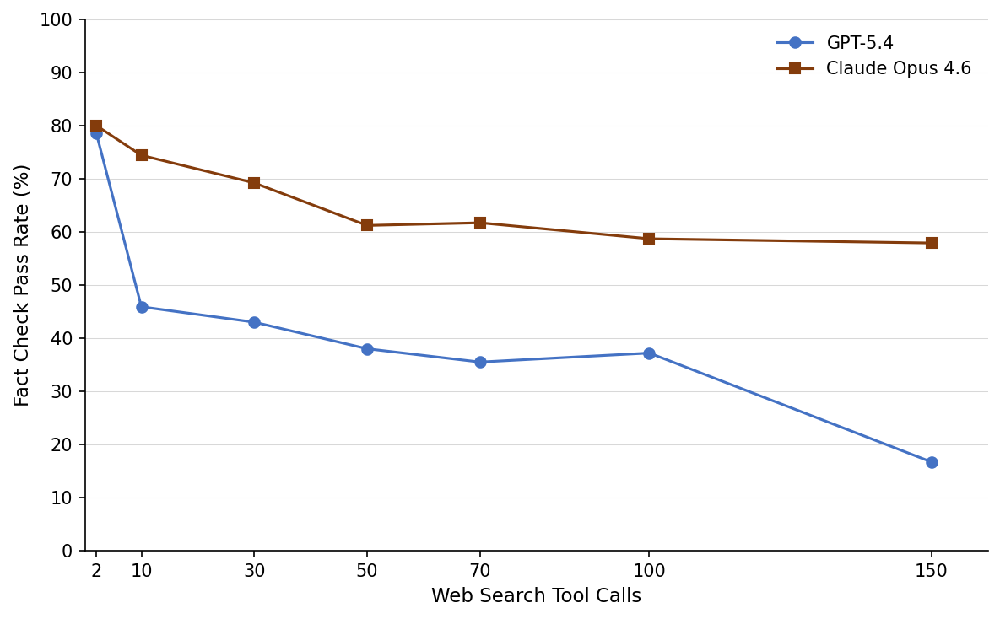

# Cited but Not Verified: Parsing and Evaluating Source Attribution in LLM Deep Research Agents

## 基本信息

- **arXiv ID:** [2605.06635v1](https://arxiv.org/abs/2605.06635v1)
- **作者:** Hailey Onweller, Elias Lumer, Austin Huber et al.
- **发布日期:** 2026-05-07
- **分类:** cs.CL
- **PDF:** [arXiv PDF](https://arxiv.org/pdf/2605.06635v1)

## 关键图示

<figure><figcaption>Figure 1</figcaption></figure>
<figure><figcaption>Figure 2</figcaption></figure>

## 摘要

### English

Large language models (LLMs) power deep research agents that synthesize information from hundreds of web sources into cited reports, yet these citations cannot be reliably verified. Current approaches either trust models to self-cite accurately, risking bias, or employ retrieval-augmented generation (RAG) that does not validate source accessibility, relevance, or factual consistency. We introduce the first source attribution evaluation framework that uses a reproducible AST parser to extract and evaluate inline citations from LLM-generated Markdown reports at scale. Unlike methods that verify claims in isolation, our framework closes the loop by retrieving the actual cited content, enabling human or model evaluators to judge each citation against its source. Citations are evaluated along three dimensions. (1) Link Works verifies URL accessibility, (2) Relevant Content measures topical alignment, and (3) Fact Check validates factual accuracy against source content. We benchmark 14 closed-source and open-source LLMs across three evaluation dimensions using rubric-based LLM-as-a-judge evaluators calibrated through human review. Our results reveal that even the strongest frontier models maintain link validity above 94% and relevance above 80%, yet achieve only 39-77% factual accuracy, while fewer than half of open-source models successfully generate cited reports in a one-shot setting. Ablation studies on research depth show that Fact Check accuracy drops by approximately 42% on average across two frontier models as tool calls scale from 2 to 150, demonstrating that more retrieval does not produce more accurate citations. These findings reveal a critical disconnect between surface-level citation quality and factual reliability, and our framework provides the evaluation infrastructure to assess the disconnect.

### 中文

大型语言模型 (LLM) 为深度研究代理提供支持，将来自数百个网络资源的信息合成为引用的报告，但这些引文无法得到可靠验证。当前的方法要么信任模型准确自引，但存在偏见，要么采用检索增强生成（RAG），但不验证来源的可访问性、相关性或事实一致性。我们引入了第一个来源归因评估框架，该框架使用可重复的 AST 解析器从 LLM 生成的 Markdown 报告中大规模提取和评估内联引用。与单独验证声明的方法不同，我们的框架通过检索实际引用的内容来闭合循环，使人类或模型评估者能够根据其来源来判断每个引用。引用沿着三个维度进行评估。 (1) Link Works 验证 URL 可访问性，(2) 相关内容衡量主题一致性，(3) 事实检查根据源内容验证事实准确性。我们使用通过人工审核校准的基于标题的法学硕士作为法官评估者，在三个评估维度上对 14 个闭源和开源法学硕士进行了基准测试。我们的结果表明，即使是最强大的前沿模型也能保持 94% 以上的链接有效性和 80% 以上的相关性，但事实准确性仅达到 39-77%，而只有不到一半的开源模型一次性成功生成引用的报告。关于研究深度的消融研究表明，随着工具调用范围从 2 到 150，事实检查准确性在两个前沿模型中平均下降约 42%，这表明更多的检索并不会产生更准确的引用。这些发现揭示了表面引用质量和事实可靠性之间的严重脱节，我们的框架提供了评估基础设施来评估这种脱节。

## 核心贡献

### English
This paper introduces the first source attribution evaluation framework for LLM deep research agents, using a reproducible AST parser to extract and evaluate inline citations from LLM-generated Markdown reports at scale. The framework evaluates citations along three dimensions: (1) Link Works — URL accessibility, (2) Relevant Content — topical alignment between citation claim and source, (3) Fact Check — factual accuracy against source content. Benchmarking 14 closed-source and open-source LLMs reveals a critical disconnect: even the strongest frontier models achieve 94%+ link validity and 80%+ relevance, but only 39-77% factual accuracy. An ablation study shows Fact Check accuracy drops by ~42% as tool calls scale from 2 to 150 — demonstrating that more retrieval does not produce more accurate citations.

### 中文
本文引入了第一个针对 LLM 深度研究智能体的来源归因评估框架，使用可复现的 AST 解析器从 LLM 生成的 Markdown 报告中大规模提取和评估内联引用。框架沿三个维度评估引用：(1) 链接有效 — URL 可访问性，(2) 相关内容 — 引用声明与来源的主题对齐，(3) 事实检查 — 与来源内容的事实准确性。对 14 个闭源和开源 LLM 的基准测试揭示了一个关键脱节：即使最强的前沿模型也达到 94%+ 链接有效性和 80%+ 相关性，但事实准确性仅 39-77%。消融研究表明，随着工具调用从 2 扩展到 150，事实检查准确性下降约 42%——证明更多检索并不产生更准确的引用。

## 方法概述

### English
The framework uses a multi-stage pipeline: (1) An AST parser extracts inline citations from LLM-generated Markdown, handling various citation formats. (2) For each citation, the source URL is checked for accessibility (Link Works). (3) The cited content is retrieved, and both the citation claim and source content are evaluated for topical alignment (Relevant Content) using an LLM judge. (4) Factual accuracy (Fact Check) is evaluated by comparing the claim made in the citation against the actual source content, using rubric-based LLM-as-a-judge calibrated through human review. 14 models are benchmarked, including GPT-4, Claude, Gemini, and various open-source models. The ablation study varies research depth by controlling the number of tool calls (2 to 150) during the research process.

### 中文
框架使用多阶段流水线：(1) AST 解析器从 LLM 生成的 Markdown 中提取内联引用，处理多种引用格式。(2) 对每个引用，检查源 URL 可访问性（链接有效）。(3) 检索引用内容，使用 LLM 评判器评估引用声明与来源内容的主题对齐（相关内容）。(4) 通过将引用中的声明与实际来源内容进行比较，使用经人工审查校准的基于评分标准的 LLM 评判器评估事实准确性（事实检查）。对 14 个模型进行基准测试。消融研究通过控制研究过程中的工具调用数量（2 到 150）来改变研究深度。

## 实验结果

### English
(1) Link Works: Frontier models maintain 94%+ link validity; open-source models vary widely. (2) Relevant Content: Frontier models achieve 80%+ relevance. (3) Fact Check: Only 39-77% factual accuracy — fewer than half of open-source models successfully generate cited reports in one-shot. (4) Critical disconnect: Surface-level citation quality (links, relevance) does not predict factual reliability. (5) Research depth ablation: Fact Check accuracy drops approximately 42% on average as tool calls scale from 2 to 150 across two frontier models. (6) The framework provides evaluation infrastructure to assess this disconnect systematically.

### 中文
(1) 链接有效：前沿模型保持 94%+ 链接有效性；开源模型差异很大。(2) 相关内容：前沿模型达 80%+ 相关性。(3) 事实检查：仅 39-77% 事实准确性——不到一半的开源模型能在一次性设置中成功生成引用报告。(4) 关键脱节：表面引用质量（链接、相关性）不能预测事实可靠性。(5) 研究深度消融：工具调用从 2 扩展到 150 时，事实检查准确性平均下降约 42%。(6) 框架提供了系统评估这种脱节的评估基础设施。

## 局限性与注意点

### English
(1) The evaluation is limited to English-language reports and sources. (2) LLM-as-a-judge for Fact Check has inherent limitations — human review was used for calibration but does not eliminate judge bias. (3) The AST parser may not capture all citation formats, especially non-standard ones. (4) Source content retrieval may be incomplete (paywalled content, dynamic pages). (5) Only one-shot setting tested for most open-source models; multi-turn agent setups may yield different results. (6) The framework does not assess citation appropriateness (whether the source should be cited for that claim).

### 中文
(1) 评估限于英语报告和来源。(2) 用于事实检查的 LLM 评判器有固有局限——人工审查用于校准但不消除评判偏见。(3) AST 解析器可能无法捕获所有引用格式，特别是非标准格式。(4) 来源内容检索可能不完整（付费内容、动态页面）。(5) 大多数开源模型仅测试一次性设置；多轮智能体设置可能产生不同结果。(6) 框架不评估引用适当性（该来源是否应被引用于该声明）。

## 相关概念

- [大语言模型](../../concepts/large-language-model.html)
- [基准评估](../../concepts/benchmarking.html)
- [AI安全与对齐](../../concepts/ai-safety-alignment.html)
- [智能体](../../concepts/ai-agents.html)

---
*导入时间: 2026-05-08 06:02*
*来源: arXiv Daily Wiki Update 2026-05-08*
